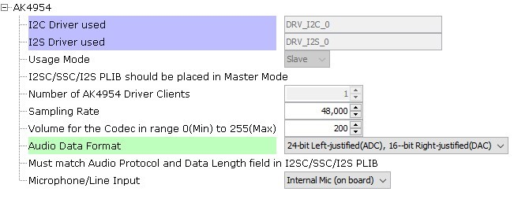
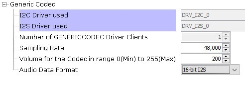

# MPLAB Harmony Audio Help

   

   
   

MPLAB Harmony Integrated Software Framework

## Driver Libraries Help

This section provides descriptions of the Driver libraries that are available in audio repo.

For additional information on Harmony 3 driver architecture, refer to the documentation in the core repository.

**Codec Libraries Help**

**AK4953 CODEC Driver Library Help**

This topic describes the AK4953 Codec Driver Library.

## _Introduction_

This topic describes the basic architecture of the AK4953 Codec Driver Library and provides information and examples on its use.

**Description**

### Interface Header File: drv_AK4953.h

The interface to the AK4953 Codec Driver library is defined in the audio/driver/codec/AK4953/drv_AK4953.h header file. Any C language source (.c) file that uses the AK4953 Codec Driver library should include this header.

**Library Source Files:**

The AK4953 Codec Driver library source files are provided in the audio/driver/codec/AK4953/src directory. This folder may contain optional files and alternate implementations. Please refer to **Configuring the Library** for instructions on how to select optional features and to **Building the Library** for instructions on how to build the library.

**_Using the Library_**

## Abstraction Model

This library provides a low-level abstraction of the AK4954 Codec Driver Library on the Microchip family microcontrollers with a convenient C language interface. This topic describes how that abstraction is modeled in software and introduces the library's interface.

**Description**

The abstraction model shown in the following diagram depicts how the AK4953 Codec Driver is positioned in the MPLAB Harmony framework. The AK4953 Codec Driver uses the I2C and I2S drivers for control and audio data transfers to the AK4953 module.

### AK4953 Driver Abstraction Model

   

   
   

## Library Overview

Refer to the Driver Library Overview section for information on how the driver operates in a system.

The AK4953 Codec Driver Library provides an API interface to transfer control commands and digital audio data to the serially interfaced AK4953 Codec module. The library interface routines are divided into various sub-sections, which address one of the blocks or the overall operation of the AK4953 Codec Driver Library.

| **Library Interface Section** | **Description** |
| --- | --- |
| System Functions | Provides system module interfaces, device initialization, deinitialization, reinitialization, tasks and status functions. |
| Client Setup Functions | Provides open and close functions. |
| Data Transfer Functions | Provides data transfer functions, such as Buffer Read and Write. |
| Settings Functions | Provides driver specific functions for settings, such as volume control and sampling rate. |
| Other Functions | Miscellaneous functions, such as getting the driver’s version number and syncing to the LRCLK signal. |
| Data Types and Constants | These data types and constants are required while interacting and setting up the AK4953 Codec Driver Library. |

 **Note:** All functions and constants in this section are named with the format DRV_ AK4953_xxx, where 'xxx' is a function name or constant. These names are redefined in the appropriate configuration’s configuration.h file to the format DRV_CODEC_xxx using #defines so that code in the application that references the library can be written as generically as possible (e.g., by writing DRV_CODEC_Open instead of DRV_ AK4953_Open etc.). This allows the codec type to be changed in the MHC without having to modify the application’s source code.

## How the Library Works

How the Library Works

The library provides interfaces to support:

*   System Functionality
*   Client Functionality

**Description**

### Setup (Initialization)

This topic describes system initialization, implementations, and includes a system access code example.

**Description**

The system performs the initialization of the device driver with settings that affect only the instance of the device that is being initialized. During system initialization in the system_init.c file, each instance of the AK4953 module would be initialized with the following configuration settings (either passed dynamically at run time using DRV_AK4953_INIT or by using Initialization Overrides) that are supported by the specific AK4953 device hardware:

*   Device requested power state: one of the System Module Power States. For specific details please refer to Data Types and Constants in the Library Interface section.
*   I2C driver module index. The module index should be same as the one used in initializing the I2C Driver
*   I2S driver module index. The module index should be same as the one used in initializing the I2S Driver
*   Sampling rate
*   Volume
*   Audio data format. The audio data format should match with the audio data format settings done in I2S driver initialization
*   Determines whether or not the microphone input is enabled

The DRV_AK4953_Initialize API returns an object handle of the type SYS_MODULE_OBJ. The object handle returned by the

Initialize interface would be used by the other system interfaces such as DRV_ AK4953_Deinitialize, DRV_ AK4953_Status and

DRV_I2S_Tasks

### Client Access

This topic describes driver initialization and provides a code example.

**Description**

For the application to start using an instance of the module, it must call the DRV_AK4953_Open function. The

DRV_AK4953_Open function provides a driver handle to the AK4953 Codec Driver instance for operations. If the driver is deinitialized using the function DRV_AK4953_Deinitialize, the application must call the DRV_AK4953_Open function again to set up the instance of the driver.

For the various options available for IO_INTENT, please refer to Data Types and Constants in the Library Interface section.

 **Note:** It is necessary to check the status of driver initialization before opening a driver instance. The status of the AK4953 Codec Driver can be known by calling DRV_ AK4953_Status.

**Example:**

DRV_HANDLE handle; SYS_STATUS ak4953Status;

ak4953Status Status = DRV_AK4953_Status(sysObjects.ak4953Status DevObject); if (SYS_STATUS_READY == ak4953Status)

{

// The driver can now be opened.

appData.ak4953Client.handle = DRV_AK4953_Open

(DRV_AK4953_INDEX_0, DRV_IO_INTENT_WRITE | DRV_IO_INTENT_EXCLUSIVE); if(appData.ak4953Client.handle != DRV_HANDLE_INVALID)

{

appData.state = APP_STATE_AK4953_SET_BUFFER_HANDLER;

}

else

{

SYS_DEBUG(0, "Find out what's wrong \r\n");

}

}

else

{

/* AK4953 Driver Is not ready */

### Client Operations

This topic provides information on client operations.

**Description**

Client operations provide the API interface for control command and audio data transfer to the AK4953 Codec.

The following AK4953 Codec specific control command functions are provided:

*   DRV_AK4953_SamplingRateSet
*   DRV_AK4953_SamplingRateGet
*   DRV_AK4953_VolumeSet
*   DRV_AK4953_VolumeGet
*   DRV_AK4953_MuteOn
*   DRV_AK4953_MuteOff

These functions schedule a non-blocking control command transfer operation. These functions submit the control command request to the AK4953 Codec. These functions submit the control command request to I2C Driver transmit queue, the request is processed immediately if it is the first request, or processed when the previous request is complete.

DRV_AK4953_BufferAddWrite, DRV_AK4953_BufferAddRead, and DRV_AK4953_BufferAddWriteRead are buffered data operation functions. These functions schedule non-blocking audio data transfer operations. These functions add the request to I2S Driver transmit or receive buffer queue depends on the request type, and are executed immediately if it is the first buffer, or executed later when the previous buffer is complete. The driver notifies the client with

DRV_AK4953_BUFFER_EVENT_COMPLETE, DRV_AK4953_BUFFER_EVENT_ERROR, or DRV_AK4953_BUFFER_EVENT_ABORT events.

 **Note:** It is not necessary to close and reopen the client between multiple transfers.

### Configuring the Library

The configuration of the I2S Driver Library is based on the file configurations.h, as generated by the MHC.

This header file contains the configuration selection for the I2S Driver Library. Based on the selections made, the I2S Driver Library may support the selected features. These configuration settings will apply to all instances of the I2S Driver Library.

This header can be placed anywhere; however, the path of this header needs to be present in the include search path for a successful build. Refer to the Applications Help section for more details.

## System Configuration

### Configuring MHC

Provides examples on how to configure the MPLAB Harmony Configurator (MHC) for a specific driver.

**Description**

When building a new application, start by creating a 32-bit MPLAB Harmony 3 project in MPLAB X IDE by selecting _File > New Project_. Chose the Configuration name the based on the BSP, and select the appropriate processor.

In the MHC, under Available Components select the appropriate BSP. Under _Audio>Templates_, double-click on a codec template such as AK4953\. Answer Yes to all questions.

You should end up with a project graph that looks like this, after rearranging the boxes:

   

   
   

Click on the AK4953 Driver component (not AK4953 Codec) and the following menu will be displayed in the Configurations Options:

   

   
   

*   **I2C Driver Used** will display the driver instance used for the I2C interface.
*   **I2S Driver Used** will display the driver instance used for the I2S interface.
*   **Usage Mode** indicates whether the AK4953 is a Master (supplies I2S clocks) or a Slave (MCU supplies I2S clocks).
*   **Number of AK4953 Clients** indicates the maximum number of clients that can be connected to the AK4953 Driver.
*   **Sampling Rate** indicates the number of samples per second per channel, 8000 to 96,000.
*   **Volume** indicates the volume in a linear scale from 0-255.

#### • Audio Data Format is either

*   24-bit Left Justified (ADC), 24-bit Right-justified(DAC)
*   24-bit Left Justified (ADC), 16-bit Right-justified(DAC)
*   24-bit Left Justified (ADC), 24-bit Left-justified(DAC)
*   24/16-bit I2S

It must match the audio protocol and data length set up in either the SSC or I2S PLIB.

*   **Microphone/Line Input** selects which microphone or line input is selected, either:
*   Internal Mic (mounted on the AK4953 daughterboard)
*   External Mic Input
*   Line Input

If External Mic input or Line Input is selected, then the following option is provided:

#### • Ext Mic Gain in dB range 0(min) to 31(max)

If External Mic input is selected, then the following option is provided:

• **Enable Microphone Bias** should be checked if using an electret microphone.

You can also bring in the AK4953 Driver by itself, by double clicking AK4953 under Audio_->Driver->Codec_ in the Available Components list. You will then need to add any additional needed components manually and connect them together.

Note that the AK4953 requires the TCx Peripheral Library and TIME System Service in order to perform some of its internal timing sequences.

### Bulding the Library

This section lists the files that are available in the AK4953 Codec Driver Library.

**Description**

This section lists the files that are available in the src folder of the AK4953 Codec Driver. It lists which files need to be included in the build based on either a hardware feature present on the board or configuration option selected by the system.

The following three tables list and describe the header (.h) and source (.c) files that implement this library. The parent folder for these files is audio/driver/codec/AK4953\. **Interface File(s)**

This table lists and describes the header files that must be included (i.e., using #include) by any code that uses this library.

| **Source File Name** | **Description** |
| --- | --- |
| drv_ak4953.h | Header file that exports the driver API. |

#### Required File(s)

 **_All of the required files listed in the following table are automatically added into the MPLAB X IDE project by the MHC when the library is selected for use._**

This table lists and describes the source and header files that must _always_ be included in the MPLAB X IDE project to build this library.

| **Source File Name** | **Description** |
| --- | --- |
| /src/drv_ak4953.c | This file contains implementation of the AK4953 Codec Driver. |

#### Optional File(s)

This table lists and describes the source and header files that may optionally be included if required for the desired implementation.

| **Source File Name** | **Description** |
| --- | --- |
| N/A | No optional files are available for this library. |

#### Module Dependencies

The AK4953 Codec Driver Library depends on the following modules:

*   I2S Driver Library
*   I2C Driver Library

### Library Interface

**Client Setup Functions**

| - | **Name** | **Description** |
| --- | --- | --- |
| | DRV_AK4953_Close | Closes an opened-instance of the AK4953 driver |
| | DRV_AK4953_CommandEventHandlerSet | This function allows a client to identify a command event handling function for the driver to call back when the last submitted command have finished. |
| | DRV_AK4953_Open | Opens the specified AK4953 driver instance and returns a handle to it. |
| | DRV_AK4953_BufferEventHandlerSet | This function allows a client to identify a buffer event handling function for the driver to call back when queued buffer transfers have finished. |

**Data Transfer Functions**

| - | **Name** | **Description** |
| --- | --- | --- |
| | DRV_AK4953_BufferAddRead | Schedule a non-blocking driver read operation. |
| | DRV_AK4953_BufferAddWrite | Schedule a non-blocking driver write operation. |
| | DRV_AK4953_BufferAddWriteRead | Schedule a non-blocking driver write-read operation. |
| | DRV_AK4953_ReadQueuePurge | Removes all buffer requests from the read queue. |
| | DRV_AK4953_WriteQueuePurge | Removes all buffer requests from the write queue. |

**Data Types and Constants**

| - | **Name** | **Description** |
| --- | --- | --- |
| - | DRV_AK4953_AUDIO_DATA_FORMAT | Identifies the Serial Audio data interface format. |
| - | DRV_AK4953_BUFFER_EVENT | Identifies the possible events that can result from a buffer add request. |
| - | DRV_AK4953_BUFFER_EVENT_HANDLER | Pointer to a AK4953 Driver Buffer Event handler function |
| - | DRV_AK4953_BUFFER_HANDLE | Handle identifying a write buffer passed to the driver. |
| - | DRV_AK4953_CHANNEL | Identifies Left/Right Audio channel |
| - | DRV_AK4953_COMMAND_EVENT_HANDLER | Pointer to a AK4953 Driver Command Event Handler Function |
| - | DRV_AK4953_DIGITAL_BLOCK_CONTROL | Identifies Bass-Boost Control function |
| - | DRV_AK4953_INIT | Defines the data required to initialize or reinitialize the AK4953 driver |
| - | DRV_AK4953_INT_EXT_MIC | Identifies the Mic input source. |
| - | DRV_AK4953_MIC | This is type DRV_AK4953_MIC. |
| - | DRV_AK4953_MONO_STEREO_MIC | Identifies the Mic input as Mono / Stereo. |

**Other Functions**

| - | **Name** | **Description** |
| --- | --- | --- |
| | DRV_AK4953_GetI2SDriver | Get the handle to the I2S driver for this codec instance. |
| | DRV_AK4953_LRCLK_Sync | Synchronize to the start of the I2S LRCLK (left/right clock) signal |
| | DRV_AK4953_VersionGet | This function returns the version of AK4953 driver. |
| | DRV_AK4953_VersionStrGet | This function returns the version of AK4953 driver in string format. |

**Settings Functions**

| - | **Name** | **Description** |
| --- | --- | --- |
| | DRV_AK4953_IntExtMicSet | This function sets up the codec for the X32 DB internal or the external microphone use. |
| | DRV_AK4953_MicGainGet | This function gets the microphone gain for the AK4953 Codec. |
| | DRV_AK4953_MicGainSet | This function sets the microphone gain for the AK4953 CODEC. |
| | DRV_AK4953_MicMuteOff | Umutes th AK4953's microphone input. |
| | DRV_AK4953_MicMuteOn | Mutes the AK4953's microphone input |
| | DRV_AK4953_MicSet | This function sets up the codec for the internal or the AK4953 Mic1 or Mic2 input. |
| | DRV_AK4953_MonoStereoMicSet | This function sets up the codec for the Mono or Stereo microphone mode. |
| | DRV_AK4953_MuteOff | This function disables AK4953 output for soft mute. |
| | DRV_AK4953_MuteOn | This function allows AK4953 output for soft mute on. |
| | DRV_AK4953_SamplingRateGet | This function gets the sampling rate set on the DAC AK4953. |
| | DRV_AK4953_SamplingRateSet | This function sets the sampling rate of the media stream. |
| | DRV_AK4953_VolumeGet | This function gets the volume for AK4953 Codec. |
| | DRV_AK4953_VolumeSet | This function sets the volume for AK4953 Codec. |

**System Interaction Functions**

| - | **Name** | **Description** |
| --- | --- | --- |
| | DRV_AK4953_Deinitialize | Deinitializes the specified instance of the AK4953 driver module. |
| | DRV_AK4953_EnableInitialization | Enable delayed initialization of the driver. |
| | DRV_AK4953_Initialize | Initializes hardware and data for the instance of the AK4953 Codec module. |
| | DRV_AK4953_IsInitializationDelayed | Checks if delayed initialization of the driver has been requested. |
| | DRV_AK4953_Status | Gets the current status of the AK4953 driver module. |
| | DRV_AK4953_Tasks | Maintains the driver's control and data interface state machine. |

**Description**

## System Interaction Functions

### DRV_AK4953_Deinitialize Function

void DRV_AK4953_Deinitialize( SYS_MODULE_OBJ object)

**Summary**

Deinitializes the specified instance of the AK4953 driver module.

**Description**

Deinitializes the specified instance of the AK4953 driver module, disabling its operation (and any hardware). Invalidates all the internal data.

**Preconditions**

Function DRV_AK4953_Initialize should have been called before calling this function.

**Parameters**

| **Parameters** | **Description** |
| --- | --- |
| object | Driver object handle, returned from the DRV_AK4953_Initialize routine |

**Returns**

None.

**Remarks**

Once the Initialize operation has been called, the De-initialize operation must be called before the Initialize operation can be called again. This routine will NEVER block waiting for hardware.

**Example**

SYS_MODULE_OBJ object; _// Returned from DRV_AK4953_Initialize_

SYS_STATUS status;

DRV_AK4953_Deinitialize(object); status = DRV_AK4953_Status(object); **if** (SYS_MODULE_DEINITIALIZED != status) {

_// Check again later if you need to know_ _// when the driver is deinitialized._

}

**C**

**void** **DRV_AK4953_Deinitialize**(SYS_MODULE_OBJ **object**);

### DRV_AK4953_EnableInitialization Function

void DRV_AK4953_EnableInitialization(SYS_MODULE_OBJ object);

**Summary**

Enable delayed initialization of the driver.

**Description**

If the AK4953 codec is sharing a RESET line with another peripheral, such as a Bluetooth module with its own driver, then the codec driver initialization has to be delayed until after the Bluetooth module has toggled its RESET pin. Once this has been accomplished, this function should be called to kick-start the codec driver initialization.

**Preconditions**

The DRV_AK4953_Initialize routine must have been called for the specified AK4953 driver instance.

**Parameters**

| **Parameters** | **Description** |
| --- | --- |
| object | Object handle for the specified driver instance (returned from DRV_AK4953_Initialize) |

**Returns**

None.

**Remarks**

This is not needed for audio-only applications without a Bluetooth module.

**C**

**void** **DRV_AK4953_EnableInitialization**(SYS_MODULE_OBJ **object**);

### DRV_AK4953_Initialize Function

SYS_MODULE_OBJ DRV_AK4953_Initialize

(

const SYS_MODULE_INDEX drvIndex, const SYS_MODULE_INIT *const init

);

**Summary**

Initializes hardware and data for the instance of the AK4953 Codec module.

**Description**

This routine initializes the AK4953 driver instance for the specified driver index, making it ready for clients to open and use it. The initialization data is specified by the init parameter. The initialization may fail if the number of driver objects allocated are insufficient or if the specified driver instance is already initialized.

**Preconditions**

DRV_I2S_Initialize must be called before calling this function to initialize the data interface of this Codec driver. DRV_I2C_Initialize must be called if SPI driver is used for handling the control interface of this Codec driver.

**Parameters**

| **Parameters** | **Description** |
| --- | --- |
| drvIndex | Identifier for the driver instance to be initialized |
| init | Pointer to the data structure containing any data necessary to initialize the hardware. This pointer may be null if no data is required and default initialization is to be used. |

**Returns**

If successful, returns a valid handle to a driver instance object. Otherwise, it returns SYS_MODULE_OBJ_INVALID.

**Remarks**

This routine must be called before any other AK4953 routine is called.

This routine should only be called once during system initialization unless DRV_AK4953_Deinitialize is called to deinitialize the driver instance. This routine will NEVER block for hardware access.

**Example**

DRV_AK4953_INIT init;

SYS_MODULE_OBJ objectHandle; init->inUse = **true**; init->status = SYS_STATUS_BUSY; init->numClients = 0; init->i2sDriverModuleIndex = ak4953Init->i2sDriverModuleIndex; init->i2cDriverModuleIndex = ak4953Init->i2cDriverModuleIndex; init->samplingRate = DRV_AK4953_AUDIO_SAMPLING_RATE; init->audioDataFormat = DRV_AK4953_AUDIO_DATA_FORMAT_MACRO; **for**(index=0; index < DRV_AK4953_NUMBER_OF_CHANNELS; index++) {

init->volume[index] = ak4953Init->volume; } init->isInInterruptContext = **false**; init->commandCompleteCallback = (DRV_AK4953_COMMAND_EVENT_HANDLER)0; init->commandContextData = 0; init->mclk_multiplier = DRV_AK4953_MCLK_SAMPLE_FREQ_MULTPLIER; objectHandle = DRV_AK4953_Initialize(DRV_AK4953_0, (SYS_MODULE_INIT*)init); **if** (SYS_MODULE_OBJ_INVALID == objectHandle) {

_// Handle error_

}

**C**

SYS_MODULE_OBJ **DRV_AK4953_Initialize**(**const** SYS_MODULE_INDEX **drvIndex**, **const** SYS_MODULE_INIT * **const** **init**);

### DRV_AK4953_IsInitializationDelayed Function

bool DRV_AK4953_IsInitializationDelayed(SYS_MODULE_OBJ object);

**Summary**

Checks if delayed initialization of the driver has been requested.

**Description**

If the AK4953 codec is sharing a RESET line with another peripheral, such as a Bluetooth module with its own driver, then the codec driver initialization has to be delayed until after the Bluetooth module has toggled its RESET pin. This function returns true if that option has been selected in MHC in the checkbox: "Delay driver initialization (due to shared RESET pin)"

**Preconditions**

The DRV_AK4953_Initialize routine must have been called for the specified AK4953 driver instance.

**Parameters**

| **Parameters** | **Description** |
| --- | --- |
| object | Object handle for the specified driver instance (returned from DRV_AK4953_Initialize) |

**Returns**

true if the delayed initialization option has been enabled

**Remarks**

This is not needed for audio-only applications without a Bluetooth module.

**C**

**bool** **DRV_AK4953_IsInitializationDelayed**(SYS_MODULE_OBJ **object**);

### DRV_AK4953_Status Function

SYS_STATUS DRV_AK4953_Status( SYS_MODULE_OBJ object)

**Summary**

Gets the current status of the AK4953 driver module.

**Description**

This routine provides the current status of the AK4953 driver module.

**Preconditions**

Function DRV_AK4953_Initialize should have been called before calling this function.

**Parameters**

| **Parameters** | **Description** |
| --- | --- |
| object | Driver object handle, returned from the DRV_AK4953_Initialize routine |

**Returns**

SYS_STATUS_DEINITIALIZED - Indicates that the driver has been deinitialized

SYS_STATUS_READY - Indicates that any previous module operation for the specified module has completed

SYS_STATUS_BUSY - Indicates that a previous module operation for the specified module has not yet completed

SYS_STATUS_ERROR - Indicates that the specified module is in an error state

**Remarks**

A driver can opened only when its status is SYS_STATUS_READY.

**Example**

SYS_MODULE_OBJ object; _// Returned from DRV_AK4953_Initialize_

SYS_STATUS AK4953Status;

AK4953Status = DRV_AK4953_Status(object); **if** (SYS_STATUS_READY == AK4953Status) {

_// This means the driver can be opened using the_ _// DRV_AK4953_Open() function._

}

**C**

SYS_STATUS **DRV_AK4953_Status**(SYS_MODULE_OBJ **object**);

### DRV_AK4953_Tasks Function

void DRV_AK4953_Tasks(SYS_MODULE_OBJ object);

**Summary**

Maintains the driver's control and data interface state machine.

**Description**

This routine is used to maintain the driver's internal control and data interface state machine and implement its control and data interface implementations. This function should be called from the SYS_Tasks() function.

**Preconditions**

The DRV_AK4953_Initialize routine must have been called for the specified AK4953 driver instance.

**Parameters**

| **Parameters** | **Description** |
| --- | --- |
| object | Object handle for the specified driver instance (returned from DRV_AK4953_Initialize) |

**Returns**

None.

**Remarks**

This routine is normally not called directly by an application. It is called by the system's Tasks routine (SYS_Tasks).

**Example**

SYS_MODULE_OBJ object; _// Returned from DRV_AK4953_Initialize_ **while** (**true**) {

DRV_AK4953_Tasks (object);

_// Do other tasks_

}

**C**

**void** **DRV_AK4953_Tasks**(SYS_MODULE_OBJ **object**);

## Client Setup Functions

### DRV_AK4953_Close Function

void DRV_AK4953_Close( DRV_Handle handle )

**Summary**

Closes an opened-instance of the AK4953 driver

**Description**

This routine closes an opened-instance of the AK4953 driver, invalidating the handle. Any buffers in the driver queue that were submitted by this client will be removed. After calling this routine, the handle passed in "handle" must not be used with any of the remaining driver routines. A new handle must be obtained by calling DRV_AK4953_Open before the caller may use the driver again

**Preconditions**

The DRV_AK4953_Initialize routine must have been called for the specified AK4953 driver instance.

DRV_AK4953_Open must have been called to obtain a valid opened device handle.

**Parameters**

| **Parameters** | **Description** |
| --- | --- |
| handle | A valid open-instance handle, returned from the driver's open routine |

**Returns**

None.

**Remarks**

Usually there is no need for the driver client to verify that the Close operation has completed. The driver will abort any ongoing operations when this routine is called.

**Example**

DRV_HANDLE handle; _// Returned from DRV_AK4953_Open_

DRV_AK4953_Close(handle);

**C**

**void** **DRV_AK4953_Close**(**const** DRV_HANDLE **handle**);

### DRV_AK4953_CommandEventHandlerSet Function

void DRV_AK4953_CommandEventHandlerSet

(

DRV_HANDLE handle,

const DRV_AK4953_COMMAND_EVENT_HANDLER eventHandler, const uintptr_t contextHandle

)

**Summary**

This function allows a client to identify a command event handling function for the driver to call back when the last submitted command have finished.

**Description**

This function allows a client to identify a command event handling function for the driver to call back when the last submitted command have finished.

When a client calls DRV_AK4953_BufferAddWrite function, it is provided with a handle identifying the buffer that was added to the driver's buffer queue. The driver will pass this handle back to the client by calling "eventHandler" function when the buffer transfer has completed.

The event handler should be set before the client performs any "AK4953 CODEC Specific Client Routines" operations that could generate events. The event handler once set, persists until the client closes the driver or sets another event handler (which could be a "NULL" pointer to indicate no callback).

**Preconditions**

The DRV_AK4953_Initialize routine must have been called for the specified AK4953 driver instance.

DRV_AK4953_Open must have been called to obtain a valid opened device handle.

**Parameters**

| **Parameters** | **Description** |
| --- | --- |
| handle | A valid open-instance handle, returned from the driver's open routine |
| eventHandler | Pointer to the event handler function. |
| context | The value of parameter will be passed back to the client unchanged, when the eventHandler function is called. It can be used to identify any client specific data object that identifies the instance of the client module (for example, it may be a pointer to the client module's state structure). |

**Returns**

None.

**Remarks**

If the client does not want to be notified when the command has completed, it does not need to register a callback.

**Example**

MY_APP_OBJ myAppObj;

uint8_t mybuffer[MY_BUFFER_SIZE]; DRV_AK4953_BUFFER_HANDLE bufferHandle;

_// myAK4953Handle is the handle returned // by the DRV_AK4953_Open function._

_// Client registers an event handler with driver_

DRV_AK4953_CommandEventHandlerSet(myAK4953Handle,

APP_AK4953CommandEventHandler, (uintptr_t)&myAppObj);

DRV_AK4953_DeEmphasisFilterSet(myAK4953Handle, DRV_AK4953_DEEMPHASIS_FILTER_44_1KHZ)

_// Event is received when // the buffer is processed._ **void** APP_AK4953CommandEventHandler(uintptr_t contextHandle) { _// contextHandle points to myAppObj._ **switch**(event) { _// Last Submitted command is completed._

_// Perform further processing here_

}

}

**C**

**void** **DRV_AK4953_CommandEventHandlerSet**(DRV_HANDLE **handle**, **const** DRV_AK4953_COMMAND_EVENT_HANDLER **eventHandler**, **const** uintptr_t **contextHandle**);

### DRV_AK4953_Open Function

DRV_HANDLE DRV_AK4953_Open

(

const SYS_MODULE_INDEX drvIndex, const DRV_IO_INTENT ioIntent

)

**Summary**

Opens the specified AK4953 driver instance and returns a handle to it.

**Description**

This routine opens the specified AK4953 driver instance and provides a handle that must be provided to all other client-level operations to identify the caller and the instance of the driver. The ioIntent parameter defines how the client interacts with this driver instance.

The DRV_IO_INTENT_BLOCKING and DRV_IO_INTENT_NONBLOCKING ioIntent options are not relevant to this driver. All the data transfer functions of this driver are non blocking.

AK4953 can be opened with DRV_IO_INTENT_WRITE, or DRV_IO_INTENT_READ or DRV_IO_INTENT_WRITEREAD io_intent option. This decides whether the driver is used for headphone output, or microphone input or both modes simultaneously.

Specifying a DRV_IO_INTENT_EXCLUSIVE will cause the driver to provide exclusive access to this client. The driver cannot be opened by any other client.

**Preconditions**

Function DRV_AK4953_Initialize must have been called before calling this function.

**Parameters**

| **Parameters** | **Description** |
| --- | --- |
| drvIndex | Identifier for the object instance to be opened |
| ioIntent | Zero or more of the values from the enumeration DRV_IO_INTENT "ORed" together to indicate the intended use of the driver. See function description for details. |

**Returns**

If successful, the routine returns a valid open-instance handle (a number identifying both the caller and the module instance).

If an error occurs, the return value is DRV_HANDLE_INVALID. Error can occur

*   if the number of client objects allocated via DRV_AK4953_CLIENTS_NUMBER is insufficient.
*   if the client is trying to open the driver but driver has been opened exclusively by another client.
*   if the driver hardware instance being opened is not initialized or is invalid.
*   if the ioIntent options passed are not relevant to this driver.

**Remarks**

The handle returned is valid until the DRV_AK4953_Close routine is called. This routine will NEVER block waiting for hardware.If the requested intent flags are not supported, the routine will return DRV_HANDLE_INVALID. This function is thread safe in a RTOS application. It should not be called in an ISR.

**Example**

DRV_HANDLE handle; handle = DRV_AK4953_Open(DRV_AK4953_INDEX_0, DRV_IO_INTENT_WRITEREAD | DRV_IO_INTENT_EXCLUSIVE); **if** (DRV_HANDLE_INVALID == handle) {

_// Unable to open the driver_

_// May be the driver is not initialized or the initialization_ _// is not complete._

}

**C**

DRV_HANDLE **DRV_AK4953_Open**(**const** SYS_MODULE_INDEX **iDriver**, **const** DRV_IO_INTENT **ioIntent**);

### DRV_AK4953_BufferEventHandlerSet Function

void DRV_AK4953_BufferEventHandlerSet

(

DRV_HANDLE handle,

const DRV_AK4953_BUFFER_EVENT_HANDLER eventHandler, const uintptr_t contextHandle

)

**Summary**

This function allows a client to identify a buffer event handling function for the driver to call back when queued buffer transfers have finished.

**Description**

This function allows a client to identify a buffer event handling function for the driver to call back when queued buffer transfers have finished. When a client calls DRV_AK4953_BufferAddRead function, it is provided with a handle identifying the buffer that was added to the driver's buffer queue. The driver will pass this handle back to the client by calling "eventHandler" function when the buffer transfer has completed.

The event handler should be set before the client performs any "buffer add" operations that could generate events. The event handler once set, persists until the client closes the driver or sets another event handler (which could be a "NULL" pointer to indicate no callback).

**Preconditions**

The DRV_AK4953_Initialize routine must have been called for the specified AK4953 driver instance.

DRV_AK4953_Open must have been called to obtain a valid opened device handle.

**Parameters**

| **Parameters** | **Description** |
| --- | --- |
| handle | A valid open-instance handle, returned from the driver's open routine |
| eventHandler | Pointer to the event handler function. |
| context | The value of parameter will be passed back to the client unchanged, when the eventHandler function is called. It can be used to identify any client specific data object that identifies the instance of the client module (for example, it may be a pointer to the client module's state structure). |

**Returns**

None.

**Remarks**

If the client does not want to be notified when the queued buffer transfer has completed, it does not need to register a callback.

**Example**

MY_APP_OBJ myAppObj;

uint8_t mybuffer[MY_BUFFER_SIZE]; DRV_AK4953_BUFFER_HANDLE bufferHandle;

_// myAK4953Handle is the handle returned // by the DRV_AK4953_Open function._

_// Client registers an event handler with driver_

DRV_AK4953_BufferEventHandlerSet(myAK4953Handle,

APP_AK4953BufferEventHandler, (uintptr_t)&myAppObj);

DRV_AK4953_BufferAddRead(myAK4953handle, &bufferHandle myBuffer, MY_BUFFER_SIZE); **if**(DRV_AK4953_BUFFER_HANDLE_INVALID == bufferHandle) {

_// Error handling here_

}

_// Event is received when // the buffer is processed._

**void** APP_AK4953BufferEventHandler(DRV_AK4953_BUFFER_EVENT event, DRV_AK4953_BUFFER_HANDLE bufferHandle, uintptr_t contextHandle)

{ _// contextHandle points to myAppObj._ **switch**(event) { **case** DRV_AK4953_BUFFER_EVENT_COMPLETE: _// This means the data was transferred._ **break**; **case** DRV_AK4953_BUFFER_EVENT_ERROR: _// Error handling here._ **break**; **default**: **break**; }

}

**C**

**void** **DRV_AK4953_BufferEventHandlerSet**(DRV_HANDLE **handle**, **const** DRV_AK4953_BUFFER_EVENT_HANDLER **eventHandler**, **const** uintptr_t **contextHandle**);

## Data Transfer Functions

### DRV_AK4953_BufferAddRead Function

void DRV_AK4953_BufferAddRead

(

const DRV_HANDLE handle,

DRV_AK4953_BUFFER_HANDLE *bufferHandle,

void *buffer, size_t size

)

**Summary**

Schedule a non-blocking driver read operation.

**Description**

This function schedules a non-blocking read operation. The function returns with a valid buffer handle in the bufferHandle argument if the read request was scheduled successfully. The function adds the request to the hardware instance receive queue and returns immediately. While the request is in the queue, the application buffer is owned by the driver and should not be modified. The function returns DRV_AK4953_BUFFER_HANDLE_INVALID

*   if a buffer could not be allocated to the request
*   if the input buffer pointer is NULL
*   if the buffer size is 0.
*   if the queue is full or the queue depth is insufficient

If the requesting client registered an event callback with the driver, the driver will issue a DRV_AK4953_BUFFER_EVENT_COMPLETE event if the buffer was processed successfully of DRV_AK4953_BUFFER_EVENT_ERROR event if the buffer was not processed successfully.

**Preconditions**

The DRV_AK4953_Initialize routine must have been called for the specified AK4953 device instance and the DRV_AK4953_Status must have returned SYS_STATUS_READY.

DRV_AK4953_Open must have been called to obtain a valid opened device handle. DRV_IO_INTENT_READ must have been specified in the DRV_AK4953_Open call.

**Parameters**

| **Parameters** | **Description** |
| --- | --- |
| handle | Handle of the AK4953 instance as return by the DRV_AK4953_Open function. |
| buffer | Data to be transmitted. |
| size | Buffer size in bytes. |
| bufferHandle | Pointer to an argument that will contain the return buffer handle. |

**Returns**

The bufferHandle parameter will contain the return buffer handle. This will be DRV_AK4953_BUFFER_HANDLE_INVALID if the function was not successful.

**Remarks**

This function is thread safe in a RTOS application. It can be called from within the AK4953 Driver Buffer Event Handler that is registered by this client. It should not be called in the event handler associated with another AK4953 driver instance. It should not otherwise be called directly in an ISR.

**C**

**void** **DRV_AK4953_BufferAddRead**(**const** DRV_HANDLE **handle**, DRV_AK4953_BUFFER_HANDLE * **bufferHandle**, **void** * **buffer**, size_t **size**);

### DRV_AK4953_BufferAddWrite Function

void DRV_AK4953_BufferAddWrite

(

const DRV_HANDLE handle,

DRV_AK4953_BUFFER_HANDLE *bufferHandle,

void *buffer, size_t size

)

**Summary**

Schedule a non-blocking driver write operation.

**Description**

This function schedules a non-blocking write operation. The function returns with a valid buffer handle in the bufferHandle argument if the write request was scheduled successfully. The function adds the request to the hardware instance transmit queue and returns immediately. While the request is in the queue, the application buffer is owned by the driver and should not be modified. The function returns DRV_AK4953_BUFFER_HANDLE_INVALID

*   if a buffer could not be allocated to the request
*   if the input buffer pointer is NULL
*   if the buffer size is 0.
*   if the queue is full or the queue depth is insufficient

If the requesting client registered an event callback with the driver, the driver will issue a DRV_AK4953_BUFFER_EVENT_COMPLETE event if the buffer was processed successfully of DRV_AK4953_BUFFER_EVENT_ERROR event if the buffer was not processed successfully.

**Preconditions**

The DRV_AK4953_Initialize routine must have been called for the specified AK4953 device instance and the DRV_AK4953_Status must have returned SYS_STATUS_READY.

DRV_AK4953_Open must have been called to obtain a valid opened device handle.

DRV_IO_INTENT_WRITE must have been specified in the DRV_AK4953_Open call.

**Parameters**

| **Parameters** | **Description** |
| --- | --- |
| handle | Handle of the AK4953 instance as return by the DRV_AK4953_Open function. |
| buffer | Data to be transmitted. |
| size | Buffer size in bytes. |
| bufferHandle | Pointer to an argument that will contain the return buffer handle. |

**Returns**

The bufferHandle parameter will contain the return buffer handle. This will be DRV_AK4953_BUFFER_HANDLE_INVALID if the function was not successful.

**Remarks**

This function is thread safe in a RTOS application. It can be called from within the AK4953 Driver Buffer Event Handler that is registered by this client. It should not be called in the event handler associated with another AK4953 driver instance. It should not otherwise be called directly in an ISR.

**Example**

MY_APP_OBJ myAppObj;

uint8_t mybuffer[MY_BUFFER_SIZE]; DRV_AK4953_BUFFER_HANDLE bufferHandle;

_// myAK4953Handle is the handle returned // by the DRV_AK4953_Open function._

_// Client registers an event handler with driver_

DRV_AK4953_BufferEventHandlerSet(myAK4953Handle,

APP_AK4953BufferEventHandler, (uintptr_t)&myAppObj);

DRV_AK4953_BufferAddWrite(myAK4953handle, &bufferHandle myBuffer, MY_BUFFER_SIZE); **if**(DRV_AK4953_BUFFER_HANDLE_INVALID == bufferHandle) { _// Error handling here_

}

_// Event is received when // the buffer is processed._

**void** APP_AK4953BufferEventHandler(DRV_AK4953_BUFFER_EVENT event, DRV_AK4953_BUFFER_HANDLE bufferHandle, uintptr_t contextHandle)

{ _// contextHandle points to myAppObj._ **switch**(event) { **case** DRV_AK4953_BUFFER_EVENT_COMPLETE: _// This means the data was transferred._

**break**; **case** DRV_AK4953_BUFFER_EVENT_ERROR: _// Error handling here._

**break**; **default**: **break**; }

}

**C**

**void** **DRV_AK4953_BufferAddWrite**(**const** DRV_HANDLE **handle**, DRV_AK4953_BUFFER_HANDLE * **bufferHandle**, **void** * **buffer**, size_t **size**);

### DRV_AK4953_BufferAddWriteRead Function

void DRV_AK4953_BufferAddWriteRead

(

const DRV_HANDLE handle,

DRV_AK4953_BUFFER_HANDLE *bufferHandle,

void *transmitBuffer, void *receiveBuffer, size_t size

)

**Summary**

Schedule a non-blocking driver write-read operation.

**Description**

This function schedules a non-blocking write-read operation. The function returns with a valid buffer handle in the bufferHandle argument if the write-read request was scheduled successfully. The function adds the request to the hardware instance queue and returns immediately. While the request is in the queue, the application buffer is owned by the driver and should not be modified. The function returns DRV_AK4953_BUFFER_EVENT_COMPLETE:

*   if a buffer could not be allocated to the request
*   if the input buffer pointer is NULL
*   if the client opened the driver for read only or write only
*   if the buffer size is 0
*   if the queue is full or the queue depth is insufficient

If the requesting client registered an event callback with the driver, the driver will issue a DRV_AK4953_BUFFER_EVENT_COMPLETE event if the buffer was processed successfully of DRV_AK4953_BUFFER_EVENT_ERROR event if the buffer was not processed successfully.

**Preconditions**

The DRV_AK4953_Initialize routine must have been called for the specified AK4953 device instance and the DRV_AK4953_Status must have returned SYS_STATUS_READY.

DRV_AK4953_Open must have been called to obtain a valid opened device handle.

DRV_IO_INTENT_READWRITE must have been specified in the DRV_AK4953_Open call.

**Parameters**

| **Parameters** | **Description** |
| --- | --- |
| handle | Handle of the AK4953 instance as returned by the DRV_AK4953_Open function |
| bufferHandle | Pointer to an argument that will contain the return buffer handle |
| transmitBuffer | The buffer where the transmit data will be stored |
| receiveBuffer | The buffer where the received data will be stored |
| size | Buffer size in bytes |

**Returns**

The bufferHandle parameter will contain the return buffer handle. This will be DRV_AK4953_BUFFER_HANDLE_INVALID if the function was not successful.

**Remarks**

This function is thread safe in a RTOS application. It can be called from within the AK4953 Driver Buffer Event Handler that is registered by this client. It should not be called in the event handler associated with another AK4953 driver instance. It should not otherwise be called directly in an ISR.

This function is useful when there is valid read expected for every AK4953 write. The transmit and receive size must be same.

**Example**

MY_APP_OBJ myAppObj; uint8_t mybufferTx[MY_BUFFER_SIZE]; uint8_t mybufferRx[MY_BUFFER_SIZE]; DRV_AK4953_BUFFER_HANDLE bufferHandle;

_// myak4953Handle is the handle returned // by the DRV_AK4953_Open function._

_// Client registers an event handler with driver_

DRV_AK4953_BufferEventHandlerSet(myak4953Handle,

APP_AK4953BufferEventHandler, (uintptr_t)&myAppObj);

DRV_AK4953_BufferAddWriteRead(myak4953handle, &bufferHandle, mybufferTx,mybufferRx,MY_BUFFER_SIZE); **if**(DRV_AK4953_BUFFER_HANDLE_INVALID == bufferHandle) {

_// Error handling here_

}

_// Event is received when // the buffer is processed._

**void** APP_AK4953BufferEventHandler(DRV_AK4953_BUFFER_EVENT event, DRV_AK4953_BUFFER_HANDLE bufferHandle, uintptr_t contextHandle)

{ _// contextHandle points to myAppObj._ **switch**(event) { **case** DRV_AK4953_BUFFER_EVENT_COMPLETE: _// This means the data was transferred._

**break**; **case** DRV_AK4953_BUFFER_EVENT_ERROR: _// Error handling here._

**break**; **default**: **break**; }

}

**C**

**void** **DRV_AK4953_BufferAddWriteRead**(**const** DRV_HANDLE **handle**, DRV_AK4953_BUFFER_HANDLE * **bufferHandle**, **void** * **transmitBuffer**, **void** * **receiveBuffer**, size_t **size**);

### DRV_AK4953_ReadQueuePurge Function

bool DRV_AK4953_ReadQueuePurge( const DRV_HANDLE handle )

**Summary**

Removes all buffer requests from the read queue.

**Description**

This function removes all the buffer requests from the read queue. The client can use this function to purge the queue on timeout or to remove unwanted stalled buffer requests or in any other use case.

**Preconditions**

DRV_I2S_Open must have been called to obtain a valid opened device handle.

**Parameters**

| **Parameters** | **Description** |
| --- | --- |
| handle | Handle of the communication channel as returned by the DRV_AK4953_Open function. |

**Returns**

True - Read queue purge is successful. False - Read queue purge has failed.

**Remarks**

This function is thread safe when used in an RTOS environment. Avoid this function call from within the callback.

**Example**

_// myCodecHandle is the handle returned by the DRV_AK4953_Open function._

_// Use DRV_AK4953_BufferAddRead to queue read requests_

_// Application timeout function, where remove queued buffers._ **void** APP_TimeOut(**void**) { **if**(**false** == DRV_AK4953_ReadQueuePurge(myCodecHandle)) { _//Couldn't purge the read queue, try again._ } **else** { _//Queue purge successful._

}

}

**C**

**bool** **DRV_AK4953_ReadQueuePurge**(**const** DRV_HANDLE **handle**);

### DRV_AK4953_WriteQueuePurge Function

bool DRV_AK4953_WriteQueuePurge( const DRV_HANDLE handle )

**Summary**

Removes all buffer requests from the write queue.

**Description**

This function removes all the buffer requests from the write queue. The client can use this function to purge the queue on timeout or to remove unwanted stalled buffer requests or in any other use case.

**Preconditions**

DRV_AK4953_Open must have been called to obtain a valid opened device handle.

**Parameters**

| **Parameters** | **Description** |
| --- | --- |
| handle | Handle of the communication channel as returned by the DRV_AK4953_Open function. |

**Returns**

True - Write queue purge is successful. False - Write queue purge has failed.

**Remarks**

This function is thread safe when used in an RTOS environment. Avoid this function call from within the callback.

**Example**

_// myCodecHandle is the handle returned by the DRV_AK4953_Open function._

_// Use DRV_AK4953_BufferAddWrite to queue write requests_

_// Application timeout function, where remove queued buffers._ **void** APP_TimeOut(**void**) { **if**(**false** == DRV_AK4953_WriteQueuePurge(myCodecHandle)) { _//Couldn't purge the write queue, try again._ } **else** { _//Queue purge successful._

}

}

**C**

**bool** **DRV_AK4953_WriteQueuePurge**(**const** DRV_HANDLE **handle**);

## Settings Functions

### DRV_AK4953_IntExtMicSet Function

void DRV_AK4953_IntExtMicSet

**Summary**

This function sets up the codec for the X32 DB internal or the external microphone use.

**Description**

This function sets up the codec for the internal or the external microphone use.

**Preconditions**

The DRV_AK4953_Initialize routine must have been called for the specified AK4953 driver instance.

DRV_AK4953_Open must have been called to obtain a valid opened device handle.

**Parameters**

| **Parameters** | **Description** |
| --- | --- |
| handle | A valid open-instance handle, returned from the driver's open routine |
| micInput | Internal vs External mic input |

**Returns**

None

**Remarks**

None.

**C**

**void** **DRV_AK4953_IntExtMicSet**(DRV_HANDLE **handle**, DRV_AK4953_INT_EXT_MIC **micInput**);

### DRV_AK4953_MicGainGet Function

uint8_t DRV_AK4953_MicGainGet(DRV_HANDLE handle)

**Summary**

This function gets the microphone gain for the AK4953 Codec.

**Description**

This functions gets the current microphone gain programmed to the Codec AK4953.

**Preconditions**

The DRV_AK4953_Initialize routine must have been called for the specified AK4953 driver instance.

DRV_AK4953_Open must have been called to obtain a valid opened device handle.

**Parameters**

| **Parameters** | **Description** |
| --- | --- |
| handle | A valid open-instance handle, returned from the driver's open routine |

**Returns**

Microphone gain, in range 0-31.

**Remarks**

None.

**Example**

_// myAppObj is an application specific object._ MY_APP_OBJ myAppObj; uint8_t gain;

_// myAK4953Handle is the handle returned // by the DRV_AK4953_Open function._

gain = DRV_AK4953_MicGainGet(myAK4953Handle);

**C**

uint8_t **DRV_AK4953_MicGainGet**(DRV_HANDLE **handle**);

### DRV_AK4953_MicGainSet Function

void DRV_AK4953_MicGainSet(DRV_HANDLE handle, uint8_t gain)

**Summary**

This function sets the microphone gain for the AK4953 CODEC.

**Description**

This functions sets the microphone gain value from 0-31 which can range from -1.5 to 28.3 dB

**Preconditions**

The DRV_AK4953_Initialize routine must have been called for the specified AK4953 driver instance.

DRV_AK4953_Open must have been called to obtain a valid opened device handle.

**Parameters**

| **Parameters** | **Description** |
| --- | --- |
| handle | A valid open-instance handle, returned from the driver's open routine |
| gain | Gain value, in range 0-31 |

**Returns**

None.

_// myAppObj is an application specific object._

MY_APP_OBJ myAppObj;

_// myAK4953Handle is the handle returned // by the DRV_AK4953_Open function._

DRV_AK4953_MicGainSet(myAK4953Handle, 15); _//AK4953 mic gain set to 15_

**Remarks**

None.

**C**

**void** **DRV_AK4953_MicGainSet**(DRV_HANDLE **handle**, uint8_t **gain**);

### DRV_AK4953_MicMuteOff Function

void DRV_AK4953_MicMuteOff(DRV_HANDLE handle)

**Summary**

Umutes th AK4953's microphone input.

**Description**

This function unmutes the AK4953's microphone input.

**Preconditions**

The DRV_AK4953_Initialize routine must have been called for the specified AK4953 driver instance.

DRV_AK4953_Open must have been called to obtain a valid opened device handle.

**Parameters**

| **Parameters** | **Description** |
| --- | --- |
| handle | A valid open-instance handle, returned from the driver's open routine |

**Returns**

None.

**Remarks**

None.

**Example**

_// myAppObj is an application specific object._

MY_APP_OBJ myAppObj;

_// myAK4953Handle is the handle returned // by the DRV_AK4953_Open function._

DRV_AK4953_MicMuteOff(myAK4953Handle); _//AK4953 microphone unmuted_

**C**

**void** **DRV_AK4953_MicMuteOff**(DRV_HANDLE **handle**);

### DRV_AK4953_MicMuteOn Function

void DRV_AK4953_MicMuteOn(DRV_HANDLE handle);

**Summary**

Mutes the AK4953's microphone input

**Description**

This function mutes the AK4953's microphone input

**Preconditions**

The DRV_AK4953_Initialize routine must have been called for the specified AK4953 driver instance.

DRV_AK4953_Open must have been called to obtain a valid opened device handle.

**Parameters**

| **Parameters** | **Description** |
| --- | --- |
| handle | A valid open-instance handle, returned from the driver's open routine |

**Returns**

None.

**Remarks**

None.

**Example**

_// myAppObj is an application specific object._

MY_APP_OBJ myAppObj;

_// myAK4953Handle is the handle returned // by the DRV_AK4953_Open function._

DRV_AK4953_MicMuteOn(myAK4953Handle); _//AK4953 microphone muted_

**C**

**void** **DRV_AK4953_MicMuteOn**(DRV_HANDLE **handle**);

### DRV_AK4953_MicSet Function

void DRV_AK4953_IntMic12Set

**Summary**

This function sets up the codec for the internal or the AK4953 Mic1 or Mic2 input.

**Description**

This function sets up the codec.

**Preconditions**

The DRV_AK4953_Initialize routine must have been called for the specified AK4953 driver instance.

DRV_AK4953_Open must have been called to obtain a valid opened device handle.

**Parameters**

| **Parameters** | **Description** |
| --- | --- |
| handle | A valid open-instance handle, returned from the driver's open routine |
| micInput | Internal vs External mic input |

**Returns**

None

**Remarks**

None.

**C**

**void** **DRV_AK4953_MicSet**(DRV_HANDLE **handle**, DRV_AK4953_MIC **micInput**);

### DRV_AK4953_MonoStereoMicSet Function

void DRV_AK4953_MonoStereoMicSet(DRV_HANDLE handle);

**Summary**

This function sets up the codec for the Mono or Stereo microphone mode.

**Description**

This function sets up the codec for the Mono or Stereo microphone mode.

**Preconditions**

The DRV_AK4953_Initialize routine must have been called for the specified AK4953 driver instance.

DRV_AK4953_Open must have been called to obtain a valid opened device handle.

**Parameters**

| **Parameters** | **Description** |
| --- | --- |
| handle | A valid open-instance handle, returned from the driver's open routine |

**Returns**

None

**Remarks**

None.

**C**

**void** **DRV_AK4953_MonoStereoMicSet**(DRV_HANDLE **handle**, DRV_AK4953_MONO_STEREO_MIC **mono_stereo_mic**);

### DRV_AK4953_MuteOff Function

void DRV_AK4953_MuteOff(DRV_HANDLE handle)

**Summary**

This function disables AK4953 output for soft mute.

**Description**

This function disables AK4953 output for soft mute.

**Preconditions**

The DRV_AK4953_Initialize routine must have been called for the specified AK4953 driver instance.

DRV_AK4953_Open must have been called to obtain a valid opened device handle.

**Parameters**

| **Parameters** | **Description** |
| --- | --- |
| handle | A valid open-instance handle, returned from the driver's open routine |

**Returns**

None.

**Remarks**

None.

**Example**

_// myAppObj is an application specific object._

MY_APP_OBJ myAppObj;

uint8_t mybuffer[MY_BUFFER_SIZE]; DRV_BUFFER_HANDLE bufferHandle;

_// myAK4953Handle is the handle returned // by the DRV_AK4953_Open function._

DRV_AK4953_MuteOff(myAK4953Handle); _//AK4953 output soft mute disabled_

**C**

**void** **DRV_AK4953_MuteOff**(DRV_HANDLE **handle**);

### DRV_AK4953_MuteOn Function

void DRV_AK4953_MuteOn(DRV_HANDLE handle);

**Summary**

This function allows AK4953 output for soft mute on.

**Description**

This function Enables AK4953 output for soft mute.

**Preconditions**

The DRV_AK4953_Initialize routine must have been called for the specified AK4953 driver instance.

DRV_AK4953_Open must have been called to obtain a valid opened device handle.

**Parameters**

| **Parameters** | **Description** |
| --- | --- |
| handle | A valid open-instance handle, returned from the driver's open routine |

**Returns**

None.

**Remarks**

None.

**Example**

_// myAppObj is an application specific object._

MY_APP_OBJ myAppObj;

uint8_t mybuffer[MY_BUFFER_SIZE]; DRV_BUFFER_HANDLE bufferHandle;

_// myAK4953Handle is the handle returned // by the DRV_AK4953_Open function._

DRV_AK4953_MuteOn(myAK4953Handle); _//AK4953 output soft muted_

**C**

**void** **DRV_AK4953_MuteOn**(DRV_HANDLE **handle**);

### DRV_AK4953_SamplingRateGet Function

uint32_t DRV_AK4953_SamplingRateGet(DRV_HANDLE handle)

**Summary**

This function gets the sampling rate set on the DAC AK4953.

**Description**

This function gets the sampling rate set on the DAC AK4953.

**Preconditions**

The DRV_AK4953_Initialize routine must have been called for the specified AK4953 driver instance.

DRV_AK4953_Open must have been called to obtain a valid opened device handle.

**Parameters**

| **Parameters** | **Description** |
| --- | --- |
| handle | A valid open-instance handle, returned from the driver's open routine |

**Returns**

None.

**Remarks**

None.

**Example**

uint32_t baudRate;

_// myAK4953Handle is the handle returned // by the DRV_AK4953_Open function._

baudRate = DRV_AK4953_SamplingRateGet(myAK4953Handle);

**C**

uint32_t **DRV_AK4953_SamplingRateGet**(DRV_HANDLE **handle**);

### DRV_AK4953_SamplingRateSet Function

void DRV_AK4953_SamplingRateSet(DRV_HANDLE handle, uint32_t samplingRate)

**Summary**

This function sets the sampling rate of the media stream.

**Description**

This function sets the media sampling rate for the client handle.

**Preconditions**

The DRV_AK4953_Initialize routine must have been called for the specified AK4953 driver instance.

DRV_AK4953_Open must have been called to obtain a valid opened device handle.

**Parameters**

| **Parameters** | **Description** |
| --- | --- |
| handle | A valid open-instance handle, returned from the driver's open routine |

**Returns**

None.

**Remarks**

None.

**Example**

_// myAK4953Handle is the handle returned // by the DRV_AK4953_Open function._

DRV_AK4953_SamplingRateSet(myAK4953Handle, 48000); _//Sets 48000 media sampling rate_

**C**

**void** **DRV_AK4953_SamplingRateSet**(DRV_HANDLE **handle**, uint32_t **samplingRate**);

### DRV_AK4953_VolumeGet Function

uint8_t DRV_AK4953_VolumeGet(DRV_HANDLE handle, DRV_AK4953_CHANNEL chan)

**Summary**

This function gets the volume for AK4953 Codec.

**Description**

This functions gets the current volume programmed to the CODEC AK4953.

**Preconditions**

The DRV_AK4953_Initialize routine must have been called for the specified AK4953 driver instance.

DRV_AK4953_Open must have been called to obtain a valid opened device handle.

**Parameters**

| **Parameters** | **Description** |
| --- | --- |
| handle | A valid open-instance handle, returned from the driver's open routine |
| chan | Audio channel volume to be set |

**Returns**

None.

**Remarks**

None.

**Example**

_// myAppObj is an application specific object._ MY_APP_OBJ myAppObj; uint8_t volume;

_// myAK4953Handle is the handle returned // by the DRV_AK4953_Open function._

volume = DRV_AK4953_VolumeGet(myAK4953Handle,DRV_AK4953_CHANNEL_LEFT);

**C**

uint8_t **DRV_AK4953_VolumeGet**(DRV_HANDLE **handle**, DRV_AK4953_CHANNEL **chan**);

### DRV_AK4953_VolumeSet Function

void DRV_AK4953_VolumeSet(DRV_HANDLE handle, DRV_AK4953_CHANNEL channel, uint8_t volume);

**Summary**

This function sets the volume for AK4953 Codec.

**Description**

This functions sets the volume value from 0-255\. The codec has DAC value to volume range mapping as :- 00 H : +12dB FF H : -115dB In order to make the volume value to dB mapping monotonically increasing from 00 to FF, re-mapping is introduced which reverses the volume value to dB mapping as well as normalizes the volume range to a more audible dB range. The current driver implementation assumes that all dB values under -60 dB are inaudible to the human ear. Re-Mapped values 00 H : -60 dB FF H : +12 dB

**Preconditions**

The DRV_AK4953_Initialize routine must have been called for the specified AK4953 driver instance.

DRV_AK4953_Open must have been called to obtain a valid opened device handle.

**Parameters**

| **Parameters** | **Description** |
| --- | --- |
| handle | A valid open-instance handle, returned from the driver's open routine |
| chan | Audio channel volume to be set |
| volume | volume value specified in the range 0-255 (0x00 to 0xFF) |

**Returns**

None.

**Remarks**

None.

**Example**

_// myAppObj is an application specific object._

MY_APP_OBJ myAppObj;

uint8_t mybuffer[MY_BUFFER_SIZE]; DRV_BUFFER_HANDLE bufferHandle;

_// myAK4953Handle is the handle returned // by the DRV_AK4953_Open function._

DRV_AK4953_VolumeSet(myAK4953Handle, DRV_AK4953_CHANNEL_LEFT, 120);

**C**

**void** **DRV_AK4953_VolumeSet**(DRV_HANDLE **handle**, DRV_AK4953_CHANNEL **channel**, uint8_t **volume**);

## Other Functions

### DRV_AK4953_GetI2SDriver Function

DRV_HANDLE DRV_AK4953_GetI2SDriver(DRV_HANDLE codecHandle)

**Summary**

Get the handle to the I2S driver for this codec instance.

**Description**

Returns the appropriate handle to the I2S based on the ioIent member of the codec object.

**Preconditions**

The DRV_AK4953_Initialize routine must have been called for the specified AK4953 driver instance.

DRV_AK4953_Open must have been called to obtain a valid opened device handle.

**Parameters**

| **Parameters** | **Description** |
| --- | --- |
| handle | A valid open-instance handle, returned from the driver's open routine |

**Returns**

- A handle to the I2S driver for this codec instance

**Remarks**

This allows the caller to directly access portions of the I2S driver that might not be available via the codec API.

**C**

DRV_HANDLE **DRV_AK4953_GetI2SDriver**(DRV_HANDLE **codecHandle**);

### DRV_AK4953_LRCLK_Sync Function

uint32_t DRV_AK4953_LRCLK_Sync (const DRV_HANDLE handle);

**Summary**

Synchronize to the start of the I2S LRCLK (left/right clock) signal

**Description**

This function waits until low-to high transition of the I2S LRCLK (left/right clock) signal (high-low if Left-Justified format, this is determined by the PLIB). In the case where this signal is generated from a codec or other external source, this allows the caller to synchronize calls to the DMA with the LRCLK signal so the left/right channel association is valid.

**Preconditions**

None.

**Parameters**

| **Parameters** | **Description** |
| --- | --- |
| handle | A valid open-instance handle, returned from the driver's open routine |

**Returns**

true if the function was successful, false if a timeout occurred (no transitions seen)

**Remarks**

None.

**Example**

_// myAK4953Handle is the handle returned_ _// by the DRV_AK4953_Open function._

DRV_AK4953_LRCLK_Sync(myAK4953Handle);

**C**

**bool** **DRV_AK4953_LRCLK_Sync**(**const** DRV_HANDLE **handle**);

### DRV_AK4953_VersionGet Function

uint32_t DRV_AK4953_VersionGet( void )

**Summary**

This function returns the version of AK4953 driver.

**Description**

The version number returned from the DRV_AK4953_VersionGet function is an unsigned integer in the following decimal format. * 10000 + * 100 + Where the numbers are represented in decimal and the meaning is the same as above. Note that there is no numerical representation of release type.

**Preconditions**

None.

**Returns**

returns the version of AK4953 driver.

**Remarks**

None.

**Example 1**

For version "0.03a", return: 0 * 10000 + 3 * 100 + 0 For version "1.00", return: 1 * 100000 + 0 * 100 + 0

**Example 2**

uint32_t AK4953version; AK4953version = DRV_AK4953_VersionGet();

**C**

uint32_t **DRV_AK4953_VersionGet**();

### DRV_AK4953_VersionStrGet Function

int8_t* DRV_AK4953_VersionStrGet(void)

**Summary**

This function returns the version of AK4953 driver in string format.

**Description**

The DRV_AK4953_VersionStrGet function returns a string in the format: ".[.][]" Where: is the AK4953 driver's version number. is the AK4953 driver's version number. is an optional "patch" or "dot" release number (which is not included in the string if it equals "00"). is an optional release type ("a" for alpha, "b" for beta ? not the entire word spelled out) that is not included if the release is a production version (I.e. Not an alpha or beta).

The String does not contain any spaces.

**Preconditions**

None.

**Returns**

returns a string containing the version of AK4953 driver.

**Remarks**

None.

**Example 1**

"0.03a" "1.00"

**Example 2**

int8_t *AK4953string; AK4953string = DRV_AK4953_VersionStrGet();

**C**

int8_t* **DRV_AK4953_VersionStrGet**();

**Data Types and Constants**

## _DRV_AK4953_AUDIO_DATA_FORMAT Type_

Identifies the Serial Audio data interface format.

**Description**

AK4953 Audio data format

This enumeration identifies Serial Audio data interface format.

**C**

**typedef** **enum** DRV_AK4953_AUDIO_DATA_FORMAT@1 **DRV_AK4953_AUDIO_DATA_FORMAT**;

## _DRV_AK4953_BUFFER_EVENT Type_

Identifies the possible events that can result from a buffer add request.

**Description**

AK4953 Driver Events

This enumeration identifies the possible events that can result from a buffer add request caused by the client calling either the DRV_AK4953_BufferAddWrite() or the DRV_AK4953_BufferAddRead() function.

**Remarks**

One of these values is passed in the "event" parameter of the event handling callback function that the client registered with the driver by calling the DRV_AK4953_BufferEventHandlerSet function when a buffer transfer request is completed.

**C**

**typedef** **enum** DRV_AK4953_BUFFER_EVENT@1 **DRV_AK4953_BUFFER_EVENT**;

## _DRV_AK4953_BUFFER_EVENT_HANDLER Type_

Pointer to a AK4953 Driver Buffer Event handler function

**Description**

AK4953 Driver Buffer Event Handler Function

This data type defines the required function signature for the AK4953 driver buffer event handling callback function. A client must register a pointer to a buffer event handling function who's function signature (parameter and return value types) match the types specified by this function pointer in order to receive buffer related event calls back from the driver.

The parameters and return values are described here and a partial example implementation is provided.

**Parameters**

| **Parameters** | **Description** |
| --- | --- |
| event | Identifies the type of event |
| bufferHandle | Handle identifying the buffer to which the event relates |
| context | Value identifying the context of the application that registered the event handling function. |

**Returns**

None.

**Remarks**

If the event is DRV_AK4953_BUFFER_EVENT_COMPLETE, this means that the data was transferred successfully.

If the event is DRV_AK4953_BUFFER_EVENT_ERROR, this means that the data was not transferred successfully. The bufferHandle parameter contains the buffer handle of the buffer that failed. The DRV_AK4953_BufferProcessedSizeGet() function can be called to find out how many bytes were processed.

The bufferHandle parameter contains the buffer handle of the buffer that associated with the event.

The context parameter contains a handle to the client context, provided at the time the event handling function was registered using the DRV_AK4953_BufferEventHandlerSet function. This context handle value is passed back to the client as the "context" parameter. It can be any value necessary to identify the client context or instance (such as a pointer to the client's data) instance of the client that made the buffer add request.

The buffer handle in bufferHandle expires after this event handler exits. In that the buffer object that was allocated is deallocated by the driver after the event handler exits.

The event handler function executes in the data driver(i2S) peripheral's interrupt context when the driver is configured for interrupt mode operation. It is recommended of the application to not perform process intensive or blocking operations with in this function.

DRV_AK4953_BufferAddWrite function can be called in the event handler to add a buffer to the driver queue.

**Example**

**void** APP_MyBufferEventHandler( DRV_AK4953_BUFFER_EVENT event, DRV_AK4953_BUFFER_HANDLE bufferHandle, uintptr_t context ) {

MY_APP_DATA_STRUCT pAppData = (MY_APP_DATA_STRUCT) context; **switch**(event) { **case** DRV_AK4953_BUFFER_EVENT_COMPLETE: _// Handle the completed buffer._

**break**; **case** DRV_AK4953_BUFFER_EVENT_ERROR:

**default**: _// Handle error._

**break**; }

}

**C**

**typedef** **void** (* **DRV_AK4953_BUFFER_EVENT_HANDLER**)(DRV_AK4953_BUFFER_EVENT event, DRV_AK4953_BUFFER_HANDLE bufferHandle, uintptr_t contextHandle);

## _DRV_AK4953_BUFFER_HANDLE Type_

Handle identifying a write buffer passed to the driver.

**Description**

AK4953 Driver Buffer Handle

A buffer handle value is returned by a call to the DRV_AK4953_BufferAddWrite() or DRV_AK4953_BufferAddRead() function. This handle is associated with the buffer passed into the function and it allows the application to track the completion of the data from (or into) that buffer.

The buffer handle value returned from the "buffer add" function is returned back to the client by the "event handler callback" function registered with the driver.

The buffer handle assigned to a client request expires when the client has been notified of the completion of the buffer transfer (after event handler function that notifies the client returns) or after the buffer has been retired by the driver if no event handler callback was set.

**Remarks**

None

**C**

**typedef** uintptr_t **DRV_AK4953_BUFFER_HANDLE**;

## _DRV_AK4953_CHANNEL Type_

Identifies Left/Right Audio channel

**Description**

AK4953 Audio Channel

This enumeration identifies Left/Right Audio channel

**Remarks**

None.

**C**

**typedef** **enum** DRV_AK4953_CHANNEL@1 **DRV_AK4953_CHANNEL**;

## _DRV_AK4953_COMMAND_EVENT_HANDLER Type_

Pointer to a AK4953 Driver Command Event Handler Function

**Description**

AK4953 Driver Command Event Handler Function

This data type defines the required function signature for the AK4953 driver command event handling callback function.

A command is a control instruction to the AK4953 Codec. Example Mute ON/OFF, Zero Detect Enable/Disable etc.

A client must register a pointer to a command event handling function who's function signature (parameter and return value types) match the types specified by this function pointer in order to receive command related event calls back from the driver.

The parameters and return values are described here and a partial example implementation is provided.

**Parameters**

| **Parameters** | **Description** |
| --- | --- |
| context | Value identifying the context of the application that registered the event handling function. |

**Returns**

None.

**Remarks**

The occurrence of this call back means that the last control command was transferred successfully.

The context parameter contains a handle to the client context, provided at the time the event handling function was registered using the DRV_AK4953_CommandEventHandlerSet function. This context handle value is passed back to the client as the "context" parameter. It can be any value necessary to identify the client context or instance (such as a pointer to the client's data) instance of the client that made the buffer add request.

The event handler function executes in the control data driver interrupt context. It is recommended of the application to not perform process intensive or blocking operations with in this function.

**Example**

**void** APP_AK4953CommandEventHandler( uintptr_t context ) {

MY_APP_DATA_STRUCT pAppData = (MY_APP_DATA_STRUCT) context;

_// Last Submitted command is completed._

_// Perform further processing here_

}

**C**

**typedef** **void** (* **DRV_AK4953_COMMAND_EVENT_HANDLER**)(uintptr_t contextHandle);

## _DRV_AK4953_DIGITAL_BLOCK_CONTROL Type_

Identifies Bass-Boost Control function

**Description**

AK4953 Bass-Boost Control

This enumeration identifies the settings for Bass-Boost Control function.

**Remarks**

None.

**C**

**typedef** **enum** DRV_AK4953_DIGITAL_BLOCK_CONTROL@1 **DRV_AK4953_DIGITAL_BLOCK_CONTROL**;

### DRV_AK4953_INIT Type

Defines the data required to initialize or reinitialize the AK4953 driver

**Description**

AK4953 Driver Initialization Data

This data type defines the data required to initialize or reinitialize the AK4953 Codec driver.

**Remarks**

None.

**C**

**typedef** **struct** DRV_AK4953_INIT@1 **DRV_AK4953_INIT**;

## _DRV_AK4953_INT_EXT_MIC Type_

Identifies the Mic input source.

**Description**

AK4953 Mic Internal / External Input

This enumeration identifies the Mic input source.

**C**

**typedef** **enum** DRV_AK4953_INT_EXT_MIC@1 **DRV_AK4953_INT_EXT_MIC**;

### DRV_AK4953_MIC Type

This is type DRV_AK4953_MIC.

**C**

**typedef** **enum** DRV_AK4953_MIC@1 **DRV_AK4953_MIC**;

## _DRV_AK4953_MONO_STEREO_MIC Type_

Identifies the Mic input as Mono / Stereo.

**Description**

AK4953 Mic Mono / Stereo Input

This enumeration identifies the Mic input as Mono / Stereo.

**C**

**typedef** **enum** DRV_AK4953_MONO_STEREO_MIC@1 **DRV_AK4953_MONO_STEREO_MIC**;

**_Files_**

**AK4954 CODEC Driver Library Help**

This topic describes the AK4954 Codec Driver Library.

## _Introduction_

This topic describes the basic architecture of the AK4954 Codec Driver Library and provides information and examples on its use.

**Description**

### Interface Header File: drv_AK4954.h

The interface to the AK4954 Codec Driver library is defined in the audio/driver/codec/AK4954/drv_AK4954.h header file.

Any C language source (.c) file that uses the AK4954 Codec Driver library should include this header.

**Library Source Files:**

The AK4954 Codec Driver library source files are provided in the audio/driver/codec/AK4954/src directory. This folder may contain optional files and alternate implementations. Please refer to **Configuring the Library** for instructions on how to select optional features and to **Building the Library** for instructions on how to build the library.

**Example Applications:**

This library is used by the following applications:

*   audio/apps/audio_tone
*   audio/apps/microphone_loopback

**_Using the Library_**

## Abstration Model

This library provides a low-level abstraction of the AK4954 Codec Driver Library on the Microchip family microcontrollers with a convenient C language interface. This topic describes how that abstraction is modeled in software and introduces the library's interface.

**Description**

The abstraction model shown in the following diagram depicts how the AK4954 Codec Driver is positioned in the MPLAB Harmony framework. The AK4954 Codec Driver uses the I2C and I2S drivers for control and audio data transfers to the AK4954 module. **AK4954 Driver Abstraction Model**

   

   
   

## Library Overview

Refer to the Driver Library Overview section for information on how the driver operates in a system.

The AK4954 Codec Driver Library provides an API interface to transfer control commands and digital audio data to the serially interfaced AK4954 Codec module. The library interface routines are divided into various sub-sections, which address one of the blocks or the overall operation of the AK4954 Codec Driver Library.

| **Library Interface Section** | **Description** |
| --- | --- |
| System Functions | Provides system module interfaces, device initialization, deinitialization, reinitialization, tasks and status functions. |
| Client Setup Functions | Provides open and close functions. |
| Data Transfer Functions | Provides data transfer functions, such as Buffer Read and Write. |
| Settings Functions | Provides driver specific functions for settings, such as volume control and sampling rate. |
| Other Functions | Miscellaneous functions, such as getting the driver’s version number and syncing to the LRCLK signal. |
| Data Types and Constants | These data types and constants are required while interacting and setting up the AK4954 Codec Driver Library. |

 **Note:** All functions and constants in this section are named with the format DRV_ AK4954_xxx, where 'xxx' is a function name or constant. These names are redefined in the appropriate configuration’s configuration.h file to the format DRV_CODEC_xxx using #defines so that code in the application that references the library can be written as generically as possible (e.g., by writing DRV_CODEC_Open instead of DRV_ AK4954_Open etc.). This allows the codec type to be changed in the MHC without having to modify the application’s source code.

## How the Library Works

How the Library Works

The library provides interfaces to support:

*   System Functionality
*   Client Functionality

### Setup (Initialization)

This topic describes system initialization, implementations, and includes a system access code example.

**Description**

## System Initialization

The system performs the initialization of the device driver with settings that affect only the instance of the device that is being initialized. During system initialization in the system_init.c file, each instance of the AK4954 module would be initialized with the following configuration settings (either passed dynamically at run time using DRV_AK4954_INIT or by using Initialization Overrides) that are supported by the specific AK4954 device hardware:

*   Device requested power state: one of the System Module Power States. For specific details please refer to Data Types and Constants in the Library Interface section.
*   I2C driver module index. The module index should be same as the one used in initializing the I2C Driver
*   I2S driver module index. The module index should be same as the one used in initializing the I2S Driver
*   Sampling rate
*   Volume
*   Audio data format. The audio data format should match with the audio data format settings done in I2S driver initialization
*   Determines whether or not the microphone input is enabled

The DRV_AK4954_Initialize API returns an object handle of the type SYS_MODULE_OBJ. The object handle returned by the

Initialize interface would be used by the other system interfaces such as DRV_ AK4954_Deinitialize, DRV_ AK4954_Status and

DRV_I2S_Tasks

### Client Access

This topic describes driver initialization and provides a code example.

**Description**

For the application to start using an instance of the module, it must call the DRV_AK4954_Open function. The

DRV_AK4954_Open function provides a driver handle to the AK4954 Codec Driver instance for operations. If the driver is deinitialized using the function DRV_AK4954_Deinitialize, the application must call the DRV_AK4954_Open function again to set up the instance of the driver.

For the various options available for IO_INTENT, please refer to Data Types and Constants in the Library Interface section.

 **Note:** It is necessary to check the status of driver initialization before opening a driver instance. The status of the AK4954 Codec Driver can be known by calling DRV_ AK4954_Status.

**Example:**

DRV_HANDLE handle; SYS_STATUS ak4954Status;

ak4954Status Status = DRV_AK4954_Status(sysObjects.ak4954Status DevObject); if (SYS_STATUS_READY == ak4954Status) { // The driver can now be opened. appData.ak4954Client.handle = DRV_AK4954_Open

( DRV_AK4954_INDEX_0, DRV_IO_INTENT_WRITE | DRV_IO_INTENT_EXCLUSIVE); if(appData.ak4954Client.handle != DRV_HANDLE_INVALID) {

appData.state = APP_STATE_AK4954_SET_BUFFER_HANDLER; } else { SYS_DEBUG(0, "Find out what's wrong \r\n");

} } else { /* AK4954 Driver Is not ready */

}

### Client Operations

This topic provides information on client operations.

**Description**

Client operations provide the API interface for control command and audio data transfer to the AK4954 Codec.

The following AK4954 Codec specific control command functions are provided:

*   DRV_AK4954_SamplingRateSet
*   DRV_AK4954_SamplingRateGet
*   DRV_AK4954_VolumeSet
*   DRV_AK4954_VolumeGet
*   DRV_AK4954_MuteOn
*   DRV_AK4954_MuteOff

These functions schedule a non-blocking control command transfer operation. These functions submit the control command request to the AK4954 Codec. These functions submit the control command request to I2C Driver transmit queue, the request is processed immediately if it is the first request, or processed when the previous request is complete.

DRV_AK4954_BufferAddWrite, DRV_AK4954_BufferAddRead, and DRV_AK4954_BufferAddWriteRead are buffered data operation functions. These functions schedule non-blocking audio data transfer operations. These functions add the request to I2S Driver transmit or receive buffer queue depends on the request type, and are executed immediately if it is the first buffer, or executed later when the previous buffer is complete. The driver notifies the client with

DRV_AK4954_BUFFER_EVENT_COMPLETE, DRV_AK4954_BUFFER_EVENT_ERROR, or DRV_AK4954_BUFFER_EVENT_ABORT events.

 **Note:** It is not necessary to close and reopen the client between multiple transfers.

### Configuring the Library

The configuration of the I2S Driver Library is based on the file configurations.h, as generated by the MHC.

This header file contains the configuration selection for the I2S Driver Library. Based on the selections made, the I2S Driver Library may support the selected features. These configuration settings will apply to all instances of the I2S Driver Library.

This header can be placed anywhere; however, the path of this header needs to be present in the include search path for a successful build. Refer to the Applications Help section for more details.

### System Configuration

**Macros**

| - | **Name** | **Description** |
| --- | --- | --- |
| - | DRV_AK4954_AUDIO_DATA_FORMAT_MACRO | Specifies the audio data format for the codec. |
| - | DRV_AK4954_AUDIO_SAMPLING_RATE | Specifies the initial baud rate for the codec. |
| - | DRV_AK4954_CLIENTS_NUMBER | Sets up the maximum number of clients that can be connected to any hardware instance. |
| - | DRV_AK4954_ENABLE_MIC_BIAS | Specifies whether to enable the microphone bias. |
| - | DRV_AK4954_I2C_DRIVER_MODULE_INDEX_IDXx | Specifies the instance number of the I2C interface. |
| - | DRV_AK4954_I2S_DRIVER_MODULE_INDEX_IDXx | Specifies the instance number of the I2S interface. |
| - | DRV_AK4954_INSTANCES_NUMBER | Sets up the maximum number of hardware instances that can be supported |
| - | DRV_AK4954_MASTER_MODE | Specifies if codec is in Master or Slave mode. |
| - | DRV_AK4954_MIC_GAIN | Specifies the gain of the microphone (external or line input only) |
| - | DRV_AK4954_VOLUME | Specifies the initial volume level. |
| - | DRV_AK4954_WHICH_MIC_INPUT | Specifies whether to enable the microphone input. |

**Description**

## _DRV_AK4954_AUDIO_DATA_FORMAT_MACRO Macro_

Specifies the audio data format for the codec.

**Description**

AK4954 Audio Data Format

Sets up the length of each sample plus the format (I2S or left-justified) for the audio.

Valid choices are: "DRV_AK4954_AUDIO_DATA_FORMAT_24BIT_MSB_SDTO_24BIT_LSB_SDTI"

"DRV_AK4954_AUDIO_DATA_FORMAT_24BIT_MSB_SDTO_16BIT_LSB_SDTI"

"DRV_AK4954_AUDIO_DATA_FORMAT_24BIT_MSB_SDTO_24BIT_MSB_SDTI" "DRV_AK4954_AUDIO_DATA_FORMAT_I2S_16BIT_24BIT"

"DRV_AK4954_AUDIO_DATA_FORMAT_32BIT_MSB_SDTO_32BIT_MSB_SDTI"

"DRV_AK4954_AUDIO_DATA_FORMAT_I2S_32BIT" where SDTO is input line (ADC) and STDI is output line (DAC)

**Remarks**

If 24-bit audio is needed, it should be sent, left-justified, in a 32-bit format.

**C**

**#define** **DRV_AK4954_AUDIO_DATA_FORMAT_MACRO**

## _DRV_AK4954_AUDIO_SAMPLING_RATE Macro_

Specifies the initial baud rate for the codec.

**Description**

AK4954 Baud Rate

Sets the initial baud rate (sampling rate) for the codec. Typical values are 8000, 16000, 44100, 48000, 88200 and 96000.

**C**

**#define** **DRV_AK4954_AUDIO_SAMPLING_RATE**

## _DRV_AK4954_CLIENTS_NUMBER Macro_

Sets up the maximum number of clients that can be connected to any hardware instance.

**Description**

AK4954 Client Count Configuration

Sets up the maximum number of clients that can be connected to any hardware instance. Typically only one client could be connected to one hardware instance. This value represents the total number of clients to be supported across all hardware instances.

**C**

**#define** **DRV_AK4954_CLIENTS_NUMBER**

## _DRV_AK4954_ENABLE_MIC_BIAS Macro_

Specifies whether to enable the microphone bias.

**Description**

AK4954 Microphone Enable

Indicates whether the bias voltage needed for electret microphones should be enabled.

**C**

**#define** **DRV_AK4954_ENABLE_MIC_BIAS**

## _DRV_AK4954_I2C_DRIVER_MODULE_INDEX_IDXx Macro_

Specifies the instance number of the I2C interface.

**Description**

AK4954 I2C instance number

Specifies the instance number of the I2C interface being used by the MCU to send commands and receive status to and from the AK4954\. enabled.

**C**

**#define** **DRV_AK4954_I2C_DRIVER_MODULE_INDEX_IDXx**

## _DRV_AK4954_I2S_DRIVER_MODULE_INDEX_IDXx Macro_

Specifies the instance number of the I2S interface.

**Description**

AK4954 I2S instance number

Specifies the instance number of the I2S interface being used by the MCU to send and receive audio data to and from the AK4954\. enabled.

**C**

**#define** **DRV_AK4954_I2S_DRIVER_MODULE_INDEX_IDXx**

## _DRV_AK4954_INSTANCES_NUMBER Macro_

Sets up the maximum number of hardware instances that can be supported

**Description**

AK4954 driver objects configuration

Sets up the maximum number of hardware instances that can be supported. It is recommended that this number be set exactly equal to the number of AK4954 Codec modules that are needed by an application, namely one.

**C**

**#define** **DRV_AK4954_INSTANCES_NUMBER**

### DRV_AK4954_MASTER_MODE Macro

Specifies if codec is in Master or Slave mode.

**Description**

AK4954 Codec Master/Slave Mode

Indicates whether the codec is to be operating in a Master mode (generating word and bit clock as outputs) or Slave mode receiving word and bit clock as inputs).

**C**

**#define** **DRV_AK4954_MASTER_MODE**

### DRV_AK4954_MIC_GAIN Macro

Specifies the gain of the microphone (external or line input only)

**Description**

AK4954 Microphone Gain

Specifies the gain of the microphone (external or line input only), on a scale of 0-31

**C**

**#define** **DRV_AK4954_MIC_GAIN**

### DRV_AK4954_VOLUME Macro

Specifies the initial volume level.

**Description**

AK4954 Volume

Sets the initial volume level, in the range 0-255.

**Remarks**

The value is mapped to an internal AK4954 volume level in the range 0-192 using a logarithmic table so the input scale appears linear (128 is half volume).

**C**

**#define** **DRV_AK4954_VOLUME**

## _DRV_AK4954_WHICH_MIC_INPUT Macro_

Specifies whether to enable the microphone input.

**Description**

AK4954 Which Microphone

Indicates which microphone (or line input) is chosen

Valid choices are: "MIC1" (Internal Mic on board) "MIC2" (External Mic Input) "MIC3" (Line Input)

**C**

**#define** **DRV_AK4954_WHICH_MIC_INPUT**

### Configuring MHC

Provides examples on how to configure the MPLAB Harmony Configurator (MHC) for a specific driver.

**Description**

When building a new application, start by creating a 32-bit MPLAB Harmony 3 project in MPLAB X IDE by selecting _File > New Project_. Chose the Configuration name the based on the BSP, and select the appropriate processor (such as ATSAME70Q21B).

In the MHC, under Available Components select the appropriate BSP, such as SAM E70 Xplained Ultra. Under _Audio>Templates_, double-click on a codec template such as AK4954\. Answer Yes to all questions.

You should end up with a project graph that looks like this, after rearranging the boxes:

   

   
   

Click on the AK4954 Driver component (not AK4954 Codec) and the following menu will be displayed in the Configurations Options:

   

   
   

*   **I2C Driver Used** will display the driver instance used for the I2C interface.
*   **I2S Driver Used** will display the driver instance used for the I2S interface.
*   **Usage Mode** indicates whether the AK4954 is a Master (supplies I2S clocks) or a Slave (MCU supplies I2S clocks).
*   **Number of AK4954 Clients** indicates the maximum number of clients that can be connected to the AK4954 Driver.
*   **Sampling Rate** indicates the number of samples per second per channel, 8000 to 96,000.
*   **Volume** indicates the volume in a linear scale from 0-255.

#### • Audio Data Format is either

*   24-bit Left Justified (ADC), 24-bit Right-justified(DAC)
*   24-bit Left Justified (ADC), 16-bit Right-justified(DAC)
*   24-bit Left Justified (ADC), 24-bit Left-justified(DAC)
*   24/16-bit I2S
*   32-bit Left Justified (ADC), 32-bit Left-justified(DAC)
*   32-bit I2S

It must match the audio protocol and data length set up in either the SSC or I2S PLIB.

*   **Microphone/Line Input** selects which microphone or line input is selected, either:
*   Internal Mic (mounted on the AK4954 daughterboard)
*   External Mic Input
*   Line Input

If External Mic input or Line Input is selected, then the following option is provided:

#### • Ext Mic Gain in dB range 0(min) to 31(max)

If External Mic input is selected, then the following option is provided:

• **Enable Microphone Bias** should be checked if using an electret microphone.

You can also bring in the AK4954 Driver by itself, by double clicking AK4954 under Audio_->Driver->Codec_ in the Available Components list. You will then need to add any additional needed components manually and connect them together.

Note that the AK4954 requires the TCx Peripheral Library and TIME System Service in order to perform some of its internal timing sequences.

### Building the Library

This section lists the files that are available in the AK4954 Codec Driver Library.

**Description**

This section lists the files that are available in the src folder of the AK4954 Codec Driver. It lists which files need to be included in the build based on either a hardware feature present on the board or configuration option selected by the system.

The following three tables list and describe the header (.h) and source (.c) files that implement this library. The parent folder for these files is audio/driver/codec/AK4954.

### Interface File(s)

This table lists and describes the header files that must be included (i.e., using #include) by any code that uses this library.

| **Source File Name** | **Description** |
| --- | --- |
| drv_ak4954.h | Header file that exports the driver API. |

### Required File(s)

 **_All of the required files listed in the following table are automatically added into the MPLAB X IDE project by the MHC when the library is selected for use._**

This table lists and describes the source and header files that must _always_ be included in the MPLAB X IDE project to build this library.

| **Source File Name** | **Description** |
| --- | --- |
| /src/drv_ak4954.c | This file contains implementation of the AK4954 Codec Driver. |

### Optional File(s)

This table lists and describes the source and header files that may optionally be included if required for the desired implementation.

| **Source File Name** | **Description** |
| --- | --- |
| N/A | No optional files are available for this library. |

### Module Dependencies

The AK4954 Codec Driver Library depends on the following modules:

*   I2S Driver Library
*   I2C Driver Library

#### _Library Interface_

**Client Setup Functions**

| - | **Name** | **Description** |
| --- | --- | --- |
| | DRV_AK4954_Open | Opens the specified AK4954 driver instance and returns a handle to it. |
| | DRV_AK4954_Close | Closes an opened-instance of the AK4954 driver |
| | DRV_AK4954_BufferEventHandlerSet | This function allows a client to identify a buffer event handling function for the driver to call back when queued buffer transfers have finished. |
| | DRV_AK4954_CommandEventHandlerSet | This function allows a client to identify a command event handling function for the driver to call back when the last submitted command have finished. |

**Data Transfer Functions**

| - | **Name** | **Description** |
| --- | --- | --- |
| | DRV_AK4954_BufferAddRead | Schedule a non-blocking driver read operation. |
| | DRV_AK4954_BufferAddWrite | Schedule a non-blocking driver write operation. |
| | DRV_AK4954_BufferAddWriteRead | Schedule a non-blocking driver write-read operation. |
| | DRV_AK4954_ReadQueuePurge | Removes all buffer requests from the read queue. |
| | DRV_AK4954_WriteQueuePurge | Removes all buffer requests from the write queue. |

**Data Types and Constants**

| - | **Name** | **Description** |
| --- | --- | --- |
| - | DRV_AK4954_AUDIO_DATA_FORMAT | Identifies the Serial Audio data interface format. |
| - | DRV_AK4954_BUFFER_EVENT | Identifies the possible events that can result from a buffer add request. |
| - | DRV_AK4954_BUFFER_EVENT_HANDLER | Pointer to a AK4954 Driver Buffer Event handler function |
| - | DRV_AK4954_BUFFER_HANDLE | Handle identifying a write buffer passed to the driver. |
| - | DRV_AK4954_CHANNEL | Identifies Left/Right Audio channel |
| - | DRV_AK4954_COMMAND_EVENT_HANDLER | Pointer to a AK4954 Driver Command Event Handler Function |
| - | DRV_AK4954_DIGITAL_BLOCK_CONTROL | Identifies Bass-Boost Control function |
| - | DRV_AK4954_INIT | Defines the data required to initialize or reinitialize the AK4954 driver |
| - | DRV_AK4954_INT_EXT_MIC | Identifies the Mic input source. |
| - | DRV_AK4954_MIC | This is type DRV_AK4954_MIC. |
| - | DRV_AK4954_MONO_STEREO_MIC | Identifies the Mic input as Mono / Stereo. |
| - | SAMPLE_LENGTH | in bits |
| - | DRV_AK4954_AUDIO_DATA_FORMAT_I2S | for compatability with old code |
| - | DRV_AK4954_BUFFER_HANDLE_INVALID | Definition of an invalid buffer handle. |
| - | DRV_AK4954_COUNT | Number of valid AK4954 driver indices |
| - | DRV_AK4954_INDEX_0 | AK4954 driver index definitions |
| - | DRV_AK4954_INDEX_1 | This is macro DRV_AK4954_INDEX_1. |
| - | DRV_AK4954_INDEX_2 | This is macro DRV_AK4954_INDEX_2. |
| - | DRV_AK4954_INDEX_3 | This is macro DRV_AK4954_INDEX_3. |
| - | DRV_AK4954_INDEX_4 | This is macro DRV_AK4954_INDEX_4. |
| - | DRV_AK4954_INDEX_5 | This is macro DRV_AK4954_INDEX_5. |

**Other Functions**

| - | **Name** | **Description** |
| --- | --- | --- |
| | DRV_AK4954_LRCLK_Sync | Synchronize to the start of the I2S LRCLK (left/right clock) signal |
| | DRV_AK4954_GetI2SDriver | Get the handle to the I2S driver for this codec instance. |
| | DRV_AK4954_VersionStrGet | This function returns the version of AK4954 driver in string format. |
| | DRV_AK4954_VersionGet | This function returns the version of AK4954 driver. |

**Settings Functions**

| - | **Name** | **Description** |
| --- | --- | --- |
| | DRV_AK4954_MicGainGet | This function gets the microphone gain for the AK4954 Codec. |
| | DRV_AK4954_MicGainSet | This function sets the microphone gain for the AK4954 CODEC. |
| | DRV_AK4954_MicMuteOff | Umutes th AK4954's microphone input. |
| | DRV_AK4954_MicMuteOn | Mutes the AK4954's microphone input |
| | DRV_AK4954_MicSet | This function sets up the codec for the internal or the AK4954 Mic1 or Mic2 input. |
| | DRV_AK4954_MonoStereoMicSet | This function sets up the codec for the Mono or Stereo microphone mode. |
| | DRV_AK4954_MuteOff | This function disables AK4954 output for soft mute. |
| | DRV_AK4954_MuteOn | This function allows AK4954 output for soft mute on. |
| | DRV_AK4954_IntExtMicSet | This function sets up the codec for the X32 DB internal or the external microphone use. |
| | DRV_AK4954_SamplingRateGet | This function gets the sampling rate set on the DAC AK4954. |
| | DRV_AK4954_SamplingRateSet | This function sets the sampling rate of the media stream. |
| | DRV_AK4954_VolumeGet | This function gets the volume for AK4954 Codec. |
| | DRV_AK4954_VolumeSet | This function sets the volume for AK4954 Codec. |

**System Interaction Functions**

| - | **Name** | **Description** |
| --- | --- | --- |
| | DRV_AK4954_Initialize | Initializes hardware and data for the instance of the AK4954 Codec module. |
| | DRV_AK4954_EnableInitialization | Enable delayed initialization of the driver. |
| | DRV_AK4954_IsInitializationDelayed | Checks if delayed initialization of the driver has been requested. |
| | DRV_AK4954_Deinitialize | Deinitializes the specified instance of the AK4954 driver module. |
| | DRV_AK4954_Status | Gets the current status of the AK4954 driver module. |
| | DRV_AK4954_Tasks | Maintains the driver's control and data interface state machine. |

**Description**

#### System Interaction Functions

##### DRV_AK4954_Initialize Function

SYS_MODULE_OBJ DRV_AK4954_Initialize

(

const SYS_MODULE_INDEX drvIndex, const SYS_MODULE_INIT *const init

);

**Summary**

Initializes hardware and data for the instance of the AK4954 Codec module.

**Description**

This routine initializes the AK4954 driver instance for the specified driver index, making it ready for clients to open and use it. The initialization data is specified by the init parameter. The initialization may fail if the number of driver objects allocated are insufficient or if the specified driver instance is already initialized.

**Preconditions**

DRV_I2S_Initialize must be called before calling this function to initialize the data interface of this Codec driver. DRV_I2C_Initialize must be called if SPI driver is used for handling the control interface of this Codec driver.

**Parameters**

| **Parameters** | **Description** |
| --- | --- |
| drvIndex | Identifier for the driver instance to be initialized |
| init | Pointer to the data structure containing any data necessary to initialize the hardware. This pointer may be null if no data is required and default initialization is to be used. |

**Returns**

If successful, returns a valid handle to a driver instance object. Otherwise, it returns SYS_MODULE_OBJ_INVALID.

**Remarks**

This routine must be called before any other AK4954 routine is called.

This routine should only be called once during system initialization unless DRV_AK4954_Deinitialize is called to deinitialize the driver instance. This routine will NEVER block for hardware access.

**Example**

DRV_AK4954_INIT init;

SYS_MODULE_OBJ objectHandle; init->inUse = **true**; init->status = SYS_STATUS_BUSY; init->numClients = 0; init->i2sDriverModuleIndex = ak4954Init->i2sDriverModuleIndex; init->i2cDriverModuleIndex = ak4954Init->i2cDriverModuleIndex; init->samplingRate = DRV_AK4954_AUDIO_SAMPLING_RATE; init->audioDataFormat = DRV_AK4954_AUDIO_DATA_FORMAT_MACRO; **for**(index=0; index < DRV_AK4954_NUMBER_OF_CHANNELS; index++) {

init->volume[index] = ak4954Init->volume; } init->isInInterruptContext = **false**; init->commandCompleteCallback = (DRV_AK4954_COMMAND_EVENT_HANDLER)0; init->commandContextData = 0; init->mclk_multiplier = DRV_AK4954_MCLK_SAMPLE_FREQ_MULTPLIER; objectHandle = DRV_AK4954_Initialize(DRV_AK4954_0, (SYS_MODULE_INIT*)init); **if** (SYS_MODULE_OBJ_INVALID == objectHandle) {

_// Handle error_

}

**C**

SYS_MODULE_OBJ **DRV_AK4954_Initialize**(**const** SYS_MODULE_INDEX **drvIndex**, **const** SYS_MODULE_INIT * **const** **init**);

##### DRV_AK4954_EnableInitialization Function

void DRV_AK4954_EnableInitialization(SYS_MODULE_OBJ object);

**Summary**

Enable delayed initialization of the driver.

**Description**

If the AK4954 codec is sharing a RESET line with another peripheral, such as a Bluetooth module with its own driver, then the codec driver initialization has to be delayed until after the Bluetooth module has toggled its RESET pin. Once this has been accomplished, this function should be called to kick-start the codec driver initialization.

**Preconditions**

The DRV_AK4954_Initialize routine must have been called for the specified AK4954 driver instance.

**Parameters**

| **Parameters** | **Description** |
| --- | --- |
| object | Object handle for the specified driver instance (returned from DRV_AK4954_Initialize) |

**Returns**

None.

**Remarks**

This is not needed for audio-only applications without a Bluetooth module.

**C**

**void** **DRV_AK4954_EnableInitialization**(SYS_MODULE_OBJ **object**);

##### DRV_AK4954_IsInitializationDelayed Function

bool DRV_AK4954_IsInitializationDelayed(SYS_MODULE_OBJ object);

**Summary**

Checks if delayed initialization of the driver has been requested.

**Description**

If the AK4954 codec is sharing a RESET line with another peripheral, such as a Bluetooth module with its own driver, then the codec driver initialization has to be delayed until after the Bluetooth module has toggled its RESET pin. This function returns true if that option has been selected in MHC in the checkbox: "Delay driver initialization (due to shared RESET pin)"

**Preconditions**

The DRV_AK4954_Initialize routine must have been called for the specified AK4954 driver instance.

**Parameters**

| **Parameters** | **Description** |
| --- | --- |
| object | Object handle for the specified driver instance (returned from DRV_AK4954_Initialize) |

**Returns**

true if the delayed initialization option has been enabled

**Remarks**

This is not needed for audio-only applications without a Bluetooth module.

**C**

**bool** **DRV_AK4954_IsInitializationDelayed**(SYS_MODULE_OBJ **object**);

##### DRV_AK4954_Deinitialize Function

void DRV_AK4954_Deinitialize( SYS_MODULE_OBJ object)

**Summary**

Deinitializes the specified instance of the AK4954 driver module.

**Description**

Deinitializes the specified instance of the AK4954 driver module, disabling its operation (and any hardware). Invalidates all the internal data.

**Preconditions**

Function DRV_AK4954_Initialize should have been called before calling this function.

**Parameters**

| **Parameters** | **Description** |
| --- | --- |
| object | Driver object handle, returned from the DRV_AK4954_Initialize routine |

**Returns**

None.

**Remarks**

Once the Initialize operation has been called, the De-initialize operation must be called before the Initialize operation can be called again. This routine will NEVER block waiting for hardware.

**Example**

SYS_MODULE_OBJ object; _// Returned from DRV_AK4954_Initialize_

SYS_STATUS status;

DRV_AK4954_Deinitialize(object);

status = DRV_AK4954_Status(object); **if** (SYS_MODULE_DEINITIALIZED != status) {

_// Check again later if you need to know_ _// when the driver is deinitialized._

}

**C**

**void** **DRV_AK4954_Deinitialize**(SYS_MODULE_OBJ **object**);

##### DRV_AK4954_Status Function

SYS_STATUS DRV_AK4954_Status( SYS_MODULE_OBJ object)

**Summary**

Gets the current status of the AK4954 driver module.

**Description**

This routine provides the current status of the AK4954 driver module.

**Preconditions**

Function DRV_AK4954_Initialize should have been called before calling this function.

**Parameters**

| **Parameters** | **Description** |
| --- | --- |
| object | Driver object handle, returned from the DRV_AK4954_Initialize routine |

**Returns**

SYS_STATUS_DEINITIALIZED - Indicates that the driver has been deinitialized

SYS_STATUS_READY - Indicates that any previous module operation for the specified module has completed

SYS_STATUS_BUSY - Indicates that a previous module operation for the specified module has not yet completed

SYS_STATUS_ERROR - Indicates that the specified module is in an error state

**Remarks**

A driver can opened only when its status is SYS_STATUS_READY.

**Example**

SYS_MODULE_OBJ object; _// Returned from DRV_AK4954_Initialize_

SYS_STATUS AK4954Status;

AK4954Status = DRV_AK4954_Status(object); **if** (SYS_STATUS_READY == AK4954Status) {

_// This means the driver can be opened using the_ _// DRV_AK4954_Open() function._

}

**C**

SYS_STATUS **DRV_AK4954_Status**(SYS_MODULE_OBJ **object**);

##### DRV_AK4954_Tasks Function

void DRV_AK4954_Tasks(SYS_MODULE_OBJ object);

**Summary**

Maintains the driver's control and data interface state machine.

**Description**

This routine is used to maintain the driver's internal control and data interface state machine and implement its control and data interface implementations. This function should be called from the SYS_Tasks() function.

**Preconditions**

The DRV_AK4954_Initialize routine must have been called for the specified AK4954 driver instance.

**Parameters**

| **Parameters** | **Description** |
| --- | --- |
| object | Object handle for the specified driver instance (returned from DRV_AK4954_Initialize) |

**Returns**

None.

**Remarks**

This routine is normally not called directly by an application. It is called by the system's Tasks routine (SYS_Tasks).

**Example**

SYS_MODULE_OBJ object; _// Returned from DRV_AK4954_Initialize_ **while** (**true**) {

DRV_AK4954_Tasks (object);

_// Do other tasks_

}

**C**

**void** **DRV_AK4954_Tasks**(SYS_MODULE_OBJ **object**);

#### Client Setup Functions

##### DRV_AK4954_Open Function

DRV_HANDLE DRV_AK4954_Open

(

const SYS_MODULE_INDEX drvIndex, const DRV_IO_INTENT ioIntent

)

**Summary**

Opens the specified AK4954 driver instance and returns a handle to it.

**Description**

This routine opens the specified AK4954 driver instance and provides a handle that must be provided to all other client-level operations to identify the caller and the instance of the driver. The ioIntent parameter defines how the client interacts with this driver instance.

The DRV_IO_INTENT_BLOCKING and DRV_IO_INTENT_NONBLOCKING ioIntent options are not relevant to this driver. All the data transfer functions of this driver are non blocking.

AK4954 can be opened with DRV_IO_INTENT_WRITE, or DRV_IO_INTENT_READ or DRV_IO_INTENT_WRITEREAD io_intent option. This decides whether the driver is used for headphone output, or microphone input or both modes simultaneously.

Specifying a DRV_IO_INTENT_EXCLUSIVE will cause the driver to provide exclusive access to this client. The driver cannot be opened by any other client.

**Preconditions**

Function DRV_AK4954_Initialize must have been called before calling this function.

**Parameters**

| **Parameters** | **Description** |
| --- | --- |
| drvIndex | Identifier for the object instance to be opened |
| ioIntent | Zero or more of the values from the enumeration DRV_IO_INTENT "ORed" together to indicate the intended use of the driver. See function description for details. |

**Returns**

If successful, the routine returns a valid open-instance handle (a number identifying both the caller and the module instance).

If an error occurs, the return value is DRV_HANDLE_INVALID. Error can occur

*   if the number of client objects allocated via DRV_AK4954_CLIENTS_NUMBER is insufficient.
*   if the client is trying to open the driver but driver has been opened exclusively by another client.
*   if the driver hardware instance being opened is not initialized or is invalid.
*   if the ioIntent options passed are not relevant to this driver.

**Remarks**

The handle returned is valid until the DRV_AK4954_Close routine is called. This routine will NEVER block waiting for hardware.If the requested intent flags are not supported, the routine will return DRV_HANDLE_INVALID. This function is thread safe in a RTOS application. It should not be called in an ISR.

**Example**

DRV_HANDLE handle; handle = DRV_AK4954_Open(DRV_AK4954_INDEX_0, DRV_IO_INTENT_WRITEREAD | DRV_IO_INTENT_EXCLUSIVE); **if** (DRV_HANDLE_INVALID == handle) {

_// Unable to open the driver_

_// May be the driver is not initialized or the initialization_ _// is not complete._

}

**C**

DRV_HANDLE **DRV_AK4954_Open**(**const** SYS_MODULE_INDEX **iDriver**, **const** DRV_IO_INTENT **ioIntent**);

##### DRV_AK4954_Close Function

void DRV_AK4954_Close( DRV_Handle handle )

**Summary**

Closes an opened-instance of the AK4954 driver

**Description**

This routine closes an opened-instance of the AK4954 driver, invalidating the handle. Any buffers in the driver queue that were submitted by this client will be removed. After calling this routine, the handle passed in "handle" must not be used with any of the remaining driver routines. A new handle must be obtained by calling DRV_AK4954_Open before the caller may use the driver again

**Preconditions**

The DRV_AK4954_Initialize routine must have been called for the specified AK4954 driver instance.

DRV_AK4954_Open must have been called to obtain a valid opened device handle.

**Parameters**

| **Parameters** | **Description** |
| --- | --- |
| handle | A valid open-instance handle, returned from the driver's open routine |

**Returns**

None.

**Remarks**

Usually there is no need for the driver client to verify that the Close operation has completed. The driver will abort any ongoing operations when this routine is called.

**Example**

DRV_HANDLE handle; _// Returned from DRV_AK4954_Open_

DRV_AK4954_Close(handle);

**C**

**void** **DRV_AK4954_Close**(**const** DRV_HANDLE **handle**);

##### DRV_AK4954_BufferEventHandlerSet Function

void DRV_AK4954_BufferEventHandlerSet

(

DRV_HANDLE handle,

const DRV_AK4954_BUFFER_EVENT_HANDLER eventHandler, const uintptr_t contextHandle

)

**Summary**

This function allows a client to identify a buffer event handling function for the driver to call back when queued buffer transfers have finished.

**Description**

This function allows a client to identify a buffer event handling function for the driver to call back when queued buffer transfers have finished. When a client calls DRV_AK4954_BufferAddRead function, it is provided with a handle identifying the buffer that was added to the driver's buffer queue. The driver will pass this handle back to the client by calling "eventHandler" function when the buffer transfer has completed.

The event handler should be set before the client performs any "buffer add" operations that could generate events. The event handler once set, persists until the client closes the driver or sets another event handler (which could be a "NULL" pointer to indicate no callback).

**Preconditions**

The DRV_AK4954_Initialize routine must have been called for the specified AK4954 driver instance.

DRV_AK4954_Open must have been called to obtain a valid opened device handle.

**Parameters**

| **Parameters** | **Description** |
| --- | --- |
| handle | A valid open-instance handle, returned from the driver's open routine |
| eventHandler | Pointer to the event handler function. |
| context | The value of parameter will be passed back to the client unchanged, when the eventHandler function is called. It can be used to identify any client specific data object that identifies the instance of the client module (for example, it may be a pointer to the client module's state structure). |

**Returns**

None.

**Remarks**

If the client does not want to be notified when the queued buffer transfer has completed, it does not need to register a callback.

**Example**

MY_APP_OBJ myAppObj;

uint8_t mybuffer[MY_BUFFER_SIZE]; DRV_AK4954_BUFFER_HANDLE bufferHandle;

_// myAK4954Handle is the handle returned // by the DRV_AK4954_Open function._

_// Client registers an event handler with driver_

DRV_AK4954_BufferEventHandlerSet(myAK4954Handle,

APP_AK4954BufferEventHandler, (uintptr_t)&myAppObj);

DRV_AK4954_BufferAddRead(myAK4954handle, &bufferHandle myBuffer, MY_BUFFER_SIZE); **if**(DRV_AK4954_BUFFER_HANDLE_INVALID == bufferHandle) {

_// Error handling here_

}

_// Event is received when // the buffer is processed._

**void** APP_AK4954BufferEventHandler(DRV_AK4954_BUFFER_EVENT event, DRV_AK4954_BUFFER_HANDLE bufferHandle, uintptr_t contextHandle)

{ _// contextHandle points to myAppObj._ **switch**(event) { **case** DRV_AK4954_BUFFER_EVENT_COMPLETE: _// This means the data was transferred._ **break**; **case** DRV_AK4954_BUFFER_EVENT_ERROR: _// Error handling here._ **break**; **default**: **break**; }

}

**C**

**void** **DRV_AK4954_BufferEventHandlerSet**(DRV_HANDLE **handle**, **const** DRV_AK4954_BUFFER_EVENT_HANDLER **eventHandler**, **const** uintptr_t **contextHandle**);

##### DRV_AK4954_CommandEventHandlerSet Function

void DRV_AK4954_CommandEventHandlerSet

(

DRV_HANDLE handle,

const DRV_AK4954_COMMAND_EVENT_HANDLER eventHandler, const uintptr_t contextHandle

)

**Summary**

This function allows a client to identify a command event handling function for the driver to call back when the last submitted command have finished.

**Description**

This function allows a client to identify a command event handling function for the driver to call back when the last submitted command have finished.

When a client calls DRV_AK4954_BufferAddWrite function, it is provided with a handle identifying the buffer that was added to the driver's buffer queue. The driver will pass this handle back to the client by calling "eventHandler" function when the buffer transfer has completed.

The event handler should be set before the client performs any "AK4954 CODEC Specific Client Routines" operations that could generate events. The event handler once set, persists until the client closes the driver or sets another event handler (which could be a "NULL" pointer to indicate no callback).

**Preconditions**

The DRV_AK4954_Initialize routine must have been called for the specified AK4954 driver instance.

DRV_AK4954_Open must have been called to obtain a valid opened device handle.

**Parameters**

| **Parameters** | **Description** |
| --- | --- |
| handle | A valid open-instance handle, returned from the driver's open routine |
| eventHandler | Pointer to the event handler function. |
| context | The value of parameter will be passed back to the client unchanged, when the eventHandler function is called. It can be used to identify any client specific data object that identifies the instance of the client module (for example, it may be a pointer to the client module's state structure). |

**Returns**

None.

**Remarks**

If the client does not want to be notified when the command has completed, it does not need to register a callback.

**Example**

MY_APP_OBJ myAppObj;

uint8_t mybuffer[MY_BUFFER_SIZE]; DRV_AK4954_BUFFER_HANDLE bufferHandle;

_// myAK4954Handle is the handle returned // by the DRV_AK4954_Open function._

_// Client registers an event handler with driver_

DRV_AK4954_CommandEventHandlerSet(myAK4954Handle,

APP_AK4954CommandEventHandler, (uintptr_t)&myAppObj);

DRV_AK4954_DeEmphasisFilterSet(myAK4954Handle, DRV_AK4954_DEEMPHASIS_FILTER_44_1KHZ)

_// Event is received when // the buffer is processed._

**void** APP_AK4954CommandEventHandler(uintptr_t contextHandle) { _// contextHandle points to myAppObj._

**switch**(event) { _// Last Submitted command is completed._ _// Perform further processing here_

}

}

**C**

**void** **DRV_AK4954_CommandEventHandlerSet**(DRV_HANDLE **handle**, **const** DRV_AK4954_COMMAND_EVENT_HANDLER **eventHandler**, **const** uintptr_t **contextHandle**);

#### Data Transfer Functions

##### DRV_AK4954_BufferAddRead Function

void DRV_AK4954_BufferAddRead

(

const DRV_HANDLE handle,

DRV_AK4954_BUFFER_HANDLE *bufferHandle,

void *buffer, size_t size

)

**Summary**

Schedule a non-blocking driver read operation.

**Description**

This function schedules a non-blocking read operation. The function returns with a valid buffer handle in the bufferHandle argument if the read request was scheduled successfully. The function adds the request to the hardware instance receive queue and returns immediately. While the request is in the queue, the application buffer is owned by the driver and should not be modified. The function returns DRV_AK4954_BUFFER_HANDLE_INVALID

*   if a buffer could not be allocated to the request
*   if the input buffer pointer is NULL
*   if the buffer size is 0.
*   if the queue is full or the queue depth is insufficient

If the requesting client registered an event callback with the driver, the driver will issue a DRV_AK4954_BUFFER_EVENT_COMPLETE event if the buffer was processed successfully of DRV_AK4954_BUFFER_EVENT_ERROR event if the buffer was not processed successfully.

**Preconditions**

The DRV_AK4954_Initialize routine must have been called for the specified AK4954 device instance and the DRV_AK4954_Status must have returned SYS_STATUS_READY.

DRV_AK4954_Open must have been called to obtain a valid opened device handle. DRV_IO_INTENT_READ must have been specified in the DRV_AK4954_Open call.

**Parameters**

| **Parameters** | **Description** |
| --- | --- |
| handle | Handle of the AK4954 instance as return by the DRV_AK4954_Open function. |
| buffer | Data to be transmitted. |
| size | Buffer size in bytes. |
| bufferHandle | Pointer to an argument that will contain the return buffer handle. |

**Returns**

The bufferHandle parameter will contain the return buffer handle. This will be DRV_AK4954_BUFFER_HANDLE_INVALID if the function was not successful.

**Remarks**

This function is thread safe in a RTOS application. It can be called from within the AK4954 Driver Buffer Event Handler that is registered by this client. It should not be called in the event handler associated with another AK4954 driver instance. It should not otherwise be called directly in an ISR.

**C**

**void** **DRV_AK4954_BufferAddRead**(**const** DRV_HANDLE **handle**, DRV_AK4954_BUFFER_HANDLE * **bufferHandle**, **void** * **buffer**, size_t **size**);

##### DRV_AK4954_BufferAddWrite Function

void DRV_AK4954_BufferAddWrite

(

const DRV_HANDLE handle,

DRV_AK4954_BUFFER_HANDLE *bufferHandle,

void *buffer, size_t size

)

**Summary**

Schedule a non-blocking driver write operation.

**Description**

This function schedules a non-blocking write operation. The function returns with a valid buffer handle in the bufferHandle argument if the write request was scheduled successfully. The function adds the request to the hardware instance transmit queue and returns immediately. While the request is in the queue, the application buffer is owned by the driver and should not be modified. The function returns DRV_AK4954_BUFFER_HANDLE_INVALID

*   if a buffer could not be allocated to the request
*   if the input buffer pointer is NULL
*   if the buffer size is 0.
*   if the queue is full or the queue depth is insufficient

If the requesting client registered an event callback with the driver, the driver will issue a DRV_AK4954_BUFFER_EVENT_COMPLETE event if the buffer was processed successfully of DRV_AK4954_BUFFER_EVENT_ERROR event if the buffer was not processed successfully.

**Preconditions**

The DRV_AK4954_Initialize routine must have been called for the specified AK4954 device instance and the DRV_AK4954_Status must have returned SYS_STATUS_READY.

DRV_AK4954_Open must have been called to obtain a valid opened device handle.

DRV_IO_INTENT_WRITE must have been specified in the DRV_AK4954_Open call.

**Parameters**

| **Parameters** | **Description** |
| --- | --- |
| handle | Handle of the AK4954 instance as return by the DRV_AK4954_Open function. |
| buffer | Data to be transmitted. |
| size | Buffer size in bytes. |
| bufferHandle | Pointer to an argument that will contain the return buffer handle. |

**Returns**

The bufferHandle parameter will contain the return buffer handle. This will be DRV_AK4954_BUFFER_HANDLE_INVALID if the function was not successful.

**Remarks**

This function is thread safe in a RTOS application. It can be called from within the AK4954 Driver Buffer Event Handler that is registered by this client. It should not be called in the event handler associated with another AK4954 driver instance. It should not otherwise be called directly in an ISR.

**Example**

MY_APP_OBJ myAppObj;

uint8_t mybuffer[MY_BUFFER_SIZE]; DRV_AK4954_BUFFER_HANDLE bufferHandle;

_// myAK4954Handle is the handle returned // by the DRV_AK4954_Open function._

_// Client registers an event handler with driver_

DRV_AK4954_BufferEventHandlerSet(myAK4954Handle,

APP_AK4954BufferEventHandler, (uintptr_t)&myAppObj);

DRV_AK4954_BufferAddWrite(myAK4954handle, &bufferHandle myBuffer, MY_BUFFER_SIZE); **if**(DRV_AK4954_BUFFER_HANDLE_INVALID == bufferHandle) {

_// Error handling here_

}

_// Event is received when // the buffer is processed._

**void** APP_AK4954BufferEventHandler(DRV_AK4954_BUFFER_EVENT event, DRV_AK4954_BUFFER_HANDLE bufferHandle, uintptr_t contextHandle)

{ _// contextHandle points to myAppObj._ **switch**(event) { **case** DRV_AK4954_BUFFER_EVENT_COMPLETE: _// This means the data was transferred._ **break**; **case** DRV_AK4954_BUFFER_EVENT_ERROR: _// Error handling here._ **break**; **default**: **break**; }

}

**C**

**void** **DRV_AK4954_BufferAddWrite**(**const** DRV_HANDLE **handle**, DRV_AK4954_BUFFER_HANDLE * **bufferHandle**, **void** * **buffer**, size_t **size**);

##### DRV_AK4954_BufferAddWriteRead Function

void DRV_AK4954_BufferAddWriteRead

(

const DRV_HANDLE handle,

DRV_AK4954_BUFFER_HANDLE *bufferHandle,

void *transmitBuffer, void *receiveBuffer, size_t size

)

**Summary**

Schedule a non-blocking driver write-read operation.

**Description**

This function schedules a non-blocking write-read operation. The function returns with a valid buffer handle in the bufferHandle argument if the write-read request was scheduled successfully. The function adds the request to the hardware instance queue and returns immediately. While the request is in the queue, the application buffer is owned by the driver and should not be modified. The function returns DRV_AK4954_BUFFER_EVENT_COMPLETE:

*   if a buffer could not be allocated to the request
*   if the input buffer pointer is NULL
*   if the client opened the driver for read only or write only
*   if the buffer size is 0
*   if the queue is full or the queue depth is insufficient

If the requesting client registered an event callback with the driver, the driver will issue a DRV_AK4954_BUFFER_EVENT_COMPLETE event if the buffer was processed successfully of DRV_AK4954_BUFFER_EVENT_ERROR event if the buffer was not processed successfully.

**Preconditions**

The DRV_AK4954_Initialize routine must have been called for the specified AK4954 device instance and the DRV_AK4954_Status must have returned SYS_STATUS_READY.

DRV_AK4954_Open must have been called to obtain a valid opened device handle.

DRV_IO_INTENT_READWRITE must have been specified in the DRV_AK4954_Open call.

**Parameters**

| **Parameters** | **Description** |
| --- | --- |
| handle | Handle of the AK4954 instance as returned by the DRV_AK4954_Open function |
| bufferHandle | Pointer to an argument that will contain the return buffer handle |
| transmitBuffer | The buffer where the transmit data will be stored |
| receiveBuffer | The buffer where the received data will be stored |
| size | Buffer size in bytes |

**Returns**

The bufferHandle parameter will contain the return buffer handle. This will be DRV_AK4954_BUFFER_HANDLE_INVALID if the function was not successful.

**Remarks**

This function is thread safe in a RTOS application. It can be called from within the AK4954 Driver Buffer Event Handler that is registered by this client. It should not be called in the event handler associated with another AK4954 driver instance. It should not otherwise be called directly in an ISR.

This function is useful when there is valid read expected for every AK4954 write. The transmit and receive size must be same.

**Example**

MY_APP_OBJ myAppObj;

uint8_t mybufferTx[MY_BUFFER_SIZE]; uint8_t mybufferRx[MY_BUFFER_SIZE]; DRV_AK4954_BUFFER_HANDLE bufferHandle;

_// myak4954Handle is the handle returned // by the DRV_AK4954_Open function._

_// Client registers an event handler with driver_

DRV_AK4954_BufferEventHandlerSet(myak4954Handle,

APP_AK4954BufferEventHandler, (uintptr_t)&myAppObj);

DRV_AK4954_BufferAddWriteRead(myak4954handle, &bufferHandle,

mybufferTx,mybufferRx,MY_BUFFER_SIZE);

**if**(DRV_AK4954_BUFFER_HANDLE_INVALID == bufferHandle) {

_// Error handling here_

}

_// Event is received when // the buffer is processed._

**void** APP_AK4954BufferEventHandler(DRV_AK4954_BUFFER_EVENT event, DRV_AK4954_BUFFER_HANDLE bufferHandle, uintptr_t contextHandle)

{ _// contextHandle points to myAppObj._ **switch**(event) { **case** DRV_AK4954_BUFFER_EVENT_COMPLETE: _// This means the data was transferred._ **break**; **case** DRV_AK4954_BUFFER_EVENT_ERROR: _// Error handling here._ **break**; **default**: **break**; }

}

**C**

**void** **DRV_AK4954_BufferAddWriteRead**(**const** DRV_HANDLE **handle**, DRV_AK4954_BUFFER_HANDLE * **bufferHandle**, **void** * **transmitBuffer**, **void** * **receiveBuffer**, size_t **size**);

##### DRV_AK4954_ReadQueuePurge Function

bool DRV_AK4954_ReadQueuePurge( const DRV_HANDLE handle )

**Summary**

Removes all buffer requests from the read queue.

**Description**

This function removes all the buffer requests from the read queue. The client can use this function to purge the queue on timeout or to remove unwanted stalled buffer requests or in any other use case.

**Preconditions**

DRV_I2S_Open must have been called to obtain a valid opened device handle.

**Parameters**

| **Parameters** | **Description** |
| --- | --- |
| handle | Handle of the communication channel as returned by the DRV_AK4954_Open function. |

**Returns**

True - Read queue purge is successful. False - Read queue purge has failed.

**Remarks**

This function is thread safe when used in an RTOS environment. Avoid this function call from within the callback.

**Example**

_// myCodecHandle is the handle returned by the DRV_AK4954_Open function._

_// Use DRV_AK4954_BufferAddRead to queue read requests_

_// Application timeout function, where remove queued buffers._ **void** APP_TimeOut(**void**) { **if**(**false** == DRV_AK4954_ReadQueuePurge(myCodecHandle)) { _//Couldn't purge the read queue, try again._ } **else** { _//Queue purge successful._

}

}

**C**

**bool** **DRV_AK4954_ReadQueuePurge**(**const** DRV_HANDLE **handle**);

##### DRV_AK4954_WriteQueuePurge Function

bool DRV_AK4954_WriteQueuePurge( const DRV_HANDLE handle )

**Summary**

Removes all buffer requests from the write queue.

**Description**

This function removes all the buffer requests from the write queue. The client can use this function to purge the queue on timeout or to remove unwanted stalled buffer requests or in any other use case.

**Preconditions**

DRV_AK4954_Open must have been called to obtain a valid opened device handle.

**Parameters**

| **Parameters** | **Description** |
| --- | --- |
| handle | Handle of the communication channel as returned by the DRV_AK4954_Open function. |

**Returns**

True - Write queue purge is successful. False - Write queue purge has failed.

**Remarks**

This function is thread safe when used in an RTOS environment. Avoid this function call from within the callback.

**Example**

_// myCodecHandle is the handle returned by the DRV_AK4954_Open function._

_// Use DRV_AK4954_BufferAddWrite to queue write requests_

_// Application timeout function, where remove queued buffers._ **void** APP_TimeOut(**void**) { **if**(**false** == DRV_AK4954_WriteQueuePurge(myCodecHandle)) { _//Couldn't purge the write queue, try again._ } **else** { _//Queue purge successful._

}

}

**C**

**bool** **DRV_AK4954_WriteQueuePurge**(**const** DRV_HANDLE **handle**);

#### Settings Functions

##### DRV_AK4954_MicGainGet Function

uint8_t DRV_AK4954_MicGainGet(DRV_HANDLE handle)

**Summary**

This function gets the microphone gain for the AK4954 Codec.

**Description**

This functions gets the current microphone gain programmed to the Codec AK4954.

**Preconditions**

The DRV_AK4954_Initialize routine must have been called for the specified AK4954 driver instance.

DRV_AK4954_Open must have been called to obtain a valid opened device handle.

**Parameters**

| **Parameters** | **Description** |
| --- | --- |
| handle | A valid open-instance handle, returned from the driver's open routine |

**Returns**

Microphone gain, in range 0-31.

**Remarks**

None.

**Example**

_// myAppObj is an application specific object._ MY_APP_OBJ myAppObj; uint8_t gain;

_// myAK4954Handle is the handle returned // by the DRV_AK4954_Open function._

gain = DRV_AK4954_MicGainGet(myAK4954Handle);

**C**

uint8_t **DRV_AK4954_MicGainGet**(DRV_HANDLE **handle**);

##### DRV_AK4954_MicGainSet Function

void DRV_AK4954_MicGainSet(DRV_HANDLE handle, uint8_t gain)

**Summary**

This function sets the microphone gain for the AK4954 CODEC.

**Description**

This functions sets the microphone gain value from 0-31 which can range from -1.5 to 28.3 dB

**Preconditions**

The DRV_AK4954_Initialize routine must have been called for the specified AK4954 driver instance.

DRV_AK4954_Open must have been called to obtain a valid opened device handle.

**Parameters**

| **Parameters** | **Description** |
| --- | --- |
| handle | A valid open-instance handle, returned from the driver's open routine |
| gain | Gain value, in range 0-31 |

**Returns**

None.

_// myAppObj is an application specific object._

MY_APP_OBJ myAppObj;

_// myAK4954Handle is the handle returned // by the DRV_AK4954_Open function._

DRV_AK4954_MicGainSet(myAK4954Handle, 15); _//AK4954 mic gain set to 15_

**Remarks**

None.

**C**

**void** **DRV_AK4954_MicGainSet**(DRV_HANDLE **handle**, uint8_t **gain**);

##### DRV_AK4954_MicMuteOff Function

void DRV_AK4954_MicMuteOff(DRV_HANDLE handle)

**Summary**

Umutes th AK4954's microphone input.

**Description**

This function unmutes the AK4954's microphone input.

**Preconditions**

The DRV_AK4954_Initialize routine must have been called for the specified AK4954 driver instance.

DRV_AK4954_Open must have been called to obtain a valid opened device handle.

**Parameters**

| **Parameters** | **Description** |
| --- | --- |
| handle | A valid open-instance handle, returned from the driver's open routine |

**Returns**

None.

**Remarks**

None.

**Example**

_// myAppObj is an application specific object._

MY_APP_OBJ myAppObj;

_// myAK4954Handle is the handle returned // by the DRV_AK4954_Open function._

DRV_AK4954_MicMuteOff(myAK4954Handle); _//AK4954 microphone unmuted_

**C**

**void** **DRV_AK4954_MicMuteOff**(DRV_HANDLE **handle**);

##### DRV_AK4954_MicMuteOn Function

void DRV_AK4954_MicMuteOn(DRV_HANDLE handle);

**Summary**

Mutes the AK4954's microphone input

**Description**

This function mutes the AK4954's microphone input

**Preconditions**

The DRV_AK4954_Initialize routine must have been called for the specified AK4954 driver instance.

DRV_AK4954_Open must have been called to obtain a valid opened device handle.

**Parameters**

| **Parameters** | **Description** |
| --- | --- |
| handle | A valid open-instance handle, returned from the driver's open routine |

**Returns**

None.

**Remarks**

None.

**Example**

_// myAppObj is an application specific object._

MY_APP_OBJ myAppObj;

_// myAK4954Handle is the handle returned // by the DRV_AK4954_Open function._

DRV_AK4954_MicMuteOn(myAK4954Handle); _//AK4954 microphone muted_

**C**

**void** **DRV_AK4954_MicMuteOn**(DRV_HANDLE **handle**);

##### DRV_AK4954_MicSet Function

void DRV_AK4954_IntMic12Set

**Summary**

This function sets up the codec for the internal or the AK4954 Mic1 or Mic2 input.

**Description**

This function sets up the codec.

**Preconditions**

The DRV_AK4954_Initialize routine must have been called for the specified AK4954 driver instance.

DRV_AK4954_Open must have been called to obtain a valid opened device handle.

**Parameters**

| **Parameters** | **Description** |
| --- | --- |
| handle | A valid open-instance handle, returned from the driver's open routine |
| micInput | Internal vs External mic input |

**Returns**

None

**Remarks**

None.

**C**

**void** **DRV_AK4954_MicSet**(DRV_HANDLE **handle**, DRV_AK4954_MIC **micInput**);

##### DRV_AK4954_MonoStereoMicSet Function

void DRV_AK4954_MonoStereoMicSet(DRV_HANDLE handle);

**Summary**

This function sets up the codec for the Mono or Stereo microphone mode.

**Description**

This function sets up the codec for the Mono or Stereo microphone mode.

**Preconditions**

The DRV_AK4954_Initialize routine must have been called for the specified AK4954 driver instance.

DRV_AK4954_Open must have been called to obtain a valid opened device handle.

**Parameters**

| **Parameters** | **Description** |
| --- | --- |
| handle | A valid open-instance handle, returned from the driver's open routine |

**Returns**

None

**Remarks**

None.

**C**

**void** **DRV_AK4954_MonoStereoMicSet**(DRV_HANDLE **handle**, DRV_AK4954_MONO_STEREO_MIC **mono_stereo_mic**);

##### DRV_AK4954_MuteOff Function

void DRV_AK4954_MuteOff(DRV_HANDLE handle)

**Summary**

This function disables AK4954 output for soft mute.

**Description**

This function disables AK4954 output for soft mute.

**Preconditions**

The DRV_AK4954_Initialize routine must have been called for the specified AK4954 driver instance.

DRV_AK4954_Open must have been called to obtain a valid opened device handle.

**Parameters**

| **Parameters** | **Description** |
| --- | --- |
| handle | A valid open-instance handle, returned from the driver's open routine |

**Returns**

None.

**Remarks**

None.

**Example**

_// myAppObj is an application specific object._

MY_APP_OBJ myAppObj;

uint8_t mybuffer[MY_BUFFER_SIZE]; DRV_BUFFER_HANDLE bufferHandle;

_// myAK4954Handle is the handle returned // by the DRV_AK4954_Open function._

DRV_AK4954_MuteOff(myAK4954Handle); _//AK4954 output soft mute disabled_

**C**

**void** **DRV_AK4954_MuteOff**(DRV_HANDLE **handle**);

##### DRV_AK4954_MuteOn Function

void DRV_AK4954_MuteOn(DRV_HANDLE handle);

**Summary**

This function allows AK4954 output for soft mute on.

**Description**

This function Enables AK4954 output for soft mute.

**Preconditions**

The DRV_AK4954_Initialize routine must have been called for the specified AK4954 driver instance.

DRV_AK4954_Open must have been called to obtain a valid opened device handle.

**Parameters**

| **Parameters** | **Description** |
| --- | --- |
| handle | A valid open-instance handle, returned from the driver's open routine |

**Returns**

None.

**Remarks**

None.

**Example**

_// myAppObj is an application specific object._

MY_APP_OBJ myAppObj;

uint8_t mybuffer[MY_BUFFER_SIZE]; DRV_BUFFER_HANDLE bufferHandle;

_// myAK4954Handle is the handle returned // by the DRV_AK4954_Open function._

DRV_AK4954_MuteOn(myAK4954Handle); _//AK4954 output soft muted_

**C**

**void** **DRV_AK4954_MuteOn**(DRV_HANDLE **handle**);

##### DRV_AK4954_IntExtMicSet Function

void DRV_AK4954_IntExtMicSet

**Summary**

This function sets up the codec for the X32 DB internal or the external microphone use.

**Description**

This function sets up the codec for the internal or the external microphone use.

**Preconditions**

The DRV_AK4954_Initialize routine must have been called for the specified AK4954 driver instance.

DRV_AK4954_Open must have been called to obtain a valid opened device handle.

**Parameters**

| **Parameters** | **Description** |
| --- | --- |
| handle | A valid open-instance handle, returned from the driver's open routine |
| micInput | Internal vs External mic input |

**Returns**

None

**Remarks**

None.

**C**

**void** **DRV_AK4954_IntExtMicSet**(DRV_HANDLE **handle**, DRV_AK4954_INT_EXT_MIC **micInput**);

##### DRV_AK4954_SamplingRateGet Function

uint32_t DRV_AK4954_SamplingRateGet(DRV_HANDLE handle)

**Summary**

This function gets the sampling rate set on the DAC AK4954.

**Description**

This function gets the sampling rate set on the DAC AK4954.

**Preconditions**

The DRV_AK4954_Initialize routine must have been called for the specified AK4954 driver instance.

DRV_AK4954_Open must have been called to obtain a valid opened device handle.

**Parameters**

| **Parameters** | **Description** |
| --- | --- |
| handle | A valid open-instance handle, returned from the driver's open routine |

**Returns**

None.

**Remarks**

None.

**Example**

uint32_t baudRate;

_// myAK4954Handle is the handle returned // by the DRV_AK4954_Open function._

baudRate = DRV_AK4954_SamplingRateGet(myAK4954Handle);

**C**

uint32_t **DRV_AK4954_SamplingRateGet**(DRV_HANDLE **handle**);

##### DRV_AK4954_SamplingRateSet Function

void DRV_AK4954_SamplingRateSet(DRV_HANDLE handle, uint32_t samplingRate)

**Summary**

This function sets the sampling rate of the media stream.

**Description**

This function sets the media sampling rate for the client handle.

**Preconditions**

The DRV_AK4954_Initialize routine must have been called for the specified AK4954 driver instance.

DRV_AK4954_Open must have been called to obtain a valid opened device handle.

**Parameters**

| **Parameters** | **Description** |
| --- | --- |
| handle | A valid open-instance handle, returned from the driver's open routine |

**Returns**

None.

**Remarks**

None.

**Example**

_// myAK4954Handle is the handle returned // by the DRV_AK4954_Open function._

DRV_AK4954_SamplingRateSet(myAK4954Handle, 48000); _//Sets 48000 media sampling rate_

**C**

**void** **DRV_AK4954_SamplingRateSet**(DRV_HANDLE **handle**, uint32_t **samplingRate**);

##### DRV_AK4954_VolumeGet Function

uint8_t DRV_AK4954_VolumeGet(DRV_HANDLE handle, DRV_AK4954_CHANNEL chan)

**Summary**

This function gets the volume for AK4954 Codec.

**Description**

This functions gets the current volume programmed to the CODEC AK4954.

**Preconditions**

The DRV_AK4954_Initialize routine must have been called for the specified AK4954 driver instance.

DRV_AK4954_Open must have been called to obtain a valid opened device handle.

**Parameters**

| **Parameters** | **Description** |
| --- | --- |
| handle | A valid open-instance handle, returned from the driver's open routine |
| chan | Audio channel volume to be set |

**Returns**

None.

**Remarks**

None.

**Example**

_// myAppObj is an application specific object._ MY_APP_OBJ myAppObj; uint8_t volume;

_// myAK4954Handle is the handle returned // by the DRV_AK4954_Open function._

volume = DRV_AK4954_VolumeGet(myAK4954Handle,DRV_AK4954_CHANNEL_LEFT);

**C**

uint8_t **DRV_AK4954_VolumeGet**(DRV_HANDLE **handle**, DRV_AK4954_CHANNEL **chan**);

##### DRV_AK4954_VolumeSet Function

void DRV_AK4954_VolumeSet(DRV_HANDLE handle, DRV_AK4954_CHANNEL channel, uint8_t volume);

**Summary**

This function sets the volume for AK4954 Codec.

**Description**

This functions sets the volume value from 0-255\. The codec has DAC value to volume range mapping as :- 00 H : +12dB FF H : -115dB In order to make the volume value to dB mapping monotonically increasing from 00 to FF, re-mapping is introduced which reverses the volume value to dB mapping as well as normalizes the volume range to a more audible dB range. The current driver implementation assumes that all dB values under -60 dB are inaudible to the human ear. Re-Mapped values 00 H : -60 dB FF H : +12 dB

**Preconditions**

The DRV_AK4954_Initialize routine must have been called for the specified AK4954 driver instance.

DRV_AK4954_Open must have been called to obtain a valid opened device handle.

**Parameters**

| **Parameters** | **Description** |
| --- | --- |
| handle | A valid open-instance handle, returned from the driver's open routine |
| chan | Audio channel volume to be set |
| volume | volume value specified in the range 0-255 (0x00 to 0xFF) |

**Returns**

None.

**Remarks**

None.

**Example**

_// myAppObj is an application specific object._

MY_APP_OBJ myAppObj;

uint8_t mybuffer[MY_BUFFER_SIZE]; DRV_BUFFER_HANDLE bufferHandle;

_// myAK4954Handle is the handle returned // by the DRV_AK4954_Open function._

DRV_AK4954_VolumeSet(myAK4954Handle, DRV_AK4954_CHANNEL_LEFT, 120);

**C**

**void** **DRV_AK4954_VolumeSet**(DRV_HANDLE **handle**, DRV_AK4954_CHANNEL **channel**, uint8_t **volume**);

#### Other Functions

##### DRV_AK4954_LRCLK_Sync Function

uint32_t DRV_AK4954_LRCLK_Sync (const DRV_HANDLE handle);

**Summary**

Synchronize to the start of the I2S LRCLK (left/right clock) signal

**Description**

This function waits until low-to high transition of the I2S LRCLK (left/right clock) signal (high-low if Left-Justified format, this is determined by the PLIB). In the case where this signal is generated from a codec or other external source, this allows the caller to synchronize calls to the DMA with the LRCLK signal so the left/right channel association is valid.

**Preconditions**

None.

**Parameters**

| **Parameters** | **Description** |
| --- | --- |
| handle | A valid open-instance handle, returned from the driver's open routine |

**Returns**

true if the function was successful, false if a timeout occurred (no transitions seen)

**Remarks**

None.

**Example**

_// myAK4954Handle is the handle returned_ _// by the DRV_AK4954_Open function._

DRV_AK4954_LRCLK_Sync(myAK4954Handle);

**C**

**bool** **DRV_AK4954_LRCLK_Sync**(**const** DRV_HANDLE **handle**);

##### DRV_AK4954_GetI2SDriver Function

DRV_HANDLE DRV_AK4954_GetI2SDriver(DRV_HANDLE codecHandle)

**Summary**

Get the handle to the I2S driver for this codec instance.

**Description**

Returns the appropriate handle to the I2S based on the ioIent member of the codec object.

**Preconditions**

The DRV_AK4954_Initialize routine must have been called for the specified AK4954 driver instance.

DRV_AK4954_Open must have been called to obtain a valid opened device handle.

**Parameters**

| **Parameters** | **Description** |
| --- | --- |
| handle | A valid open-instance handle, returned from the driver's open routine |

**Returns**

- A handle to the I2S driver for this codec instance

**Remarks**

This allows the caller to directly access portions of the I2S driver that might not be available via the codec API.

**C**

DRV_HANDLE **DRV_AK4954_GetI2SDriver**(DRV_HANDLE **codecHandle**);

##### DRV_AK4954_VersionStrGet Function

int8_t* DRV_AK4954_VersionStrGet(void)

**Summary**

This function returns the version of AK4954 driver in string format.

**Description**

The DRV_AK4954_VersionStrGet function returns a string in the format: ".[.][]" Where: is the AK4954 driver's version number. is the AK4954 driver's version number. is an optional "patch" or "dot" release number (which is not included in the string if it equals "00"). is an optional release type ("a" for alpha, "b" for beta ? not the entire word spelled out) that is not included if the release is a production version (I.e. Not an alpha or beta).

The String does not contain any spaces.

**Preconditions**

None.

**Returns**

returns a string containing the version of AK4954 driver.

**Remarks**

None.

**Example 1**

"0.03a" "1.00"

**Example 2**

int8_t *AK4954string; AK4954string = DRV_AK4954_VersionStrGet();

**C**

int8_t* **DRV_AK4954_VersionStrGet**();

##### DRV_AK4954_VersionGet Function

uint32_t DRV_AK4954_VersionGet( void )

**Summary**

This function returns the version of AK4954 driver.

**Description**

The version number returned from the DRV_AK4954_VersionGet function is an unsigned integer in the following decimal format. * 10000 + * 100 + Where the numbers are represented in decimal and the meaning is the same as above. Note that there is no numerical representation of release type.

**Preconditions**

None.

**Returns**

returns the version of AK4954 driver.

**Remarks**

None.

**Example 1**

For version "0.03a", return: 0 * 10000 + 3 * 100 + 0 For version "1.00", return: 1 * 100000 + 0 * 100 + 0

**Example 2**

uint32_t AK4954version; AK4954version = DRV_AK4954_VersionGet();

**C**

uint32_t **DRV_AK4954_VersionGet**();

**Data Types and Constants**

## _DRV_AK4954_AUDIO_DATA_FORMAT Type_

Identifies the Serial Audio data interface format.

**Description**

AK4954 Audio data format

This enumeration identifies Serial Audio data interface format.

**C**

**typedef** **enum** DRV_AK4954_AUDIO_DATA_FORMAT@1 **DRV_AK4954_AUDIO_DATA_FORMAT**;

## _DRV_AK4954_BUFFER_EVENT Type_

Identifies the possible events that can result from a buffer add request.

**Description**

AK4954 Driver Events

This enumeration identifies the possible events that can result from a buffer add request caused by the client calling either the DRV_AK4954_BufferAddWrite() or the DRV_AK4954_BufferAddRead() function.

**Remarks**

One of these values is passed in the "event" parameter of the event handling callback function that the client registered with the driver by calling the DRV_AK4954_BufferEventHandlerSet function when a buffer transfer request is completed.

**C**

**typedef** **enum** DRV_AK4954_BUFFER_EVENT@1 **DRV_AK4954_BUFFER_EVENT**;

## _DRV_AK4954_BUFFER_EVENT_HANDLER Type_

Pointer to a AK4954 Driver Buffer Event handler function

**Description**

AK4954 Driver Buffer Event Handler Function

This data type defines the required function signature for the AK4954 driver buffer event handling callback function. A client must register a pointer to a buffer event handling function who's function signature (parameter and return value types) match the types specified by this function pointer in order to receive buffer related event calls back from the driver.

The parameters and return values are described here and a partial example implementation is provided.

**Parameters**

| **Parameters** | **Description** |
| --- | --- |
| event | Identifies the type of event |
| bufferHandle | Handle identifying the buffer to which the event relates |
| context | Value identifying the context of the application that registered the event handling function. |

**Returns**

None.

**Remarks**

If the event is DRV_AK4954_BUFFER_EVENT_COMPLETE, this means that the data was transferred successfully.

If the event is DRV_AK4954_BUFFER_EVENT_ERROR, this means that the data was not transferred successfully. The bufferHandle parameter contains the buffer handle of the buffer that failed. The DRV_AK4954_BufferProcessedSizeGet() function can be called to find out how many bytes were processed.

The bufferHandle parameter contains the buffer handle of the buffer that associated with the event.

The context parameter contains a handle to the client context, provided at the time the event handling function was registered using the DRV_AK4954_BufferEventHandlerSet function. This context handle value is passed back to the client as the "context" parameter. It can be any value necessary to identify the client context or instance (such as a pointer to the client's data) instance of the client that made the buffer add request.

The buffer handle in bufferHandle expires after this event handler exits. In that the buffer object that was allocated is deallocated by the driver after the event handler exits.

The event handler function executes in the data driver(i2S) peripheral's interrupt context when the driver is configured for interrupt mode operation. It is recommended of the application to not perform process intensive or blocking operations with in this function.

DRV_AK4954_BufferAddWrite function can be called in the event handler to add a buffer to the driver queue.

**Example**

**void** APP_MyBufferEventHandler( DRV_AK4954_BUFFER_EVENT event, DRV_AK4954_BUFFER_HANDLE bufferHandle, uintptr_t context ) {

MY_APP_DATA_STRUCT pAppData = (MY_APP_DATA_STRUCT) context; **switch**(event) { **case** DRV_AK4954_BUFFER_EVENT_COMPLETE: _// Handle the completed buffer._ **break**; **case** DRV_AK4954_BUFFER_EVENT_ERROR: **default**: _// Handle error._ **break**; }

}

**C**

**typedef** **void** (* **DRV_AK4954_BUFFER_EVENT_HANDLER**)(DRV_AK4954_BUFFER_EVENT event, DRV_AK4954_BUFFER_HANDLE bufferHandle, uintptr_t contextHandle);

## _DRV_AK4954_BUFFER_HANDLE Type_

Handle identifying a write buffer passed to the driver.

**Description**

AK4954 Driver Buffer Handle

A buffer handle value is returned by a call to the DRV_AK4954_BufferAddWrite() or DRV_AK4954_BufferAddRead() function. This handle is associated with the buffer passed into the function and it allows the application to track the completion of the data from (or into) that buffer.

The buffer handle value returned from the "buffer add" function is returned back to the client by the "event handler callback" function registered with the driver.

The buffer handle assigned to a client request expires when the client has been notified of the completion of the buffer transfer (after event handler function that notifies the client returns) or after the buffer has been retired by the driver if no event handler callback was set.

**Remarks**

None

**C**

**typedef** uintptr_t **DRV_AK4954_BUFFER_HANDLE**;

## _DRV_AK4954_CHANNEL Type_

Identifies Left/Right Audio channel

**Description**

AK4954 Audio Channel

This enumeration identifies Left/Right Audio channel

**Remarks**

None.

DRV_AK4954_CHANNEL@1 **DRV_AK4954_CHANNEL**;

## _DRV_AK4954_COMMAND_EVENT_HANDLER Type_

Pointer to a AK4954 Driver Command Event Handler Function

**Description**

AK4954 Driver Command Event Handler Function

This data type defines the required function signature for the AK4954 driver command event handling callback function.

A command is a control instruction to the AK4954 Codec. Example Mute ON/OFF, Zero Detect Enable/Disable etc.

A client must register a pointer to a command event handling function who's function signature (parameter and return value types) match the types specified by this function pointer in order to receive command related event calls back from the driver.

The parameters and return values are described here and a partial example implementation is provided.

**Parameters**

| **Parameters** | **Description** |
| --- | --- |
| context | Value identifying the context of the application that registered the event handling function. |

**Returns**

None.

**Remarks**

The occurrence of this call back means that the last control command was transferred successfully.

The context parameter contains a handle to the client context, provided at the time the event handling function was registered using the DRV_AK4954_CommandEventHandlerSet function. This context handle value is passed back to the client as the "context" parameter. It can be any value necessary to identify the client context or instance (such as a pointer to the client's data) instance of the client that made the buffer add request.

The event handler function executes in the control data driver interrupt context. It is recommended of the application to not perform process intensive or blocking operations with in this function.

**Example**

**void** APP_AK4954CommandEventHandler( uintptr_t context ) {

MY_APP_DATA_STRUCT pAppData = (MY_APP_DATA_STRUCT) context;

_// Last Submitted command is completed._ _// Perform further processing here_

}

**C**

**typedef** **void** (* **DRV_AK4954_COMMAND_EVENT_HANDLER**)(uintptr_t contextHandle);

## _DRV_AK4954_DIGITAL_BLOCK_CONTROL Type_

Identifies Bass-Boost Control function

**Description**

AK4954 Bass-Boost Control

This enumeration identifies the settings for Bass-Boost Control function.

**Remarks**

None.

DRV_AK4954_DIGITAL_BLOCK_CONTROL@1 **DRV_AK4954_DIGITAL_BLOCK_CONTROL**;

### DRV_AK4954_INIT Type

Defines the data required to initialize or reinitialize the AK4954 driver

**Description**

AK4954 Driver Initialization Data

This data type defines the data required to initialize or reinitialize the AK4954 Codec driver.

**Remarks**

None.

**C**

**typedef** **struct** DRV_AK4954_INIT@1 **DRV_AK4954_INIT**;

## _DRV_AK4954_INT_EXT_MIC Type_

Identifies the Mic input source.

**Description**

AK4954 Mic Internal / External Input

This enumeration identifies the Mic input source.

**C**

**typedef** **enum** DRV_AK4954_INT_EXT_MIC@1 **DRV_AK4954_INT_EXT_MIC**;

### DRV_AK4954_MIC Type

This is type DRV_AK4954_MIC.

**C**

**typedef** **enum** DRV_AK4954_MIC@1 **DRV_AK4954_MIC**;

## _DRV_AK4954_MONO_STEREO_MIC Type_

Identifies the Mic input as Mono / Stereo.

**Description**

AK4954 Mic Mono / Stereo Input

This enumeration identifies the Mic input as Mono / Stereo.

**C**

**typedef** **enum** DRV_AK4954_MONO_STEREO_MIC@1 **DRV_AK4954_MONO_STEREO_MIC**;

## _SAMPLE_LENGTH Type_

in bits

SAMPLE_LENGTH@2 **SAMPLE_LENGTH**;

## _DRV_AK4954_AUDIO_DATA_FORMAT_I2S Macro_

for compatability with old code

**C**

**#define** **DRV_AK4954_AUDIO_DATA_FORMAT_I2S** DRV_AK4954_AUDIO_DATA_FORMAT_I2S_16BIT_24BIT _// for compatability with old code_

## _DRV_AK4954_BUFFER_HANDLE_INVALID Macro_

Definition of an invalid buffer handle.

**Description**

AK4954 Driver Invalid Buffer Handle

This is the definition of an invalid buffer handle. An invalid buffer handle is returned by DRV_AK4954_BufferAddWrite() and the DRV_AK4954_BufferAddRead() function if the buffer add request was not successful.

**Remarks**

None

**C**

**#define** **DRV_AK4954_BUFFER_HANDLE_INVALID** ((DRV_AK4954_BUFFER_HANDLE)(-1))

### DRV_AK4954_COUNT Macro

Number of valid AK4954 driver indices

**Description**

AK4954 Driver Module Count

This constant identifies the maximum number of AK4954 Driver instances that should be defined by the application. Defining more instances than this constant will waste RAM memory space.

This constant can also be used by the application to identify the number of AK4954 instances on this microcontroller.

**Remarks**

This value is part-specific.

**C**

**#define** **DRV_AK4954_COUNT**

### DRV_AK4954_INDEX_0 Macro

AK4954 driver index definitions

**Description**

Driver AK4954 Module Index

These constants provide AK4954 driver index definition.

**Remarks**

These constants should be used in place of hard-coded numeric literals. These values should be passed into the

DRV_AK4954_Initialize and DRV_AK4954_Open routines to identify the driver instance in use.

**C**

**#define** **DRV_AK4954_INDEX_0** 0

### DRV_AK4954_INDEX_1 Macro

This is macro DRV_AK4954_INDEX_1.

**C**

**#define** **DRV_AK4954_INDEX_1** 1

### DRV_AK4954_INDEX_2 Macro

This is macro DRV_AK4954_INDEX_2.

**C**

**#define** **DRV_AK4954_INDEX_2** 2

### DRV_AK4954_INDEX_3 Macro

This is macro DRV_AK4954_INDEX_3.

**C**

**#define** **DRV_AK4954_INDEX_3** 3

### DRV_AK4954_INDEX_4 Macro

This is macro DRV_AK4954_INDEX_4.

**C**

**#define** **DRV_AK4954_INDEX_4** 4

### DRV_AK4954_INDEX_5 Macro

This is macro DRV_AK4954_INDEX_5.

**C**

**#define** **DRV_AK4954_INDEX_5** 5

### Files

**Files**

| **Name** | **Description** |
| --- | --- |
| drv_ak4954.h | AK4954 Codec Driver Interface header file |
| drv_ak4954_config_template.h | AK4954 Codec Driver Configuration Template. |

**Description**

### drv_ak4954.h

drv_ak4954.h

**Summary**

AK4954 Codec Driver Interface header file

**Description**

AK4954 Codec Driver Interface

The AK4954 Codec device driver interface provides a simple interface to manage the AK4954 16/24/32-Bit Codec that can be interfaced to a Microchip microcontroller. This file provides the public interface definitions for the AK4954 Codec device driver.

### drv_ak4954_config_template.h

drv_ak4954_config_template.h

**Summary**

AK4954 Codec Driver Configuration Template.

**Description**

AK4954 Codec Driver Configuration Template

These file provides the list of all the configurations that can be used with the driver. This file should not be included in the driver.

**GENERIC AUDIO DRIVER CODEC Library**

This topic describes the Generic Codec Driver Library.

## _Introduction_

### Summary

This library provides an Applications Programming Interface (API) to manage the Generic Codec that is serially interfaced to the I2C and I2S peripherals of a Microchip microcontroller for the purpose of providing audio solutions.

**Description**

### Description

This file contains the implementation of the Generic Codec driver, which provides a simple interface to manage a codec that can be interfaced to Microchip microcontroller. The user will need to modify it to match the requirements of their codec. Areas where code needs to be added or changed are marked with TO-DO!!

Note: this module assumes the codec is controlled over an I22C interface. The I2C Driver will need to be enabled in the MHC Project Graph. If another type of interface is used, the user will need to modify the code to suit. This module makes use of SYS_TIME. It will need to be enabled in the Project Graph.

This module assumes the an I2S interface is used for audio data output (to headphones or line-out) and input (from microphone or line-in).

The Generic Codec can be configured as either an I2S clock slave (receives all clocks from the host), or I2S clock master (generates I2S clocks from a master clock input MCLK).

A typical interface of Generic Codec to a Microchip microcontroller using an I2C and SSC interface (configured as I2S), with the Generic Codec set up as the I2S clock slave, is provided in the following diagram:

   

   
   

## _Using the Library_

This topic describes the basic architecture of the Generic Codec Driver Library and provides information and examples on its use.

**Description**

### Interface Header File: drv_Generic.h

The interface to the Generic Codec Driver library is defined in the audio/driver/codec/Generic/drv_Generic.h header file. Any C language source (.c) file that uses the Generic Codec Driver library should include this header.

**Library Source Files:**

The Generic Codec Driver library source files are provided in the audio/driver/codec/Generic/src directory. This folder may contain optional files and alternate implementations. Please refer to **Configuring the Library** for instructions on how to select optional features and to **Building the Library** for instructions on how to build the library.

**Example Applications:**

This codec is not used directly by any demonstration applications. However the following applications could be looked at, to see how a codec such as the WM8904 or AK4954 is used:

*   audio/apps/audio_tone
*   audio/apps/microphone_loopback

## Abstraction Model

This library provides a low-level abstraction of the Generic Codec Driver Library on the Microchip family microcontrollers with a convenient C language interface. This topic describes how that abstraction is modeled in software and introduces the library's interface.

**Description**

The abstraction model shown in the following diagram depicts how the Generic Codec Driver is positioned in the MPLAB Harmony framework. The Generic Codec Driver uses the I2C and I2S drivers for control and audio data transfers to the Generic module.

### Generic Driver Abstraction Model

   

   
   

## Library Overview

Refer to the Driver Library Overview section for information on how the driver operates in a system.

The Generic Codec Driver Library provides an API interface to transfer control commands and digital audio data to the serially interfaced Generic Codec module. The library interface routines are divided into various sub-sections, which address one of the blocks or the overall operation of the Generic Codec Driver Library.

| **Library Interface Section** | **Description** |
| --- | --- |
| System Functions | Provides system module interfaces, device initialization, deinitialization, reinitialization, tasks and status functions. |
| Client Setup Functions | Provides open and close functions. |
| Data Transfer Functions | Provides data transfer functions, such as Buffer Read and Write. |
| Settings Functions | Provides driver specific functions for settings, such as volume control and sampling rate. |
| Other Functions | Miscellaneous functions, such as getting the driver’s version number and syncing to the LRCLK signal. |
| Data Types and Constants | These data types and constants are required while interacting and setting up the Generic Codec Driver Library. |

 **Note:** All functions and constants in this section are named with the format DRV_ Generic_xxx, where 'xxx' is a function name or constant. These names are redefined in the appropriate configuration’s configuration.h file to the format DRV_CODEC_xxx using #defines so that code in the application that references the library can be written as generically as possible (e.g., by writing DRV_CODEC_Open instead of DRV_ Generic_Open etc.). This allows the codec type to be changed in the MHC without having to modify the application’s source code.

## How the Library Works

How the Library Works

The library provides interfaces to support:

*   System Functionality
*   Client Functionality

### Setup (Initialization)

This topic describes system initialization, implementations, and includes a system access code example.

**Description**

## System Initialization

The system performs the initialization of the device driver with settings that affect only the instance of the device that is being initialized. During system initialization in the system_init.c file, each instance of the Generic module would be initialized with the following configuration settings (either passed dynamically at run time using DRV_Generic_INIT or by using Initialization Overrides) that are supported by the specific Generic device hardware:

*   Device requested power state: one of the System Module Power States. For specific details please refer to Data Types and Constants in the Library Interface section.
*   I2C driver module index. The module index should be same as the one used in initializing the I2C Driver
*   I2S driver module index. The module index should be same as the one used in initializing the I2S Driver
*   Sampling rate
*   Volume
*   Audio data format. The audio data format should match with the audio data format settings done in I2S driver initialization
*   Determines whether or not the microphone input is enabled

The DRV_Generic_Initialize API returns an object handle of the type SYS_MODULE_OBJ. The object handle returned by the Initialize interface would be used by the other system interfaces such as DRV_ Generic_Deinitialize, DRV_ Generic_Status and DRV_I2S_Tasks.

### Client Access

This topic describes driver initialization and provides a code example.

**Description**

For the application to start using an instance of the module, it must call the DRV_Generic_Open function. The

DRV_Generic_Open function provides a driver handle to the Generic Codec Driver instance for operations. If the driver is deinitialized using the function DRV_Generic_Deinitialize, the application must call the DRV_Generic_Open function again to set up the instance of the driver.

For the various options available for IO_INTENT, please refer to Data Types and Constants in the Library Interface section.

 **Note:** It is necessary to check the status of driver initialization before opening a driver instance. The status of the Generic Codec Driver can be known by calling DRV_ Generic_Status.

**Example:**

DRV_HANDLE handle; SYS_STATUS genericStatus;

genericStatus Status = DRV_Generic_Status(sysObjects.genericStatus DevObject); if (SYS_STATUS_READY == genericStatus) { // The driver can now be opened.

appData.genericClient.handle = DRV_Generic_Open

(DRV_Generic_INDEX_0, DRV_IO_INTENT_WRITE | DRV_IO_INTENT_EXCLUSIVE); if(appData.genericClient.handle != DRV_HANDLE_INVALID) {

appData.state = APP_STATE_Generic_SET_BUFFER_HANDLER; } else { SYS_DEBUG(0, "Find out what's wrong \r\n");

} } else { /* Generic Driver Is not ready */

}

### Client Operations

This topic provides information on client operations.

**Description**

Client operations provide the API interface for control command and audio data transfer to the Generic Codec.

The following Generic Codec specific control command functions are provided:

*   DRV_Generic_SamplingRateSet
*   DRV_Generic_SamplingRateGet
*   DRV_Generic_VolumeSet
*   DRV_Generic_VolumeGet
*   DRV_Generic_MuteOn
*   DRV_Generic_MuteOff

These functions schedule a non-blocking control command transfer operation. These functions submit the control command request to the Generic Codec. These functions submit the control command request to I2C Driver transmit queue, the request is processed immediately if it is the first request, or processed when the previous request is complete.

DRV_Generic_BufferAddWrite, DRV_Generic_BufferAddRead, and DRV_Generic_BufferAddWriteRead are buffered data operation functions. These functions schedule non-blocking audio data transfer operations. These functions add the request to I2S Driver transmit or receive buffer queue depends on the request type, and are executed immediately if it is the first buffer, or executed later when the previous buffer is complete. The driver notifies the client with

DRV_Generic_BUFFER_EVENT_COMPLETE, DRV_Generic_BUFFER_EVENT_ERROR, or DRV_Generic_BUFFER_EVENT_ABORT events.

 **Note:** It is not necessary to close and reopen the client between multiple transfers.

### Configuring the Library

The configuration of the I2S Driver Library is based on the file configurations.h, as generated by the MHC.

This header file contains the configuration selection for the I2S Driver Library. Based on the selections made, the I2S Driver Library may support the selected features. These configuration settings will apply to all instances of the I2S Driver Library.

This header can be placed anywhere; however, the path of this header needs to be present in the include search path for a successful build. Refer to the Applications Help section for more details.

### System Configuration

**Macros**

| - | **Name** | **Description** |
| --- | --- | --- |
| - | DRV_GENERICCODEC_AUDIO_DATA_FORMAT_MACRO | Specifies the audio data format for the codec. |
| - | DRV_GENERICCODEC_AUDIO_SAMPLING_RATE | Specifies the initial baud rate for the codec. |
| - | DRV_GENERICCODEC_CLIENTS_NUMBER | Sets up the maximum number of clients that can be connected to any hardware instance. |
| - | DRV_GENERICCODEC_I2C_DRIVER_MODULE_INDEX_IDXx | Specifies the instance number of the I2C interface. |
| - | DRV_GENERICCODEC_I2S_DRIVER_MODULE_INDEX_IDXx | Specifies the instance number of the I2S interface. |
| - | DRV_GENERICCODEC_INSTANCES_NUMBER | Sets up the maximum number of hardware instances that can be supported |
| - | DRV_GENERICCODEC_VOLUME | Specifies the initial volume level. |

**Description**

## _DRV_GENERICCODEC_AUDIO_DATA_FORMAT_MACRO Macro_

Specifies the audio data format for the codec.

**Description**

Generic Codec Audio Data Format

Sets up the length of each sample plus the format (I2S or left-justified) for the audio.

Valid choices are: "DATA_16_BIT_LEFT_JUSTIFIED", 16-bit Left Justified "DATA_16_BIT_I2S", 16-bit I2S"

"DATA_32_BIT_LEFT_JUSTIFIED", 32-bit Left Justified "DATA_32_BIT_I2S", 32-bit I2S"

**C**

**#define** **DRV_GENERICCODEC_AUDIO_DATA_FORMAT_MACRO**

## _DRV_GENERICCODEC_AUDIO_SAMPLING_RATE Macro_

Specifies the initial baud rate for the codec.

**Description**

Generic Codec Baud Rate

Sets the initial baud rate (sampling rate) for the codec. Typical values are 8000, 16000, 44100, 48000, 88200 and 96000.

**C**

**#define** **DRV_GENERICCODEC_AUDIO_SAMPLING_RATE**

## _DRV_GENERICCODEC_CLIENTS_NUMBER Macro_

Sets up the maximum number of clients that can be connected to any hardware instance.

**Description**

Generic Codec Client Count Configuration

Sets up the maximum number of clients that can be connected to any hardware instance. Typically only one client could be connected to one hardware instance. This value represents the total number of clients to be supported across all hardware instances.

**C**

**#define** **DRV_GENERICCODEC_CLIENTS_NUMBER**

## _DRV_GENERICCODEC_I2C_DRIVER_MODULE_INDEX_IDXx Macro_

Specifies the instance number of the I2C interface.

**Description**

Generic Codec I2C instance number

Specifies the instance number of the I2C interface being used by the MCU to send commands and receive status to and from the Generic Codec. enabled.

**C**

**#define** **DRV_GENERICCODEC_I2C_DRIVER_MODULE_INDEX_IDXx**

## _DRV_GENERICCODEC_I2S_DRIVER_MODULE_INDEX_IDXx Macro_

Specifies the instance number of the I2S interface.

**Description**

Generic Codec I2S instance number

Specifies the instance number of the I2S interface being used by the MCU to send and receive audio data to and from the Generic Codec. enabled.

**C**

**#define** **DRV_GENERICCODEC_I2S_DRIVER_MODULE_INDEX_IDXx**

## _DRV_GENERICCODEC_INSTANCES_NUMBER Macro_

Sets up the maximum number of hardware instances that can be supported

**Description**

Generic Codec driver objects configuration

Sets up the maximum number of hardware instances that can be supported. It is recommended that this number be set exactly equal to the number of Generic Codec modules that are needed by an application, namely one.

**C**

**#define** **DRV_GENERICCODEC_INSTANCES_NUMBER**

## _DRV_GENERICCODEC_VOLUME Macro_

Specifies the initial volume level.

**Description**

Generic Codec Volume

Sets the initial volume level, in the range 0-255.

**Remarks**

The value is mapped to an internal Generic Codec volume level in the range 0-192 using a logarithmic table so the input scale appears linear (128 is half volume).

**C**

**#define** **DRV_GENERICCODEC_VOLUME**

### Confuguring MHC

Provides examples on how to configure the MPLAB Harmony Configurator (MHC) for a specific driver.

**Description**

When building a new application, start by creating a 32-bit MPLAB Harmony 3 project in MPLAB X IDE by selecting _File > New Project_. Chose the Configuration name the based on the BSP, and select the appropriate processor (such as ATSAME70Q21B).

In the MHC, under Available Components select the appropriate BSP, such as SAM E70 Xplained Ultra. Under _Audio>Templates_, double-click on a codec template such as Generic. Answer Yes to all questions.

You should end up with a project graph that looks like this, after rearranging the boxes:

   

   
   

Click on the Generic Driver component (not Generic Codec) and the following menu will be displayed in the Configurations Options:

   

   
   

*   **I2C Driver Used** will display the driver instance used for the I2C interface.
*   **I2S Driver Used** will display the driver instance used for the I2S interface.
*   **Number of Generic Clients** indicates the maximum number of clients that can be connected to the Generic Driver.
*   **Sampling Rate** indicates the number of samples per second per channel, 8000 to 96,000.
*   **Volume** indicates the volume in a linear scale from 0-255.

#### • Audio Data Format is either

*   24-bit Left Justified (ADC), 24-bit Right-justified(DAC)
*   24-bit Left Justified (ADC), 16-bit Right-justified(DAC)
*   24-bit Left Justified (ADC), 24-bit Left-justified(DAC)
*   24/16-bit I2S
*   32-bit Left Justified (ADC), 32-bit Left-justified(DAC)
*   32-bit I2S

It must match the audio protocol and data length set up in either the SSC or I2S PLIB..

You can also bring in the Generic Driver by itself, by double clicking Generic under Audio_->Driver->Codec_ in the Available Components list. You will then need to add any additional needed components manually and connect them together.

Note that the Generic requires the TCx Peripheral Library and TIME System Service in order to perform some of its internal timing sequences.

### Building the Library

This section lists the files that are available in the Generic Codec Driver Library.

**Description**

This section lists the files that are available in the src folder of the Generic Codec Driver. It lists which files need to be included in the build based on either a hardware feature present on the board or configuration option selected by the system.

The following three tables list and describe the header (.h) and source (.c) files that implement this library. The parent folder for these files is audio/driver/codec/Generic.

### Interface File(s)

This table lists and describes the header files that must be included (i.e., using #include) by any code that uses this library.

| **Source File Name** | **Description** |
| --- | --- |
| drv_genericcodec.h | Header file that exports the driver API. |

### Required File(s)

 **_All of the required files listed in the following table are automatically added into the MPLAB X IDE project by the MHC when the library is selected for use._**

This table lists and describes the source and header files that must _always_ be included in the MPLAB X IDE project to build this library.

| **Source File Name** | **Description** |
| --- | --- |
| /src/drv_genericcodec.c | This file contains implementation of the Generic Codec Driver. |

### Optional File(s)

This table lists and describes the source and header files that may optionally be included if required for the desired implementation.

| **Source File Name** | **Description** |
| --- | --- |
| N/A | No optional files are available for this library. |

### Module Dependencies

The Generic Codec Driver Library depends on the following modules:

*   I2S Driver Library
*   I2C Driver Library

#### _Library Interface_

**Client Setup Functions**

| - | **Name** | **Description** |
| --- | --- | --- |
| | DRV_GENERICCODEC_Open | Opens the specified Generic Codec driver instance and returns a handle to it |
| | DRV_GENERICCODEC_Close | Closes an opened-instance of the Generic Codec driver |
| | DRV_GENERICCODEC_BufferEventHandlerSet | This function allows a client to identify a buffer event handling function for the driver to call back when queued buffer transfers have finished. |
| | DRV_GENERICCODEC_CommandEventHandlerSet | This function allows a client to identify a command event handling function for the driver to call back when the last submitted command have finished. |

**Dara Types and Constants**

| - | **Name** | **Description** |
| --- | --- | --- |
| - | DRV_GENERICCODEC_BUFFER_EVENT | Identifies the possible events that can result from a buffer add request. |
| - | DRV_GENERICCODEC_BUFFER_EVENT_HANDLER | Pointer to a Generic Codec Driver Buffer Event handler function |
| - | DRV_GENERICCODEC_BUFFER_HANDLE | Handle identifying a write buffer passed to the driver. |
| - | DRV_GENERICCODEC_CHANNEL | Identifies Left/Right Audio channel |
| - | DRV_GENERICCODEC_COMMAND_EVENT_HANDLER | Pointer to a Generic Codec Driver Command Event Handler Function |
| - | DRV_GENERICCODEC_INIT | Defines the data required to initialize or reinitialize the Generic Codec driver |
| - | DRV_GENERICCODEC_BUFFER_HANDLE_INVALID | Definition of an invalid buffer handle. |
| - | DRV_GENERICCODEC_COUNT | Number of valid Generic Codec driver indices |
| - | DRV_GENERICCODEC_INDEX_0 | Generic Codec driver index definitions |
| - | DRV_GENERICCODEC_INDEX_1 | This is macro DRV_GENERICCODEC_INDEX_1. |
| - | DRV_GENERICCODEC_INDEX_2 | This is macro DRV_GENERICCODEC_INDEX_2. |
| - | DRV_GENERICCODEC_INDEX_3 | This is macro DRV_GENERICCODEC_INDEX_3. |
| - | DRV_GENERICCODEC_INDEX_4 | This is macro DRV_GENERICCODEC_INDEX_4. |
| - | DRV_GENERICCODEC_INDEX_5 | This is macro DRV_GENERICCODEC_INDEX_5. |
| - | DRV_GENERICCODEC_AUDIO_DATA_FORMAT | Identifies the Serial Audio data interface format. |

**Data Transfer Functions**

| - | **Name** | **Description** |
| --- | --- | --- |
| | DRV_GENERICCODEC_BufferAddRead | Schedule a non-blocking driver read operation. |
| | DRV_GENERICCODEC_BufferAddWrite | Schedule a non-blocking driver write operation. |
| | DRV_GENERICCODEC_BufferAddWriteRead | Schedule a non-blocking driver write-read operation. |
| | DRV_GENERICCODEC_ReadQueuePurge | Removes all buffer requests from the read queue. |
| | DRV_GENERICCODEC_WriteQueuePurge | Removes all buffer requests from the write queue. |

**Other Functions**

| - | **Name** | **Description** |
| --- | --- | --- |
| | DRV_GENERICCODEC_GetI2SDriver | Get the handle to the I2S driver for this codec instance. |
| | DRV_GENERICCODEC_LRCLK_Sync | Synchronize to the start of the I2S LRCLK (left/right clock) signal |

**Settings Functions**

| - | **Name** | **Description** |
| --- | --- | --- |
| | DRV_GENERICCODEC_MicGainGet | This function gets the microphone gain for the Generic Codec. |
| | DRV_GENERICCODEC_MicGainSet | This function sets the microphone gain for the Generic Codec CODEC. |
| | DRV_GENERICCODEC_MicMuteOff | Umutes th Generic Codec's microphone input. |
| | DRV_GENERICCODEC_MicMuteOn | Mutes the Generic Codec's microphone input |
| | DRV_GENERICCODEC_MuteOff | This function disables Generic Codec output for soft mute. |
| | DRV_GENERICCODEC_MuteOn | This function allows Generic Codec output for soft mute on. |
| | DRV_GENERICCODEC_SamplingRateGet | This function gets the sampling rate set on the Generic Codec. |
| | DRV_GENERICCODEC_SamplingRateSet | This function sets the sampling rate of the media stream. |
| | DRV_GENERICCODEC_VersionGet | This function returns the version of Generic Codec driver |
| | DRV_GENERICCODEC_VersionStrGet | This function returns the version of Generic Codec driver in string format. |
| | DRV_GENERICCODEC_VolumeGet | This function gets the volume for Generic Codec. |
| | DRV_GENERICCODEC_VolumeSet | This function sets the volume for Generic Codec. |

**System Interaction Functions**

| - | **Name** | **Description** |
| --- | --- | --- |
| | DRV_GENERICCODEC_Initialize | Initializes hardware and data for the instance of the Generic Codec module |
| | DRV_GENERICCODEC_Deinitialize | Deinitializes the specified instance of the Generic Codec driver module |
| | DRV_GENERICCODEC_Status | Gets the current status of the Generic Codec driver module. |
| | DRV_GENERICCODEC_Tasks | Maintains the driver's control and data interface state machine. |

**Description**

#### System Interaction Functions

##### DRV_GENERICCODEC_Initialize Function

SYS_MODULE_OBJ DRV_GENERICCODEC_Initialize

(

const SYS_MODULE_INDEX drvIndex, const SYS_MODULE_INIT *const init

);

**Summary**

Initializes hardware and data for the instance of the Generic Codec module

**Description**

This routine initializes the Generic Codec driver instance for the specified driver index, making it ready for clients to open and use it. The initialization data is specified by the init parameter. The initialization may fail if the number of driver objects allocated are insufficient or if the specified driver instance is already initialized.

**Preconditions**

DRV_I2S_Initialize must be called before calling this function to initialize the data interface of this Codec driver. DRV_I2C_Initialize must be called if SPI driver is used for handling the control interface of this Codec driver.

**Parameters**

| **Parameters** | **Description** |
| --- | --- |
| drvIndex | Identifier for the driver instance to be initialized |
| init | Pointer to the data structure containing any data necessary to initialize the hardware. This pointer may be null if no data is required and default initialization is to be used. |

**Returns**

If successful, returns a valid handle to a driver instance object. Otherwise, it returns SYS_MODULE_OBJ_INVALID.

**Remarks**

This routine must be called before any other Generic Codec routine is called.

This routine should only be called once during system initialization unless DRV_GENERICCODEC_Deinitialize is called to deinitialize the driver instance. This routine will NEVER block for hardware access.

**Example**

DRV_GENERICCODEC_INIT init;

SYS_MODULE_OBJ objectHandle; init->inUse = **true**; init->status = SYS_STATUS_BUSY; init->numClients = 0; init->i2sDriverModuleIndex = genercicodecInit->i2sDriverModuleIndex; init->i2cDriverModuleIndex = genercicodecInit->i2cDriverModuleIndex; init->samplingRate = DRV_GENERICCODEC_AUDIO_SAMPLING_RATE; init->audioDataFormat = DRV_GENERICCODEC_AUDIO_DATA_FORMAT_MACRO; init->isInInterruptContext = **false**; init->commandCompleteCallback = (DRV_GENERICCODEC_COMMAND_EVENT_HANDLER)0; init->commandContextData = 0; init->mclk_multiplier = DRV_GENERICCODEC_MCLK_SAMPLE_FREQ_MULTPLIER; objectHandle = DRV_GENERICCODEC_Initialize(DRV_GENERICCODEC_0, (SYS_MODULE_INIT*)init); **if** (SYS_MODULE_OBJ_INVALID == objectHandle) {

_// Handle error_

}

**C**

SYS_MODULE_OBJ **DRV_GENERICCODEC_Initialize**(**const** SYS_MODULE_INDEX **drvIndex**, **const**

SYS_MODULE_INIT * **const** **init**);

##### DRV_GENERICCODEC_Deinitialize Function

void DRV_GENERICCODEC_Deinitialize( SYS_MODULE_OBJ object)

**Summary**

Deinitializes the specified instance of the Generic Codec driver module

**Description**

Deinitializes the specified instance of the Generic Codec driver module, disabling its operation (and any hardware). Invalidates all the internal data.

**Preconditions**

Function DRV_GENERICCODEC_Initialize should have been called before calling this function.

**Parameters**

| **Parameters** | **Description** |
| --- | --- |
| object | Driver object handle, returned from the DRV_GENERICCODEC_Initialize routine |

**Returns**

None.

**Remarks**

Once the Initialize operation has been called, the De-initialize operation must be called before the Initialize operation can be called again. This routine will NEVER block waiting for hardware.

**Example**

SYS_MODULE_OBJ object; _// Returned from DRV_GENERICCODEC_Initialize_

SYS_STATUS status;

DRV_GENERICCODEC_Deinitialize(object); status = DRV_GENERICCODEC_Status(object); **if** (SYS_MODULE_DEINITIALIZED != status) {

_// Check again later if you need to know_ _// when the driver is deinitialized._

}

**C**

**void** **DRV_GENERICCODEC_Deinitialize**(SYS_MODULE_OBJ **object**);

##### DRV_GENERICCODEC_Status Function

SYS_STATUS DRV_GENERICCODEC_Status( SYS_MODULE_OBJ object)

**Summary**

Gets the current status of the Generic Codec driver module.

**Description**

This routine provides the current status of the Generic Codec driver module.

**Preconditions**

Function DRV_GENERICCODEC_Initialize should have been called before calling this function.

**Parameters**

| **Parameters** | **Description** |
| --- | --- |
| object | Driver object handle, returned from the DRV_GENERICCODEC_Initialize routine |

**Returns**

SYS_STATUS_DEINITIALIZED - Indicates that the driver has been deinitialized

SYS_STATUS_READY - Indicates that any previous module operation for the specified module has completed

SYS_STATUS_BUSY - Indicates that a previous module operation for the specified module has not yet completed

SYS_STATUS_ERROR - Indicates that the specified module is in an error state

**Remarks**

A driver can opened only when its status is SYS_STATUS_READY.

**Example**

SYS_MODULE_OBJ object; _// Returned from DRV_GENERICCODEC_Initialize_

SYS_STATUS GENERICCODECStatus;

GENERICCODECStatus = DRV_GENERICCODEC_Status(object); **if** (SYS_STATUS_READY == GENERICCODECStatus) {

_// This means the driver can be opened using the_ _// DRV_GENERICCODEC_Open() function._

}

**C**

SYS_STATUS **DRV_GENERICCODEC_Status**(SYS_MODULE_OBJ **object**);

##### DRV_GENERICCODEC_Tasks Function

void DRV_GENERICCODEC_Tasks(SYS_MODULE_OBJ object);

**Summary**

Maintains the driver's control and data interface state machine.

**Description**

This routine is used to maintain the driver's internal control and data interface state machine and implement its control and data interface implementations. This function should be called from the SYS_Tasks() function.

**Preconditions**

The DRV_GENERICCODEC_Initialize routine must have been called for the specified Generic Codec driver instance.

**Parameters**

| **Parameters** | **Description** |
| --- | --- |
| object | Object handle for the specified driver instance (returned from DRV_GENERICCODEC_Initialize) |

**Returns**

None.

**Remarks**

This routine is normally not called directly by an application. It is called by the system's Tasks routine (SYS_Tasks).

**Example**

SYS_MODULE_OBJ object; _// Returned from DRV_GENERICCODEC_Initialize_ **while** (**true**) {

DRV_GENERICCODEC_Tasks (object);

_// Do other tasks_

}

**C**

**void** **DRV_GENERICCODEC_Tasks**(SYS_MODULE_OBJ **object**);

#### Client Setup Functions

##### DRV_GENERICCODEC_Open Function

DRV_HANDLE DRV_GENERICCODEC_Open

(

const SYS_MODULE_INDEX drvIndex, const DRV_IO_INTENT ioIntent

)

**Summary**

Opens the specified Generic Codec driver instance and returns a handle to it

**Description**

This routine opens the specified Generic Codec driver instance and provides a handle that must be provided to all other client-level operations to identify the caller and the instance of the driver. The ioIntent parameter defines how the client interacts with this driver instance.

The DRV_IO_INTENT_BLOCKING and DRV_IO_INTENT_NONBLOCKING ioIntent options are not relevant to this driver. All the data transfer functions of this driver are non blocking.

Generic Codec can be opened with DRV_IO_INTENT_WRITE, or DRV_IO_INTENT_READ or DRV_IO_INTENT_WRITEREAD

io_intent option. This decides whether the driver is used for headphone output, or microphone input or both modes simultaneously.

Specifying a DRV_IO_INTENT_EXCLUSIVE will cause the driver to provide exclusive access to this client. The driver cannot be opened by any other client.

**Preconditions**

Function DRV_GENERICCODEC_Initialize must have been called before calling this function.

**Parameters**

| **Parameters** | **Description** |
| --- | --- |
| drvIndex | Identifier for the object instance to be opened |
| ioIntent | Zero or more of the values from the enumeration DRV_IO_INTENT "ORed" together to indicate the intended use of the driver. See function description for details. |

**Returns**

If successful, the routine returns a valid open-instance handle (a number identifying both the caller and the module instance).

If an error occurs, the return value is DRV_HANDLE_INVALID. Error can occur

*   if the number of client objects allocated via DRV_GENERICCODEC_CLIENTS_NUMBER is insufficient.
*   if the client is trying to open the driver but driver has been opened exclusively by another client.
*   if the driver hardware instance being opened is not initialized or is invalid.
*   if the ioIntent options passed are not relevant to this driver.

**Remarks**

The handle returned is valid until the DRV_GENERICCODEC_Close routine is called. This routine will NEVER block waiting for hardware.If the requested intent flags are not supported, the routine will return DRV_HANDLE_INVALID. This function is thread safe in a RTOS application. It should not be called in an ISR.

**Example**

DRV_HANDLE handle;

handle = DRV_GENERICCODEC_Open(DRV_GENERICCODEC_INDEX_0, DRV_IO_INTENT_WRITEREAD | DRV_IO_INTENT_EXCLUSIVE); **if** (DRV_HANDLE_INVALID == handle) {

_// Unable to open the driver_ _// May be the driver is not initialized or the initialization_ _// is not complete._

}

**C**

DRV_HANDLE **DRV_GENERICCODEC_Open**(**const** SYS_MODULE_INDEX **iDriver**, **const** DRV_IO_INTENT **ioIntent**);

##### DRV_GENERICCODEC_Close Function

void DRV_GENERICCODEC_Close( DRV_Handle handle )

**Summary**

Closes an opened-instance of the Generic Codec driver

**Description**

This routine closes an opened-instance of the Generic Codec driver, invalidating the handle. Any buffers in the driver queue that were submitted by this client will be removed. After calling this routine, the handle passed in "handle" must not be used with any of the remaining driver routines. A new handle must be obtained by calling DRV_GENERICCODEC_Open before the caller may use the driver again

**Preconditions**

The DRV_GENERICCODEC_Initialize routine must have been called for the specified Generic Codec driver instance.

DRV_GENERICCODEC_Open must have been called to obtain a valid opened device handle.

**Parameters**

| **Parameters** | **Description** |
| --- | --- |
| handle | A valid open-instance handle, returned from the driver's open routine |

**Returns**

• None

**Remarks**

Usually there is no need for the driver client to verify that the Close operation has completed. The driver will abort any ongoing operations when this routine is called.

**Example**

DRV_HANDLE handle; _// Returned from DRV_GENERICCODEC_Open_

DRV_GENERICCODEC_Close(handle);

**C**

**void** **DRV_GENERICCODEC_Close**(**const** DRV_HANDLE **handle**);

##### DRV_GENERICCODEC_BufferEventHandlerSet Function

void DRV_GENERICCODEC_BufferEventHandlerSet

(

DRV_HANDLE handle,

const DRV_GENERICCODEC_BUFFER_EVENT_HANDLER eventHandler, const uintptr_t contextHandle

)

**Summary**

This function allows a client to identify a buffer event handling function for the driver to call back when queued buffer transfers have finished.

**Description**

This function allows a client to identify a buffer event handling function for the driver to call back when queued buffer transfers have finished. When a client calls DRV_GENERICCODEC_BufferAddWrite function, it is provided with a handle identifying the buffer that was added to the driver's buffer queue. The driver will pass this handle back to the client by calling "eventHandler" function when the buffer transfer has completed.

The event handler should be set before the client performs any "buffer add" operations that could generate events. The event handler once set, persists until the client closes the driver or sets another event handler (which could be a "NULL" pointer to indicate no callback).

**Preconditions**

The DRV_GENERICCODEC_Initialize routine must have been called for the specified Generic Codec driver instance.

DRV_GENERICCODEC_Open must have been called to obtain a valid opened device handle.

**Parameters**

| **Parameters** | **Description** |
| --- | --- |
| handle | A valid open-instance handle, returned from the driver's open routine |
| eventHandler | Pointer to the event handler function. |
| context | The value of parameter will be passed back to the client unchanged, when the eventHandler function is called. It can be used to identify any client specific data object that identifies the instance of the client module (for example, it may be a pointer to the client module's state structure). |

**Returns**

None.

**Remarks**

If the client does not want to be notified when the queued buffer transfer has completed, it does not need to register a callback.

**Example**

MY_APP_OBJ myAppObj;

uint8_t mybuffer[MY_BUFFER_SIZE]; DRV_GENERICCODEC_BUFFER_HANDLE bufferHandle;

_// myGENERICCODECHandle is the handle returned // by the DRV_GENERICCODEC_Open function._

_// Client registers an event handler with driver_

DRV_GENERICCODEC_BufferEventHandlerSet(myGENERICCODECHandle,

DRV_GENERICCODECBufferEventHandler, (uintptr_t)&myAppObj);

DRV_GENERICCODEC_BufferAddWrite(myGENERICCODEChandle, &bufferHandle myBuffer, MY_BUFFER_SIZE); **if**(DRV_GENERICCODEC_BUFFER_HANDLE_INVALID == bufferHandle) { _// Error handling here_

}

_// Event is received when // the buffer is processed._

**void** DRV_GENERICCODECBufferEventHandler(DRV_GENERICCODEC_BUFFER_EVENT event, DRV_GENERICCODEC_BUFFER_HANDLE bufferHandle, uintptr_t contextHandle)

{ _// contextHandle points to myAppObj._

**switch**(event) { **case** DRV_GENERICCODEC_BUFFER_EVENT_COMPLETE: _// This means the data was transferred._

**break**; **case** DRV_GENERICCODEC_BUFFER_EVENT_ERROR: _// Error handling here._

**break**;

**default**: **break**; }

}

**C**

**void** **DRV_GENERICCODEC_BufferEventHandlerSet**(DRV_HANDLE **handle**, **const** DRV_GENERICCODEC_BUFFER_EVENT_HANDLER **eventHandler**, **const** uintptr_t **contextHandle**);

##### DRV_GENERICCODEC_CommandEventHandlerSet Function

void DRV_GENERICCODEC_CommandEventHandlerSet

(

DRV_HANDLE handle,

const DRV_GENERICCODEC_COMMAND_EVENT_HANDLER eventHandler, const uintptr_t contextHandle

)

**Summary**

This function allows a client to identify a command event handling function for the driver to call back when the last submitted command have finished.

**Description**

This function allows a client to identify a command event handling function for the driver to call back when the last submitted command have finished.

The event handler should be set before the client performs any "Generic Codec Specific Client Routines" operations that could generate events. The event handler once set, persists until the client closes the driver or sets another event handler (which could be a "NULL" pointer to indicate no callback).

**Preconditions**

The DRV_GENERICCODEC_Initialize routine must have been called for the specified Generic Codec driver instance.

DRV_GENERICCODEC_Open must have been called to obtain a valid opened device handle.

**Parameters**

| **Parameters** | **Description** |
| --- | --- |
| handle | A valid open-instance handle, returned from the driver's open routine |
| eventHandler | Pointer to the event handler function. |
| context | The value of parameter will be passed back to the client unchanged, when the eventHandler function is called. It can be used to identify any client specific data object that identifies the instance of the client module (for example, it may be a pointer to the client module's state structure). |

**Returns**

None.

**Remarks**

If the client does not want to be notified when the command has completed, it does not need to register a callback.

**Example**

MY_APP_OBJ myAppObj;

uint8_t mybuffer[MY_BUFFER_SIZE]; DRV_GENERICCODEC_BUFFER_HANDLE bufferHandle;

_// myGENERICCODECHandle is the handle returned // by the DRV_GENERICCODEC_Open function._

_// Client registers an event handler with driver_

DRV_GENERICCODEC_CommandEventHandlerSet(myGENERICCODECHandle,

DRV_GENERICCODECCommandEventHandler, (uintptr_t)&myAppObj);

DRV_GENERICCODEC_DeEmphasisFilterSet(myGENERICCODECHandle,

DRV_GENERICCODEC_DEEMPHASIS_FILTER_44_1KHZ)

_// Event is received when // the buffer is processed._ **void** DRV_GENERICCODECCommandEventHandler(uintptr_t contextHandle) { _// contextHandle points to myAppObj._ **switch**(event) { _// Last Submitted command is completed._

_// Perform further processing here_

}

}

**C**

**void** **DRV_GENERICCODEC_CommandEventHandlerSet**(DRV_HANDLE **handle**, **const** DRV_GENERICCODEC_COMMAND_EVENT_HANDLER **eventHandler**, **const** uintptr_t **contextHandle**);

#### Data Transfer Functions

##### DRV_GENERICCODEC_BufferAddRead Function

void DRV_GENERICCODEC_BufferAddRead

(

const DRV_HANDLE handle,

DRV_GENERICCODEC_BUFFER_HANDLE *bufferHandle,

void *buffer, size_t size

)

**Summary**

Schedule a non-blocking driver read operation.

**Description**

This function schedules a non-blocking read operation. The function returns with a valid buffer handle in the bufferHandle argument if the read request was scheduled successfully. The function adds the request to the hardware instance receive queue and returns immediately. While the request is in the queue, the application buffer is owned by the driver and should not be modified. The function returns DRV_GENERICCODEC_BUFFER_HANDLE_INVALID

*   if a buffer could not be allocated to the request
*   if the input buffer pointer is NULL
*   if the buffer size is 0.
*   if the queue is full or the queue depth is insufficient

If the requesting client registered an event callback with the driver, the driver will issue a

DRV_GENERICCODEC_BUFFER_EVENT_COMPLETE event if the buffer was processed successfully of DRV_GENERICCODEC_BUFFER_EVENT_ERROR event if the buffer was not processed successfully.

**Preconditions**

The DRV_GENERICCODEC_Initialize routine must have been called for the specified Generic Codec device instance and the DRV_GENERICCODEC_Status must have returned SYS_STATUS_READY.

DRV_GENERICCODEC_Open must have been called to obtain a valid opened device handle. DRV_IO_INTENT_READ must have been specified in the DRV_GENERICCODEC_Open call.

**Parameters**

| **Parameters** | **Description** |
| --- | --- |
| handle | Handle of the Generic Codec instance as return by the DRV_GENERICCODEC_Open function. |
| buffer | Data to be transmitted. |
| size | Buffer size in bytes. |
| bufferHandle | Pointer to an argument that will contain the return buffer handle. |

**Returns**

The bufferHandle parameter will contain the return buffer handle. This will be

DRV_GENERICCODEC_BUFFER_HANDLE_INVALID if the function was not successful.

**Remarks**

This function is thread safe in a RTOS application. It can be called from within the Generic Codec Driver Buffer Event Handler that is registered by this client. It should not be called in the event handler associated with another Generic Codec driver instance. It should not otherwise be called directly in an ISR.

**C**

**void** **DRV_GENERICCODEC_BufferAddRead**(**const** DRV_HANDLE **handle**, DRV_GENERICCODEC_BUFFER_HANDLE * **bufferHandle**, **void** * **buffer**, size_t **size**);

##### DRV_GENERICCODEC_BufferAddWrite Function

void DRV_GENERICCODEC_BufferAddWrite

(

const DRV_HANDLE handle,

DRV_GENERICCODEC_BUFFER_HANDLE *bufferHandle,

void *buffer, size_t size

)

**Summary**

Schedule a non-blocking driver write operation.

**Description**

This function schedules a non-blocking write operation. The function returns with a valid buffer handle in the bufferHandle argument if the write request was scheduled successfully. The function adds the request to the hardware instance transmit queue and returns immediately. While the request is in the queue, the application buffer is owned by the driver and should not be modified. The function returns DRV_GENERICCODEC_BUFFER_HANDLE_INVALID:

*   if a buffer could not be allocated to the request
*   if the input buffer pointer is NULL
*   if the buffer size is 0.
*   if the queue is full or the queue depth is insufficient

If the requesting client registered an event callback with the driver, the driver will issue a

DRV_GENERICCODEC_BUFFER_EVENT_COMPLETE event if the buffer was processed successfully of DRV_GENERICCODEC_BUFFER_EVENT_ERROR event if the buffer was not processed successfully.

**Preconditions**

The DRV_GENERICCODEC_Initialize routine must have been called for the specified Generic Codec device instance and the DRV_GENERICCODEC_Status must have returned SYS_STATUS_READY.

DRV_GENERICCODEC_Open must have been called to obtain a valid opened device handle.

DRV_IO_INTENT_WRITE must have been specified in the DRV_GENERICCODEC_Open call.

**Parameters**

| **Parameters** | **Description** |
| --- | --- |
| handle | Handle of the Generic Codec instance as return by the DRV_GENERICCODEC_Open function. |
| buffer | Data to be transmitted. |
| size | Buffer size in bytes. |
| bufferHandle | Pointer to an argument that will contain the return buffer handle. |

**Returns**

The bufferHandle parameter will contain the return buffer handle. This will be

DRV_GENERICCODEC_BUFFER_HANDLE_INVALID if the function was not successful.

**Remarks**

This function is thread safe in a RTOS application. It can be called from within the Generic Codec Driver Buffer Event Handler that is registered by this client. It should not be called in the event handler associated with another Generic Codec driver instance. It should not otherwise be called directly in an ISR.

**Example**

MY_APP_OBJ myAppObj;

uint8_t mybuffer[MY_BUFFER_SIZE]; DRV_GENERICCODEC_BUFFER_HANDLE bufferHandle;

_// myGENERICCODECHandle is the handle returned // by the DRV_GENERICCODEC_Open function._

_// Client registers an event handler with driver_

DRV_GENERICCODEC_BufferEventHandlerSet(myGENERICCODECHandle,

DRV_GENERICCODECBufferEventHandler, (uintptr_t)&myAppObj);

DRV_GENERICCODEC_BufferAddWrite(myGENERICCODEChandle, &bufferHandle myBuffer, MY_BUFFER_SIZE); **if**(DRV_GENERICCODEC_BUFFER_HANDLE_INVALID == bufferHandle) {

_// Error handling here_

}

_// Event is received when // the buffer is processed._

**void** DRV_GENERICCODECBufferEventHandler(DRV_GENERICCODEC_BUFFER_EVENT event, DRV_GENERICCODEC_BUFFER_HANDLE bufferHandle, uintptr_t contextHandle)

{ _// contextHandle points to myAppObj._ **switch**(event) { **case** DRV_GENERICCODEC_BUFFER_EVENT_COMPLETE: _// This means the data was transferred._ **break**; **case** DRV_GENERICCODEC_BUFFER_EVENT_ERROR: _// Error handling here._

**break**; **default**: **break**; }

}

**C**

**void** **DRV_GENERICCODEC_BufferAddWrite**(**const** DRV_HANDLE **handle**, DRV_GENERICCODEC_BUFFER_HANDLE * **bufferHandle**, **void** * **buffer**, size_t **size**);

##### DRV_GENERICCODEC_BufferAddWriteRead Function

void DRV_GENERICCODEC_BufferAddWriteRead

(

const DRV_HANDLE handle,

DRV_GENERICCODEC_BUFFER_HANDLE *bufferHandle,

void *transmitBuffer, void *receiveBuffer, size_t size

)

**Summary**

Schedule a non-blocking driver write-read operation.

**Description**

This function schedules a non-blocking write-read operation. The function returns with a valid buffer handle in the bufferHandle argument if the write-read request was scheduled successfully. The function adds the request to the hardware instance queue and returns immediately. While the request is in the queue, the application buffer is owned by the driver and should not be modified.

The function returns DRV_GENERICCODEC_BUFFER_EVENT_COMPLETE:

*   if a buffer could not be allocated to the request
*   if the input buffer pointer is NULL
*   if the client opened the driver for read only or write only
*   if the buffer size is 0
*   if the queue is full or the queue depth is insufficient

If the requesting client registered an event callback with the driver, the driver will issue a

DRV_GENERICCODEC_BUFFER_EVENT_COMPLETE event if the buffer was processed successfully of DRV_GENERICCODEC_BUFFER_EVENT_ERROR event if the buffer was not processed successfully.

**Preconditions**

The DRV_GENERICCODEC_Initialize routine must have been called for the specified Generic Codec device instance and the DRV_GENERICCODEC_Status must have returned SYS_STATUS_READY.

DRV_GENERICCODEC_Open must have been called to obtain a valid opened device handle.

DRV_IO_INTENT_READWRITE must have been specified in the DRV_GENERICCODEC_Open call.

**Parameters**

| **Parameters** | **Description** |
| --- | --- |
| handle | Handle of the Generic Codec instance as returned by the DRV_GENERICCODEC_Open function |
| bufferHandle | Pointer to an argument that will contain the return buffer handle |
| transmitBuffer | The buffer where the transmit data will be stored |
| receiveBuffer | The buffer where the received data will be stored |
| size | Buffer size in bytes |

**Returns**

The bufferHandle parameter will contain the return buffer handle. This will be

DRV_GENERICCODEC_BUFFER_HANDLE_INVALID if the function was not successful.

**Remarks**

This function is thread safe in a RTOS application. It can be called from within the Generic Codec Driver Buffer Event Handler that

is registered by this client. It should not be called in the event handler associated with another Generic Codec driver instance. It should not otherwise be called directly in an ISR.

This function is useful when there is valid read expected for every Generic Codec write. The transmit and receive size must be same.

**Example**

MY_APP_OBJ myAppObj; uint8_t mybufferTx[MY_BUFFER_SIZE]; uint8_t mybufferRx[MY_BUFFER_SIZE]; DRV_GENERICCODEC_BUFFER_HANDLE bufferHandle;

_// mygenericcodecHandle is the handle returned // by the DRV_GENERICCODEC_Open function._

_// Client registers an event handler with driver_

DRV_GENERICCODEC_BufferEventHandlerSet(mygenericcodecHandle,

DRV_GENERICCODECBufferEventHandler, (uintptr_t)&myAppObj);

DRV_GENERICCODEC_BufferAddWriteRead(mygenericcodecHandle, &bufferHandle, mybufferTx,mybufferRx,MY_BUFFER_SIZE); **if**(DRV_GENERICCODEC_BUFFER_HANDLE_INVALID == bufferHandle) {

_// Error handling here_

}

_// Event is received when // the buffer is processed._

**void** DRV_GENERICCODECBufferEventHandler(DRV_GENERICCODEC_BUFFER_EVENT event, DRV_GENERICCODEC_BUFFER_HANDLE bufferHandle, uintptr_t contextHandle)

{ _// contextHandle points to myAppObj._ **switch**(event) { **case** DRV_GENERICCODEC_BUFFER_EVENT_COMPLETE: _// This means the data was transferred._ **break**; **case** DRV_GENERICCODEC_BUFFER_EVENT_ERROR: _// Error handling here._

**break**; **default**: **break**; }

}

**C**

**void** **DRV_GENERICCODEC_BufferAddWriteRead**(**const** DRV_HANDLE **handle**, DRV_GENERICCODEC_BUFFER_HANDLE * **bufferHandle**, **void** * **transmitBuffer**, **void** * **receiveBuffer**, size_t **size**);

##### DRV_GENERICCODEC_ReadQueuePurge Function

bool DRV_GENERICCODEC_ReadQueuePurge( const DRV_HANDLE handle )

**Summary**

Removes all buffer requests from the read queue.

**Description**

This function removes all the buffer requests from the read queue. The client can use this function to purge the queue on timeout or to remove unwanted stalled buffer requests or in any other use case.

**Preconditions**

DRV_I2S_Open must have been called to obtain a valid opened device handle.

**Parameters**

| **Parameters** | **Description** |
| --- | --- |
| handle | Handle of the communication channel as returned by the DRV_GENERICCODEC_Open function. |

**Returns**

True - Read queue purge is successful. False - Read queue purge has failed.

**Remarks**

This function is thread safe when used in an RTOS environment. Avoid this function call from within the callback.

**Example**

_// myCodecHandle is the handle returned by the DRV_GENERICCODEC_Open function._

_// Use DRV_GENERICCODEC_BufferAddRead to queue read requests_

_// Application timeout function, where remove queued buffers._ **void** APP_TimeOut(**void**) { **if**(**false** == DRV_GENERICCODEC_ReadQueuePurge(myCodecHandle)) { _//Couldn't purge the read queue, try again._ } **else** { _//Queue purge successful._

}

}

**C**

**bool** **DRV_GENERICCODEC_ReadQueuePurge**(**const** DRV_HANDLE **handle**);

##### DRV_GENERICCODEC_WriteQueuePurge Function

bool DRV_GENERICCODEC_WriteQueuePurge( const DRV_HANDLE handle )

**Summary**

Removes all buffer requests from the write queue.

**Description**

This function removes all the buffer requests from the write queue. The client can use this function to purge the queue on timeout or to remove unwanted stalled buffer requests or in any other use case.

**Preconditions**

DRV_GENERICCODEC_Open must have been called to obtain a valid opened device handle.

**Parameters**

| **Parameters** | **Description** |
| --- | --- |
| handle | Handle of the communication channel as returned by the DRV_GENERICCODEC_Open function. |

**Returns**

True - Write queue purge is successful. False - Write queue purge has failed.

**Remarks**

This function is thread safe when used in an RTOS environment. Avoid this function call from within the callback.

**Example**

_// myCodecHandle is the handle returned by the DRV_GENERICCODEC_Open function._

_// Use DRV_GENERICCODEC_BufferAddWrite to queue write requests_

_// Application timeout function, where remove queued buffers._ **void** APP_TimeOut(**void**) { **if**(**false** == DRV_GENERICCODEC_WriteQueuePurge(myCodecHandle)) { _//Couldn't purge the write queue, try again._ } **else** { _//Queue purge successful._

}

}

**C**

**bool** **DRV_GENERICCODEC_WriteQueuePurge**(**const** DRV_HANDLE **handle**);

#### Settings Functions

##### DRV_GENERICCODEC_MicGainGet Function

uint8_t DRV_GENERICCODEC_MicGainGet(DRV_HANDLE handle)

**Summary**

This function gets the microphone gain for the Generic Codec.

**Description**

This functions gets the current microphone gain programmed to the Generic Codec.

**Preconditions**

The DRV_GENERICCODEC_Initialize routine must have been called for the specified Generic Codec driver instance.

DRV_GENERICCODEC_Open must have been called to obtain a valid opened device handle.

**Parameters**

| **Parameters** | **Description** |
| --- | --- |
| handle | A valid open-instance handle, returned from the driver's open routine |

**Returns**

Microphone gain, in range 0-31.

**Remarks**

None.

**Example**

_// myAppObj is an application specific object._

MY_APP_OBJ myAppObj;

uint8_t gain;

_// myGENERICCODECHandle is the handle returned // by the DRV_GENERICCODEC_Open function._

gain = DRV_GENERICCODEC_MicGainGet(myGENERICCODECHandle);

**C**

uint8_t **DRV_GENERICCODEC_MicGainGet**(DRV_HANDLE **handle**);

##### DRV_GENERICCODEC_MicGainSet Function

void DRV_GENERICCODEC_MicGainSet(DRV_HANDLE handle, uint8_t gain)

**Summary**

This function sets the microphone gain for the Generic Codec CODEC.

**Description**

This functions sets the microphone gain value from 0-31

**Preconditions**

The DRV_GENERICCODEC_Initialize routine must have been called for the specified Generic Codec driver instance.

DRV_GENERICCODEC_Open must have been called to obtain a valid opened device handle.

**Parameters**

| **Parameters** | **Description** |
| --- | --- |
| handle | A valid open-instance handle, returned from the driver's open routine |
| gain | Gain value, in range 0-31 |

**Returns**

None.

_// myAppObj is an application specific object._

MY_APP_OBJ myAppObj;

_// myGENERICCODECHandle is the handle returned // by the DRV_GENERICCODEC_Open function._

DRV_GENERICCODEC_MicGainSet(myGENERICCODECHandle, 15); _//GENERICCODEC mic gain set to 15_ **Remarks**

None.

**C**

**void** **DRV_GENERICCODEC_MicGainSet**(DRV_HANDLE **handle**, uint8_t **gain**);

##### DRV_GENERICCODEC_MicMuteOff Function

void DRV_GENERICCODEC_MicMuteOff(DRV_HANDLE handle)

**Summary**

Umutes th Generic Codec's microphone input.

**Description**

This function unmutes the Generic Codec's microphone input.

**Preconditions**

The DRV_GENERICCODEC_Initialize routine must have been called for the specified Generic Codec driver instance.

DRV_GENERICCODEC_Open must have been called to obtain a valid opened device handle.

**Parameters**

| **Parameters** | **Description** |
| --- | --- |
| handle | A valid open-instance handle, returned from the driver's open routine |

**Returns**

None.

**Remarks**

None.

**Example**

_// myAppObj is an application specific object._

MY_APP_OBJ myAppObj;

_// myGENERICCODECHandle is the handle returned // by the DRV_GENERICCODEC_Open function._

DRV_GENERICCODEC_MicMuteOff(myGENERICCODECHandle); _//Generic Codec microphone unmuted_

**C**

**void** **DRV_GENERICCODEC_MicMuteOff**(DRV_HANDLE **handle**);

##### DRV_GENERICCODEC_MicMuteOn Function

void DRV_GENERICCODEC_MicMuteOn(DRV_HANDLE handle);

**Summary**

Mutes the Generic Codec's microphone input

**Description**

This function mutes the Generic Codec's microphone input

**Preconditions**

The DRV_GENERICCODEC_Initialize routine must have been called for the specified Generic Codec driver instance.

DRV_GENERICCODEC_Open must have been called to obtain a valid opened device handle.

**Parameters**

| **Parameters** | **Description** |
| --- | --- |
| handle | A valid open-instance handle, returned from the driver's open routine |

**Returns**

None.

**Remarks**

None.

**Example**

_// myAppObj is an application specific object._ MY_APP_OBJ myAppObj;

_// myGENERICCODECHandle is the handle returned // by the DRV_GENERICCODEC_Open function._

DRV_GENERICCODEC_MicMuteOn(myGENERICCODECHandle); _//Generic Codec microphone muted_

**C**

**void** **DRV_GENERICCODEC_MicMuteOn**(DRV_HANDLE **handle**);

##### DRV_GENERICCODEC_MuteOff Function

void DRV_GENERICCODEC_MuteOff(DRV_HANDLE handle)

**Summary**

This function disables Generic Codec output for soft mute.

**Description**

This function disables Generic Codec output for soft mute.

**Preconditions**

The DRV_GENERICCODEC_Initialize routine must have been called for the specified Generic Codec driver instance.

DRV_GENERICCODEC_Open must have been called to obtain a valid opened device handle.

**Parameters**

| **Parameters** | **Description** |
| --- | --- |
| handle | A valid open-instance handle, returned from the driver's open routine |

**Returns**

None.

**Remarks**

None.

**Example**

_// myAppObj is an application specific object._

MY_APP_OBJ myAppObj;

uint8_t mybuffer[MY_BUFFER_SIZE]; DRV_BUFFER_HANDLE bufferHandle;

_// myGENERICCODECHandle is the handle returned // by the DRV_GENERICCODEC_Open function._

DRV_GENERICCODEC_MuteOff(myGENERICCODECHandle); _//Generic Codec output soft mute disabled_

**C**

**void** **DRV_GENERICCODEC_MuteOff**(DRV_HANDLE **handle**);

##### DRV_GENERICCODEC_MuteOn Function

void DRV_GENERICCODEC_MuteOn(DRV_HANDLE handle);

**Summary**

This function allows Generic Codec output for soft mute on.

**Description**

This function Enables Generic Codec output for soft mute.

**Preconditions**

The DRV_GENERICCODEC_Initialize routine must have been called for the specified Generic Codec driver instance.

DRV_GENERICCODEC_Open must have been called to obtain a valid opened device handle.

**Parameters**

| **Parameters** | **Description** |
| --- | --- |
| handle | A valid open-instance handle, returned from the driver's open routine |

**Returns**

None.

**Remarks**

None.

**Example**

_// myAppObj is an application specific object._

MY_APP_OBJ myAppObj;

uint8_t mybuffer[MY_BUFFER_SIZE]; DRV_BUFFER_HANDLE bufferHandle;

_// myGENERICCODECHandle is the handle returned // by the DRV_GENERICCODEC_Open function._

DRV_GENERICCODEC_MuteOn(myGENERICCODECHandle); _//GENERICCODEC output soft muted_

**C**

**void** **DRV_GENERICCODEC_MuteOn**(DRV_HANDLE **handle**);

##### DRV_GENERICCODEC_SamplingRateGet Function

uint32_t DRV_GENERICCODEC_SamplingRateGet(DRV_HANDLE handle)

**Summary**

This function gets the sampling rate set on the Generic Codec.

**Description**

This function gets the sampling rate set on the DAC Generic Codec.

**Parameters**

| **Parameters** | **Description** |
| --- | --- |
| handle | A valid open-instance handle, returned from the driver's open routine |

**Remarks**

None.

**Example**

uint32_t baudRate;

_// myGENERICCODECHandle is the handle returned // by the DRV_GENERICCODEC_Open function._

baudRate = DRV_GENERICCODEC_SamplingRateGet(myGENERICCODECHandle);

**C**

uint32_t **DRV_GENERICCODEC_SamplingRateGet**(DRV_HANDLE **handle**);

##### DRV_GENERICCODEC_SamplingRateSet Function

void DRV_GENERICCODEC_SamplingRateSet(DRV_HANDLE handle, uint32_t samplingRate)

**Summary**

This function sets the sampling rate of the media stream.

**Description**

This function sets the media sampling rate for the client handle.

**Preconditions**

The DRV_GENERICCODEC_Initialize routine must have been called for the specified Generic Codec driver instance.

DRV_GENERICCODEC_Open must have been called to obtain a valid opened device handle.

**Parameters**

| **Parameters** | **Description** |
| --- | --- |
| handle | A valid open-instance handle, returned from the driver's open routine |
| samplingRate | Sampling frequency in Hz |

**Returns**

None.

**Remarks**

None.

**Example**

_// myGENERICCODECHandle is the handle returned // by the DRV_GENERICCODEC_Open function._

DRV_GENERICCODEC_SamplingRateSet(myGENERICCODECHandle, 48000); _//Sets 48000 media sampling rate_

**C**

**void** **DRV_GENERICCODEC_SamplingRateSet**(DRV_HANDLE **handle**, uint32_t **samplingRate**);

##### DRV_GENERICCODEC_VersionGet Function

uint32_t DRV_GENERICCODEC_VersionGet( void )

**Summary**

This function returns the version of Generic Codec driver

**Description**

The version number returned from the DRV_GENERICCODEC_VersionGet function is an unsigned integer in the following decimal format. * 10000 + * 100 + Where the numbers are represented in decimal and the meaning is the same as above. Note that there is no numerical representation of release type.

**Preconditions**

None.

**Returns**

returns the version of Generic Codec driver.

**Remarks**

None.

**Example 1**

For version "0.03a", return: 0 * 10000 + 3 * 100 + 0 For version "1.00", return: 1 * 100000 + 0 * 100 + 0

**Example 2** uint32_t GENERICCODECversion; GENERICCODECversion = DRV_GENERICCODEC_VersionGet();

**C**

uint32_t **DRV_GENERICCODEC_VersionGet**();

##### DRV_GENERICCODEC_VersionStrGet Function

int8_t* DRV_GENERICCODEC_VersionStrGet(void)

**Summary**

This function returns the version of Generic Codec driver in string format.

**Description**

The DRV_GENERICCODEC_VersionStrGet function returns a string in the format: ".[.][]" Where: is the Generic Codec driver's version number. is the Generic Codec driver's version number. is an optional "patch" or "dot" release number (which is not included in the string if it equals "00"). is an optional release type ("a" for alpha, "b" for beta ? not the entire word spelled out) that is not included if the release is a production version (I.e. Not an alpha or beta).

The String does not contain any spaces. For example, "0.03a" "1.00"

**Preconditions**

None.

**Returns**

returns a string containing the version of Generic Codec driver.

**Remarks**

None

**Example**

int8_t *GENERICCODECstring; GENERICCODECstring = DRV_GENERICCODEC_VersionStrGet();

**C**

int8_t* **DRV_GENERICCODEC_VersionStrGet**();

##### DRV_GENERICCODEC_VolumeGet Function

uint8_t DRV_GENERICCODEC_VolumeGet(DRV_HANDLE handle, DRV_GENERICCODEC_CHANNEL channel)

**Summary**

This function gets the volume for Generic Codec.

**Description**

This functions gets the current volume programmed to the Generic Codec.

**Preconditions**

The DRV_GENERICCODEC_Initialize routine must have been called for the specified Generic Codec driver instance.

DRV_GENERICCODEC_Open must have been called to obtain a valid opened device handle.

**Parameters**

| **Parameters** | **Description** |
| --- | --- |
| handle | A valid open-instance handle, returned from the driver's open routine |
| channel | argument indicating Left or Right or Both channel volume to be modified |

**Returns**

None.

**Remarks**

None.

**Example**

_// myAppObj is an application specific object._ MY_APP_OBJ myAppObj; uint8_t volume;

_// myGENERICCODECHandle is the handle returned // by the DRV_GENERICCODEC_Open function._

volume = DRV_GENERICCODEC_VolumeGet(myGENERICCODECHandle, DRV_GENERICCODEC_CHANNEL_LEFT);

**C**

uint8_t **DRV_GENERICCODEC_VolumeGet**(DRV_HANDLE **handle**, DRV_GENERICCODEC_CHANNEL **channel**);

##### DRV_GENERICCODEC_VolumeSet Function

void DRV_GENERICCODEC_VolumeSet(DRV_HANDLE handle, DRV_GENERICCODEC_CHANNEL channel, uint8_t volume);

**Summary**

This function sets the volume for Generic Codec.

**Description**

This functions sets the volume value from 0-255.

**Preconditions**

The DRV_GENERICCODEC_Initialize routine must have been called for the specified Generic Codec driver instance.

DRV_GENERICCODEC_Open must have been called to obtain a valid opened device handle.

**Parameters**

| **Parameters** | **Description** |
| --- | --- |
| handle | A valid open-instance handle, returned from the driver's open routine |
| channel | argument indicating Left or Right or Both channel volume to be modified |
| volume | volume value specified in the range 0-255 (0x00 to 0xFF) |

**Returns**

None

**Remarks**

None.

**Example**

_// myAppObj is an application specific object._ MY_APP_OBJ myAppObj;

uint8_t mybuffer[MY_BUFFER_SIZE]; DRV_BUFFER_HANDLE bufferHandle;

_// myGENERICCODECHandle is the handle returned // by the DRV_GENERICCODEC_Open function._

DRV_GENERICCODEC_VolumeSet(myGENERICCODECHandle,DRV_GENERICCODEC_CHANNEL_LEFT, 120);

**C**

**void** **DRV_GENERICCODEC_VolumeSet**(DRV_HANDLE **handle**, DRV_GENERICCODEC_CHANNEL **channel**, uint8_t **volume**);

#### Other Functions

##### DRV_GENERICCODEC_GetI2SDriver Function

DRV_HANDLE DRV_GENERICCODEC_GetI2SDriver(DRV_HANDLE codecHandle)

**Summary**

Get the handle to the I2S driver for this codec instance.

**Description**

Returns the appropriate handle to the I2S based on the ioIent member of the codec object.

**Preconditions**

The DRV_GENERICCODEC_Initialize routine must have been called for the specified Generic Codec driver instance.

DRV_GENERICCODEC_Open must have been called to obtain a valid opened device handle.

**Parameters**

| **Parameters** | **Description** |
| --- | --- |
| handle | A valid open-instance handle, returned from the driver's open routine |

**Returns**

- A handle to the I2S driver for this codec instance

**Remarks**

This allows the caller to directly access portions of the I2S driver that might not be available via the codec API.

**C**

DRV_HANDLE **DRV_GENERICCODEC_GetI2SDriver**(DRV_HANDLE **codecHandle**);

##### DRV_GENERICCODEC_LRCLK_Sync Function

uint32_t DRV_GENERICCODEC_LRCLK_Sync (const DRV_HANDLE handle);

**Summary**

Synchronize to the start of the I2S LRCLK (left/right clock) signal

**Description**

This function waits until low-to high transition of the I2S LRCLK (left/right clock) signal (high-low if Left-Justified format, this is determined by the PLIB). In the case where this signal is generated from a codec or other external source, this allows the caller to synchronize calls to the DMA with the LRCLK signal so the left/right channel association is valid.

**Preconditions**

None.

**Parameters**

| **Parameters** | **Description** |
| --- | --- |
| handle | A valid open-instance handle, returned from the driver's open routine |

**Returns**

true if the function was successful, false if a timeout occurred (no transitions seen)

**Remarks**

None.

**Example**

_// myGENERICCODECHandle is the handle returned_ _// by the DRV_GENERICCODEC_Open function._

DRV_GENERICCODEC_LRCLK_Sync(myGENERICCODECHandle);

**C**

**bool** **DRV_GENERICCODEC_LRCLK_Sync**(**const** DRV_HANDLE **handle**);

**Dara Types and Constants**

## _DRV_GENERICCODEC_BUFFER_EVENT Type_

Identifies the possible events that can result from a buffer add request.

**Description**

Generic Codec Driver Events

This enumeration identifies the possible events that can result from a buffer add request caused by the client calling either the DRV_GENERICCODEC_BufferAddWrite() or the DRV_GENERICCODEC_BufferAddRead() function.

**Remarks**

One of these values is passed in the "event" parameter of the event handling callback function that the client registered with the driver by calling the DRV_GENERICCODEC_BufferEventHandlerSet function when a buffer transfer request is completed.

**C**

**typedef** **enum** DRV_GENERICCODEC_BUFFER_EVENT@1 **DRV_GENERICCODEC_BUFFER_EVENT**;

## _DRV_GENERICCODEC_BUFFER_EVENT_HANDLER Type_

Pointer to a Generic Codec Driver Buffer Event handler function

**Description**

Generic Codec Driver Buffer Event Handler Function

This data type defines the required function signature for the Generic Codec driver buffer event handling callback function. A client must register a pointer to a buffer event handling function who's function signature (parameter and return value types) match the types specified by this function pointer in order to receive buffer related event calls back from the driver.

The parameters and return values are described here and a partial example implementation is provided.

**Parameters**

| **Parameters** | **Description** |
| --- | --- |
| event | Identifies the type of event |
| bufferHandle | Handle identifying the buffer to which the event relates |
| context | Value identifying the context of the application that registered the event handling function. |

**Returns**

None.

**Remarks**

If the event is DRV_GENERICCODEC_BUFFER_EVENT_COMPLETE, this means that the data was transferred successfully.

If the event is DRV_GENERICCODEC_BUFFER_EVENT_ERROR, this means that the data was not transferred successfully.

The bufferHandle parameter contains the buffer handle of the buffer that failed. The

DRV_GENERICCODEC_BufferProcessedSizeGet() function can be called to find out how many bytes were processed.

The bufferHandle parameter contains the buffer handle of the buffer that associated with the event.

The context parameter contains a handle to the client context, provided at the time the event handling function was registered using the DRV_GENERICCODEC_BufferEventHandlerSet function. This context handle value is passed back to the client as the "context" parameter. It can be any value necessary to identify the client context or instance (such as a pointer to the client's data) instance of the client that made the buffer add request.

The buffer handle in bufferHandle expires after this event handler exits. In that the buffer object that was allocated is deallocated by the driver after the event handler exits.

The event handler function executes in the data driver(i2S) peripheral's interrupt context when the driver is configured for interrupt mode operation. It is recommended of the application to not perform process intensive or blocking operations with in this function.

DRV_GENERICCODEC_BufferAddWrite function can be called in the event handler to add a buffer to the driver queue.

**Example**

**void** DRV_GENERICCODECBufferEventHandler( DRV_GENERICCODEC_BUFFER_EVENT event, DRV_GENERICCODEC_BUFFER_HANDLE bufferHandle, uintptr_t context ) {

MY_APP_DATA_STRUCT pAppData = (MY_APP_DATA_STRUCT) context; **switch**(event) { **case** DRV_GENERICCODEC_BUFFER_EVENT_COMPLETE: _// Handle the completed buffer._ **break**; **case** DRV_GENERICCODEC_BUFFER_EVENT_ERROR: **default**: _// Handle error._ **break**; }

}

**C**

**typedef** **void** (* **DRV_GENERICCODEC_BUFFER_EVENT_HANDLER**)(DRV_GENERICCODEC_BUFFER_EVENT event, DRV_GENERICCODEC_BUFFER_HANDLE bufferHandle, uintptr_t contextHandle);

## _DRV_GENERICCODEC_BUFFER_HANDLE Type_

Handle identifying a write buffer passed to the driver.

**Description**

Generic Codec Driver Buffer Handle

A buffer handle value is returned by a call to the DRV_GENERICCODEC_BufferAddWrite() or

DRV_GENERICCODEC_BufferAddRead() function. This handle is associated with the buffer passed into the function and it allows the application to track the completion of the data from (or into) that buffer.

The buffer handle value returned from the "buffer add" function is returned back to the client by the "event handler callback" function registered with the driver.

The buffer handle assigned to a client request expires when the client has been notified of the completion of the buffer transfer (after event handler function that notifies the client returns) or after the buffer has been retired by the driver if no event handler callback was set.

**Remarks**

None

**C**

**typedef** uintptr_t **DRV_GENERICCODEC_BUFFER_HANDLE**;

## _DRV_GENERICCODEC_CHANNEL Type_

Identifies Left/Right Audio channel

**Description**

Generic Codec Audio Channel

This enumeration identifies Left/Right Audio channel

**Remarks**

None.

**C**

**typedef** **enum** DRV_GENERICCODEC_CHANNEL@1 **DRV_GENERICCODEC_CHANNEL**;

## _DRV_GENERICCODEC_COMMAND_EVENT_HANDLER Type_

Pointer to a Generic Codec Driver Command Event Handler Function

**Description**

Generic Codec Driver Command Event Handler Function

This data type defines the required function signature for the Generic Codec driver command event handling callback function.

A command is a control instruction to the Generic Codec. Example Mute ON/OFF, Zero Detect Enable/Disable etc.

A client must register a pointer to a command event handling function who's function signature (parameter and return value types) match the types specified by this function pointer in order to receive command related event calls back from the driver.

The parameters and return values are described here and a partial example implementation is provided.

**Parameters**

| **Parameters** | **Description** |
| --- | --- |
| context | Value identifying the context of the application that registered the event handling function. |

**Returns**

None.

**Remarks**

The occurrence of this call back means that the last control command was transferred successfully.

The context parameter contains a handle to the client context, provided at the time the event handling function was registered using the DRV_GENERICCODEC_CommandEventHandlerSet function. This context handle value is passed back to the client as the "context" parameter. It can be any value necessary to identify the client context or instance (such as a pointer to the client's data) instance of the client that made the buffer add request.

The event handler function executes in the control data driver interrupt context. It is recommended of the application to not perform process intensive or blocking operations with in this function.

**Example**

**void** DRV_GENERICCODECCommandEventHandler( uintptr_t context ) {

MY_APP_DATA_STRUCT pAppData = (MY_APP_DATA_STRUCT) context;

_// Last Submitted command is completed._

_// Perform further processing here_

}

**C**

**typedef** **void** (* **DRV_GENERICCODEC_COMMAND_EVENT_HANDLER**)(uintptr_t contextHandle);

## _DRV_GENERICCODEC_INIT Type_

Defines the data required to initialize or reinitialize the Generic Codec driver

**Description**

Generic Codec Driver Initialization Data

This data type defines the data required to initialize or reinitialize the Generic Codec driver.

**Remarks**

None.

**C**

**typedef** **struct** DRV_GENERICCODEC_INIT@1 **DRV_GENERICCODEC_INIT**;

## _DRV_GENERICCODEC_BUFFER_HANDLE_INVALID Macro_

Definition of an invalid buffer handle.

**Description**

Generic Codec Driver Invalid Buffer Handle

This is the definition of an invalid buffer handle. An invalid buffer handle is returned by DRV_GENERICCODEC_BufferAddWrite() and the DRV_GENERICCODEC_BufferAddRead() function if the buffer add request was not successful.

**Remarks**

None.

**C**

**#define** **DRV_GENERICCODEC_BUFFER_HANDLE_INVALID** ((DRV_GENERICCODEC_BUFFER_HANDLE)(-1))

## _DRV_GENERICCODEC_COUNT Macro_

Number of valid Generic Codec driver indices

**Description**

Generic Codec Driver Module Count

This constant identifies the maximum number of Generic Codec Driver instances that should be defined by the application. Defining more instances than this constant will waste RAM memory space.

This constant can also be used by the application to identify the number of Generic Codec instances on this microcontroller.

**Remarks**

This value is part-specific.

**C**

**#define** **DRV_GENERICCODEC_COUNT**

### DRV_GENERICCODEC_INDEX_0 Macro

Generic Codec driver index definitions

**Description**

Driver Generic Codec Module Index

These constants provide Generic Codec driver index definition.

**Remarks**

These constants should be used in place of hard-coded numeric literals. These values should be passed into the DRV_GENERICCODEC_Initialize and DRV_GENERICCODEC_Open routines to identify the driver instance in use.

**C**

**#define** **DRV_GENERICCODEC_INDEX_0** 0

## _DRV_GENERICCODEC_INDEX_1 Macro_

This is macro DRV_GENERICCODEC_INDEX_1.

**C**

**#define** **DRV_GENERICCODEC_INDEX_1** 1

## _DRV_GENERICCODEC_INDEX_2 Macro_

This is macro DRV_GENERICCODEC_INDEX_2.

**C**

**#define** **DRV_GENERICCODEC_INDEX_2** 2

## _DRV_GENERICCODEC_INDEX_3 Macro_

This is macro DRV_GENERICCODEC_INDEX_3.

**C**

**#define** **DRV_GENERICCODEC_INDEX_3** 3

## _DRV_GENERICCODEC_INDEX_4 Macro_

This is macro DRV_GENERICCODEC_INDEX_4.

**C**

**#define** **DRV_GENERICCODEC_INDEX_4** 4

## _DRV_GENERICCODEC_INDEX_5 Macro_

This is macro DRV_GENERICCODEC_INDEX_5.

**C**

**#define** **DRV_GENERICCODEC_INDEX_5** 5

### DRV_GENERICCODEC_AUDIO_DATA_FORMAT Type

Identifies the Serial Audio data interface format.

**Description**

Generic Codec Audio data format

This enumeration identifies Serial Audio data interface format.

**C**

**typedef** **enum** DRV_GENERICCODEC_AUDIO_DATA_FORMAT@1 **DRV_GENERICCODEC_AUDIO_DATA_FORMAT**;

### Files

**Files**

| **Name** | **Description** |
| --- | --- |
| drv_genericcodec.h | Generic Codec Driver Interface header file |
| drv_genericcodec_config_template.h | Generic Codec Driver Configuration Template. |

**Description**

### drv_genericcodec.h

drv_genericcodec.h

**Summary**

Generic Codec Driver Interface header file

**Description**

Generic Codec Driver Interface

The Generic Codec device driver interface provides a simple interface to manage a codec that can be interfaced to a Microchip microcontroller. This file provides the public interface definitions for the Generic Codec device driver.

### drv_genericcodec_config_template.h

drv_genericcodec_config_template.h

**Summary**

Generic Codec Driver Configuration Template.

**Description**

Generic Codec Driver Configuration Template

These file provides the list of all the configurations that can be used with the driver. This file should not be included in the driver.

**WM8904 CODEC Driver Library Help**

This topic describes the WM8904 Codec Driver Library.

## _Introduction_

This library provides an Applications Programming Interface (API) to manage the WM8904 Codec that is serially interfaced to the I2C and I2S peripherals of a Microchip microcontroller for the purpose of providing audio solutions.

**Description**

The WM8904 module is 24-bit Audio Codec from Cirrus Logic, which can operate in 16-, 20-, 24-, and 32-bit audio modes. The WM8904 can be interfaced to Microchip microcontrollers through I2C and I2S serial interfaces. The I2C interface is used to send commands and receive status, and the I2S interface is used for audio data output (to headphones or line-out) and input (from microphone or line-in).

The WM8904 can be configured as either an I2S clock slave (receives all clocks from the host), or I2S clock master (generates I2S clocks from a master clock input MCLK). Currently the driver only supports master mode with headphone output and (optionally) microphone input.

A typical interface of WM8904 to a Microchip microcontroller using an I2C and SSC interface (configured as I2S), with the WM8904 set up as the I2S clock master, is provided in the following diagram:

   

   
   

The WM8904 Codec supports the following features:

*   Audio Interface Format: 16-/20-/24-/32-bit interface, LSB justified or I2S format (only 16 and 32-bit interfaces supported in the driver)
*   Sampling Frequency Range: 8 kHz to 96 kHz
*   Digital Volume Control: -71.625 to 0 dB in 192 steps (converted to a linear scale 0-255 in the driver)
*   Soft mute capability

## _Using the Library_

This topic describes the basic architecture of the WM8904 Codec Driver Library and provides information and examples on its use.

**Description**

### Interface Header File: drv_WM8904.h

The interface to the WM8904 Codec Driver library is defined in the audio/driver/codec/WM8904/drv_WM8904.h header file.

Any C language source (.c) file that uses the WM8904 Codec Driver library should include this header.

**Library Source Files:**

The WM8904 Codec Driver library source files are provided in the audio/driver/codec/WM8904/src directory. This folder may contain optional files and alternate implementations. Please refer to **Configuring the Library** for instructions on how to select optional features and to **Building the Library** for instructions on how to build the library.

**Example Applications:**

This library is used by the following applications, among others:

*   audio/apps/audio_tone
*   audio/apps/audio_tone_linkeddma
*   audio/apps/microphone_loopback

## Abstraction Model

This library provides a low-level abstraction of the WM8904 Codec Driver Library on the Microchip family microcontrollers with a convenient C language interface. This topic describes how that abstraction is modeled in software and introduces the library's interface.

**Description**

The abstraction model shown in the following diagram depicts how the WM8904 Codec Driver is positioned in the MPLAB Harmony framework. The WM8904 Codec Driver uses the I2C and I2S drivers for control and audio data transfers to the WM8904 module.

### WM8904 Driver Abstraction Model

   

   
   

## Library Overview

Refer to the Driver Library Overview section for information on how the driver operates in a system.

The WM8904 Codec Driver Library provides an API interface to transfer control commands and digital audio data to the serially interfaced WM8904 Codec module. The library interface routines are divided into various sub-sections, which address one of the blocks or the overall operation of the WM8904 Codec Driver Library.

| **Library Interface Section** | **Description** |
| --- | --- |
| System Functions | Provides system module interfaces, device initialization, deinitialization, reinitialization, tasks and status functions. |
| Client Setup Functions | Provides open and close functions. |
| Data Transfer Functions | Provides data transfer functions, such as Buffer Read and Write. |
| Settings Functions | Provides driver specific functions for settings, such as volume control and sampling rate. |
| Other Functions | Miscellaneous functions, such as getting the driver’s version number and syncing to the LRCLK signal. |
| Data Types and Constants | These data types and constants are required while interacting and setting up the WM8904 Codec Driver Library. |

 **Note:** All functions and constants in this section are named with the format DRV_ WM8904_xxx, where 'xxx' is a function name or constant. These names are redefined in the appropriate configuration’s configuration.h file to the format DRV_CODEC_xxx using #defines so that code in the application that references the library can be written as generically as possible (e.g., by writing DRV_CODEC_Open instead of DRV_ WM8904_Open etc.). This allows the codec type to be changed in the MHC without having to modify the application’s source code.

## How the Library Works

How the Library Works

The library provides interfaces to support:

*   System Functionality
*   Client Functionality

### Setup (Initialization)

This topic describes system initialization, implementations, and includes a system access code example.

**Description**

## System Initialization

The system performs the initialization of the device driver with settings that affect only the instance of the device that is being initialized. During system initialization in the system_init.c file, each instance of the WM8904 module would be initialized with the following configuration settings (either passed dynamically at run time using DRV_WM8904_INIT or by using Initialization Overrides) that are supported by the specific WM8904 device hardware:

*   Device requested power state: one of the System Module Power States. For specific details please refer to Data Types and Constants in the Library Interface section.
*   I2C driver module index. The module index should be same as the one used in initializing the I2C Driver
*   I2S driver module index. The module index should be same as the one used in initializing the I2S Driver
*   Sampling rate
*   Volume
*   Audio data format. The audio data format should match with the audio data format settings done in I2S driver initialization
*   Determines whether or not the microphone input is enabled

The DRV_WM8904_Initialize API returns an object handle of the type SYS_MODULE_OBJ. The object handle returned by the Initialize interface would be used by the other system interfaces such as DRV_ WM8904_Deinitialize, DRV_ WM8904_Status and DRV_I2S_Tasks.

### Client Access

This topic describes driver initialization and provides a code example.

**Description**

For the application to start using an instance of the module, it must call the DRV_WM8904_Open function. The

DRV_WM8904_Open function provides a driver handle to the WM8904 Codec Driver instance for operations. If the driver is deinitialized using the function DRV_WM8904_Deinitialize, the application must call the DRV_WM8904_Open function again to set up the instance of the driver.

For the various options available for IO_INTENT, please refer to Data Types and Constants in the Library Interface section.

 **Note:** It is necessary to check the status of driver initialization before opening a driver instance. The status of the WM8904 Codec Driver can be known by calling DRV_ WM8904_Status.

**Example:**

DRV_HANDLE handle; SYS_STATUS wm8904Status;

wm8904Status Status = DRV_WM8904_Status(sysObjects.wm8904Status DevObject); if (SYS_STATUS_READY == wm8904Status) { // The driver can now be opened. appData.wm8904Client.handle = DRV_WM8904_Open

( DRV_WM8904_INDEX_0, DRV_IO_INTENT_WRITE | DRV_IO_INTENT_EXCLUSIVE); if(appData.wm8904Client.handle != DRV_HANDLE_INVALID) {

appData.state = APP_STATE_WM8904_SET_BUFFER_HANDLER; } else { SYS_DEBUG(0, "Find out what's wrong \r\n");

} } else { /* WM8904 Driver Is not ready */

}

### Client Operations

This topic provides information on client operations.

**Description**

Client operations provide the API interface for control command and audio data transfer to the WM8904 Codec.

The following WM8904 Codec specific control command functions are provided:

*   DRV_WM8904_SamplingRateSet
*   DRV_WM8904_SamplingRateGet
*   DRV_WM8904_VolumeSet
*   DRV_WM8904_VolumeGet
*   DRV_WM8904_MuteOn
*   DRV_WM8904_MuteOff

These functions schedule a non-blocking control command transfer operation. These functions submit the control command request to the WM8904 Codec. These functions submit the control command request to I2C Driver transmit queue, the request is processed immediately if it is the first request, or processed when the previous request is complete.

DRV_WM8904_BufferAddWrite, DRV_WM8904_BufferAddRead, and DRV_WM8904_BufferAddWriteRead are buffered data operation functions. These functions schedule non-blocking audio data transfer operations. These functions add the request to I2S Driver transmit or receive buffer queue depends on the request type, and are executed immediately if it is the first buffer, or executed later when the previous buffer is complete. The driver notifies the client with

DRV_WM8904_BUFFER_EVENT_COMPLETE, DRV_WM8904_BUFFER_EVENT_ERROR, or DRV_WM8904_BUFFER_EVENT_ABORT events.

 **Note:** It is not necessary to close and reopen the client between multiple transfers.

### Configuring the Library

The configuration of the I2S Driver Library is based on the file configurations.h, as generated by the MHC.

This header file contains the configuration selection for the I2S Driver Library. Based on the selections made, the I2S Driver Library may support the selected features. These configuration settings will apply to all instances of the I2S Driver Library.

This header can be placed anywhere; however, the path of this header needs to be present in the include search path for a successful build. Refer to the Applications Help section for more details.

### System Configuration

**Macros**

| - | **Name** | **Description** |
| --- | --- | --- |
| - | DRV_WM8904_AUDIO_DATA_FORMAT_MACRO | Specifies the audio data format for the codec. |
| - | DRV_WM8904_AUDIO_SAMPLING_RATE | Specifies the initial baud rate for the codec. |
| - | DRV_WM8904_CLIENTS_NUMBER | Sets up the maximum number of clients that can be connected to any hardware instance. |
| - | DRV_WM8904_ENABLE_MIC_BIAS | Specifies whether to enable the microphone bias. |
| - | DRV_WM8904_ENABLE_MIC_INPUT | Specifies whether to enable the microphone input. |
| - | DRV_WM8904_I2C_DRIVER_MODULE_INDEX_IDXx | Specifies the instance number of the I2C interface. |
| - | DRV_WM8904_I2S_DRIVER_MODULE_INDEX_IDXx | Specifies the instance number of the I2S interface. |
| - | DRV_WM8904_INSTANCES_NUMBER | Sets up the maximum number of hardware instances that can be supported |
| - | DRV_WM8904_MASTER_MODE | Specifies if codec is in Master or Slave mode. |
| - | DRV_WM8904_VOLUME | Specifies the initial volume level. |

**Description**

## _DRV_WM8904_AUDIO_DATA_FORMAT_MACRO Macro_

Specifies the audio data format for the codec.

**Description**

WM8904 Audio Data Format

Sets up the length of each sample plus the format (I2S or left-justified) for the audio.

Valid choices are: "DATA_16_BIT_LEFT_JUSTIFIED" "DATA_16_BIT_I2S" "DATA_32_BIT_LEFT_JUSTIFIED" "DATA_32_BIT_I2S"

**Remarks**

If 24-bit audio is needed, it should be sent, left-justified, in a 32-bit format.

**C**

**#define** **DRV_WM8904_AUDIO_DATA_FORMAT_MACRO**

## _DRV_WM8904_AUDIO_SAMPLING_RATE Macro_

Specifies the initial baud rate for the codec.

**Description**

WM8904 Baud Rate

Sets the initial baud rate (sampling rate) for the codec. Typical values are 8000, 16000, 44100, 48000, 88200 and 96000.

**C**

**#define** **DRV_WM8904_AUDIO_SAMPLING_RATE**

## _DRV_WM8904_CLIENTS_NUMBER Macro_

Sets up the maximum number of clients that can be connected to any hardware instance.

**Description**

WM8904 Client Count Configuration

Sets up the maximum number of clients that can be connected to any hardware instance. Typically only one client could be connected to one hardware instance. This value represents the total number of clients to be supported across all hardware instances.

**C**

**#define** **DRV_WM8904_CLIENTS_NUMBER**

## _DRV_WM8904_ENABLE_MIC_BIAS Macro_

Specifies whether to enable the microphone bias.

**Description**

WM8904 Microphone Enable

Indicates whether the bias voltage needed for electret microphones should be enabled.

**C**

**#define** **DRV_WM8904_ENABLE_MIC_BIAS**

## _DRV_WM8904_ENABLE_MIC_INPUT Macro_

Specifies whether to enable the microphone input.

**Description**

WM8904 Microphone Enable

Indicates whether the ADC inputs for the two microphone channels (L-R) should be enabled.

**C**

**#define** **DRV_WM8904_ENABLE_MIC_INPUT**

## _DRV_WM8904_I2C_DRIVER_MODULE_INDEX_IDXx Macro_

Specifies the instance number of the I2C interface.

**Description**

WM8904 I2C instance number

Specifies the instance number of the I2C interface being used by the MCU to send commands and receive status to and from the WM8904\. enabled.

**C**

**#define** **DRV_WM8904_I2C_DRIVER_MODULE_INDEX_IDXx**

## _DRV_WM8904_I2S_DRIVER_MODULE_INDEX_IDXx Macro_

Specifies the instance number of the I2S interface.

**Description**

WM8904 I2S instance number

Specifies the instance number of the I2S interface being used by the MCU to send and receive audio data to and from the WM8904\. enabled.

**C**

**#define** **DRV_WM8904_I2S_DRIVER_MODULE_INDEX_IDXx**

## _DRV_WM8904_INSTANCES_NUMBER Macro_

Sets up the maximum number of hardware instances that can be supported

**Description**

WM8904 driver objects configuration

Sets up the maximum number of hardware instances that can be supported. It is recommended that this number be set exactly equal to the number of WM8904 Codec modules that are needed by an application, namely one.

**C**

**#define** **DRV_WM8904_INSTANCES_NUMBER**

### DRV_WM8904_MASTER_MODE Macro

Specifies if codec is in Master or Slave mode.

**Description**

WM8904 Codec Master/Slave Mode

Indicates whether the codec is to be operating in a Master mode (generating word and bit clock as outputs) or Slave mode receiving word and bit clock as inputs).

**C**

**#define** **DRV_WM8904_MASTER_MODE**

### DRV_WM8904_VOLUME Macro

Specifies the initial volume level.

**Description**

WM8904 Volume

Sets the initial volume level, in the range 0-255.

**Remarks**

The value is mapped to an internal WM8904 volume level in the range 0-192 using a logarithmic table so the input scale appears linear (128 is half volume).

**C**

**#define** **DRV_WM8904_VOLUME**

### Configuring MHC

Provides examples on how to configure the MPLAB Harmony Configurator (MHC) for a specific driver.

**Description**

When building a new application, start by creating a 32-bit MPLAB Harmony 3 project in MPLAB X IDE by selecting _File > New Project_. Chose the Configuration name the based on the BSP, and select the appropriate processor (such as ATSAME70Q21B).

In the MHC, under Available Components select the appropriate BSP, such as SAM E70 Xplained Ultra. Under _Audio>Templates_, double-click on a codec template such as WM8904\. Answer Yes to all questions.

You should end up with a project graph that looks like this, after rearranging the boxes:

   

   
   

Click on the WM8904 Driver component (not WM8904 Codec) and the following menu will be displayed in the Configurations Options:

   

   
   

*   **I2C Driver Used** will display the driver instance used for the I2C interface.
*   **I2S Driver Used** will display the driver instance used for the I2S interface.
*   **Usage Mode** indicates whether the WM8904 is a Master (supplies I2S clocks) or a Slave (MCU supplies I2S clocks).
*   **Number of WM8904 Clients** indicates the maximum number of clients that can be connected to the WM8904 Driver.
*   **Sampling Rate** indicates the number of samples per second per channel, 8000 to 96,000.
*   **Volume** indicates the volume in a linear scale from 0-255.
*   **Audio Data Format** is either 16-bit Left Justified, 16-bit I2S, 32-bit Left Justified, or 32-bit I2S. It must match the audio protocol and data length set up in either the SSC or I2S PLIB.
*   **Sampling Rate** indicates the number of samples per second per channel, 8000 to 96,000.
*   **Enable Microphone Input** should be checked a microphone is being used. If checked, another option,
*   **Enable Microphone Bias** should be checked if using an electret microphone.

You can also bring in the WM8904 Driver by itself, by double clicking WM8904 under Audio_->Driver->Codec_ in the Available Components list. You will then need to add any additional needed components manually and connect them together.

Note that the WM8904 requires the TCx Peripheral Library and TIME System Service in order to perform some of its internal timing sequences.

### Building the Library

This section lists the files that are available in the WM8904 Codec Driver Library.

**Description**

This section lists the files that are available in the src folder of the WM8904 Codec Driver. It lists which files need to be included in the build based on either a hardware feature present on the board or configuration option selected by the system.

The following three tables list and describe the header (.h) and source (.c) files that implement this library. The parent folder for these files is audio/driver/codec/WM8904.

### Interface File(s)

This table lists and describes the header files that must be included (i.e., using #include) by any code that uses this library.

| **Source File Name** | **Description** |
| --- | --- |
| drv_wm8904.h | Header file that exports the driver API. |

### Required File(s)

 **_All of the required files listed in the following table are automatically added into the MPLAB X IDE project by the MHC when the library is selected for use._**

This table lists and describes the source and header files that must _always_ be included in the MPLAB X IDE project to build this library.

| **Source File Name** | **Description** |
| --- | --- |
| /src/drv_wm8904.c | This file contains implementation of the WM8904 Codec Driver. |

### Optional File(s)

This table lists and describes the source and header files that may optionally be included if required for the desired implementation.

| **Source File Name** | **Description** |
| --- | --- |
| N/A | No optional files are available for this library. |

### Module Dependencies

The WM8904 Codec Driver Library depends on the following modules:

*   I2S Driver Library
*   I2C Driver Library

#### _Library Interface_

**Client Setup Functions**

| - | **Name** | **Description** |
| --- | --- | --- |
| | DRV_WM8904_Open | Opens the specified WM8904 driver instance and returns a handle to it |
| | DRV_WM8904_Close | Closes an opened-instance of the WM8904 driver |
| | DRV_WM8904_BufferEventHandlerSet | This function allows a client to identify a buffer event handling function for the driver to call back when queued buffer transfers have finished. |
| | DRV_WM8904_CommandEventHandlerSet | This function allows a client to identify a command event handling function for the driver to call back when the last submitted command have finished. |

**Data Transfer Functions**

| - | **Name** | **Description** |
| --- | --- | --- |
| | DRV_WM8904_BufferAddRead | Schedule a non-blocking driver read operation. |
| | DRV_WM8904_BufferAddWrite | Schedule a non-blocking driver write operation. |
| | DRV_WM8904_BufferAddWriteRead | Schedule a non-blocking driver write-read operation. |
| | DRV_WM8904_ReadQueuePurge | Removes all buffer requests from the read queue. |
| | DRV_WM8904_WriteQueuePurge | Removes all buffer requests from the write queue. |

**Data Types and Constants**

| - | **Name** | **Description** |
| --- | --- | --- |
| - | DATA_LENGTH | in bits |
| - | DRV_WM8904_AUDIO_DATA_FORMAT | Identifies the Serial Audio data interface format. |
| - | DRV_WM8904_BUFFER_EVENT | Identifies the possible events that can result from a buffer add request. |
| - | DRV_WM8904_BUFFER_EVENT_HANDLER | Pointer to a WM8904 Driver Buffer Event handler function |
| - | DRV_WM8904_BUFFER_HANDLE | Handle identifying a write buffer passed to the driver. |
| - | DRV_WM8904_CHANNEL | Identifies Left/Right Audio channel |
| - | DRV_WM8904_COMMAND_EVENT_HANDLER | Pointer to a WM8904 Driver Command Event Handler Function |
| - | DRV_WM8904_INIT | Defines the data required to initialize or reinitialize the WM8904 driver |
| - | DRV_WM8904_BUFFER_HANDLE_INVALID | Definition of an invalid buffer handle. |
| - | DRV_WM8904_COUNT | Number of valid WM8904 driver indices |
| - | DRV_WM8904_INDEX_0 | WM8904 driver index definitions |
| - | DRV_I2C_INDEX | This is macro DRV_I2C_INDEX. |

**Other Functions**

| - | **Name** | **Description** |
| --- | --- | --- |
| | DRV_WM8904_GetI2SDriver | Get the handle to the I2S driver for this codec instance. |
| | DRV_WM8904_VersionGet | This function returns the version of WM8904 driver |
| | DRV_WM8904_VersionStrGet | This function returns the version of WM8904 driver in string format. |
| | DRV_WM8904_LRCLK_Sync | Synchronize to the start of the I2S LRCLK (left/right clock) signal |

**Settings Functions**

| - | **Name** | **Description** |
| --- | --- | --- |
| | DRV_WM8904_MuteOff | This function disables WM8904 output for soft mute. |
| | DRV_WM8904_MuteOn | This function allows WM8904 output for soft mute on. |
| | DRV_WM8904_SamplingRateGet | This function gets the sampling rate set on the WM8904. |
| | DRV_WM8904_SamplingRateSet | This function sets the sampling rate of the media stream. |
| | DRV_WM8904_VolumeGet | This function gets the volume for WM8904 Codec. |
| | DRV_WM8904_VolumeSet | This function sets the volume for WM8904 Codec. |

**System Interaction Functions**

| - | **Name** | **Description** |
| --- | --- | --- |
| | DRV_WM8904_Initialize | Initializes hardware and data for the instance of the WM8904 DAC module |
| | DRV_WM8904_Deinitialize | Deinitializes the specified instance of the WM8904 driver module |
| | DRV_WM8904_Status | Gets the current status of the WM8904 driver module. |
| | DRV_WM8904_Tasks | Maintains the driver's control and data interface state machine. |

#### System Interaction Functions

##### DRV_WM8904_Initialize Function

SYS_MODULE_OBJ DRV_WM8904_Initialize

(

const SYS_MODULE_INDEX drvIndex, const SYS_MODULE_INIT *const init

);

**Summary**

Initializes hardware and data for the instance of the WM8904 DAC module

**Description**

This routine initializes the WM8904 driver instance for the specified driver index, making it ready for clients to open and use it. The initialization data is specified by the init parameter. The initialization may fail if the number of driver objects allocated are insufficient or if the specified driver instance is already initialized.

**Preconditions**

DRV_I2S_Initialize must be called before calling this function to initialize the data interface of this Codec driver. DRV_I2C_Initialize must be called if SPI driver is used for handling the control interface of this Codec driver.

**Parameters**

| **Parameters** | **Description** |
| --- | --- |
| drvIndex | Identifier for the driver instance to be initialized |
| init | Pointer to the data structure containing any data necessary to initialize the hardware. This pointer may be null if no data is required and default initialization is to be used. |

**Returns**

If successful, returns a valid handle to a driver instance object. Otherwise, it returns SYS_MODULE_OBJ_INVALID.

**Remarks**

This routine must be called before any other WM8904 routine is called.

This routine should only be called once during system initialization unless DRV_WM8904_Deinitialize is called to deinitialize the driver instance. This routine will NEVER block for hardware access.

**Example**

DRV_WM8904_INIT init; SYS_MODULE_OBJ objectHandle;

init->inUse = **true**; init->status = SYS_STATUS_BUSY; init->numClients = 0;

init->i2sDriverModuleIndex = wm8904Init->i2sDriverModuleIndex; init->i2cDriverModuleIndex = wm8904Init->i2cDriverModuleIndex; init->samplingRate = DRV_WM8904_AUDIO_SAMPLING_RATE; init->audioDataFormat = DRV_WM8904_AUDIO_DATA_FORMAT_MACRO;

init->isInInterruptContext = **false**; init->commandCompleteCallback = (DRV_WM8904_COMMAND_EVENT_HANDLER)0; init->commandContextData = 0; init->mclk_multiplier = DRV_WM8904_MCLK_SAMPLE_FREQ_MULTPLIER; objectHandle = DRV_WM8904_Initialize(DRV_WM8904_0, (SYS_MODULE_INIT*)init); **if** (SYS_MODULE_OBJ_INVALID == objectHandle) {

_// Handle error_

}

**C**

SYS_MODULE_OBJ **DRV_WM8904_Initialize**(**const** SYS_MODULE_INDEX **drvIndex**, **const** SYS_MODULE_INIT * **const** **init**);

##### DRV_WM8904_Deinitialize Function

void DRV_WM8904_Deinitialize( SYS_MODULE_OBJ object)

**Summary**

Deinitializes the specified instance of the WM8904 driver module

**Description**

Deinitializes the specified instance of the WM8904 driver module, disabling its operation (and any hardware). Invalidates all the internal data.

**Preconditions**

Function DRV_WM8904_Initialize should have been called before calling this function.

**Parameters**

| **Parameters** | **Description** |
| --- | --- |
| object | Driver object handle, returned from the DRV_WM8904_Initialize routine |

**Returns**

None.

**Remarks**

Once the Initialize operation has been called, the De-initialize operation must be called before the Initialize operation can be called again. This routine will NEVER block waiting for hardware.

**Example**

SYS_MODULE_OBJ object; _// Returned from DRV_WM8904_Initialize_

SYS_STATUS status;

DRV_WM8904_Deinitialize(object); status = DRV_WM8904_Status(object); **if** (SYS_MODULE_DEINITIALIZED != status) {

_// Check again later if you need to know_ _// when the driver is deinitialized._

}

**C**

**void** **DRV_WM8904_Deinitialize**(SYS_MODULE_OBJ **object**);

##### DRV_WM8904_Status Function

SYS_STATUS DRV_WM8904_Status( SYS_MODULE_OBJ object)

**Summary**

Gets the current status of the WM8904 driver module.

**Description**

This routine provides the current status of the WM8904 driver module.

**Preconditions**

Function DRV_WM8904_Initialize should have been called before calling this function.

**Parameters**

| **Parameters** | **Description** |
| --- | --- |
| object | Driver object handle, returned from the DRV_WM8904_Initialize routine |

**Returns**

SYS_STATUS_DEINITIALIZED - Indicates that the driver has been deinitialized

SYS_STATUS_READY - Indicates that any previous module operation for the specified module has completed

SYS_STATUS_BUSY - Indicates that a previous module operation for the specified module has not yet completed

SYS_STATUS_ERROR - Indicates that the specified module is in an error state

**Remarks**

A driver can opened only when its status is SYS_STATUS_READY.

**Example**

SYS_MODULE_OBJ object; _// Returned from DRV_WM8904_Initialize_

SYS_STATUS WM8904Status;

WM8904Status = DRV_WM8904_Status(object); **if** (SYS_STATUS_READY == WM8904Status) {

_// This means the driver can be opened using the_ _// DRV_WM8904_Open() function._

}

**C**

SYS_STATUS **DRV_WM8904_Status**(SYS_MODULE_OBJ **object**);

##### DRV_WM8904_Tasks Function

void DRV_WM8904_Tasks(SYS_MODULE_OBJ object);

**Summary**

Maintains the driver's control and data interface state machine.

**Description**

This routine is used to maintain the driver's internal control and data interface state machine and implement its control and data interface implementations. This function should be called from the SYS_Tasks() function.

**Preconditions**

The DRV_WM8904_Initialize routine must have been called for the specified WM8904 driver instance.

**Parameters**

| **Parameters** | **Description** |
| --- | --- |
| object | Object handle for the specified driver instance (returned from DRV_WM8904_Initialize) |

**Returns**

None.

**Remarks**

This routine is normally not called directly by an application. It is called by the system's Tasks routine (SYS_Tasks).

**Example**

SYS_MODULE_OBJ object; _// Returned from DRV_WM8904_Initialize_ **while** (**true**) {

DRV_WM8904_Tasks (object);

_// Do other tasks_

}

**C**

**void** **DRV_WM8904_Tasks**(SYS_MODULE_OBJ **object**);

#### Client Setup Functions

##### DRV_WM8904_Open Function

DRV_HANDLE DRV_WM8904_Open

(

const SYS_MODULE_INDEX drvIndex, const DRV_IO_INTENT ioIntent

)

**Summary**

Opens the specified WM8904 driver instance and returns a handle to it

**Description**

This routine opens the specified WM8904 driver instance and provides a handle that must be provided to all other client-level operations to identify the caller and the instance of the driver. The ioIntent parameter defines how the client interacts with this driver instance.

The DRV_IO_INTENT_BLOCKING and DRV_IO_INTENT_NONBLOCKING ioIntent options are not relevant to this driver. All the data transfer functions of this driver are non blocking.

The WM8904 can be opened with DRV_IO_INTENT_WRITE, or DRV_IO_INTENT_READ or DRV_IO_INTENT_WRITEREAD

io_intent option. This decides whether the driver is used for headphone output, or microphone input or both modes simultaneously.

Specifying a DRV_IO_INTENT_EXCLUSIVE will cause the driver to provide exclusive access to this client. The driver cannot be opened by any other client.

**Preconditions**

Function DRV_WM8904_Initialize must have been called before calling this function.

**Parameters**

| **Parameters** | **Description** |
| --- | --- |
| drvIndex | Identifier for the object instance to be opened |
| ioIntent | Zero or more of the values from the enumeration DRV_IO_INTENT "ORed" together to indicate the intended use of the driver. See function description for details. |

**Returns**

If successful, the routine returns a valid open-instance handle (a number identifying both the caller and the module instance).

If an error occurs, the return value is DRV_HANDLE_INVALID. Error can occur:

*   if the number of client objects allocated via DRV_WM8904_CLIENTS_NUMBER is insufficient.
*   if the client is trying to open the driver but driver has been opened exclusively by another client.
*   if the driver hardware instance being opened is not initialized or is invalid.
*   if the ioIntent options passed are not relevant to this driver.

**Remarks**

The handle returned is valid until the DRV_WM8904_Close routine is called. This routine will NEVER block waiting for hardware.If the requested intent flags are not supported, the routine will return DRV_HANDLE_INVALID. This function is thread safe in a RTOS application. It should not be called in an ISR.

**Example**

DRV_HANDLE handle; handle = DRV_WM8904_Open(DRV_WM8904_INDEX_0, DRV_IO_INTENT_WRITEREAD | DRV_IO_INTENT_EXCLUSIVE); **if** (DRV_HANDLE_INVALID == handle) {

_// Unable to open the driver_

_// May be the driver is not initialized or the initialization_ _// is not complete._

}

**C**

DRV_HANDLE **DRV_WM8904_Open**(**const** SYS_MODULE_INDEX **iDriver**, **const** DRV_IO_INTENT **ioIntent**);

##### DRV_WM8904_Close Function

void DRV_WM8904_Close( DRV_Handle handle )

**Summary**

Closes an opened-instance of the WM8904 driver

**Description**

This routine closes an opened-instance of the WM8904 driver, invalidating the handle. Any buffers in the driver queue that were submitted by this client will be removed. After calling this routine, the handle passed in "handle" must not be used with any of the remaining driver routines. A new handle must be obtained by calling DRV_WM8904_Open before the caller may use the driver again

**Preconditions**

The DRV_WM8904_Initialize routine must have been called for the specified WM8904 driver instance.

DRV_WM8904_Open must have been called to obtain a valid opened device handle.

**Parameters**

| **Parameters** | **Description** |
| --- | --- |
| handle | A valid open-instance handle, returned from the driver's open routine |

**Returns**

• None

**Remarks**

Usually there is no need for the driver client to verify that the Close operation has completed. The driver will abort any ongoing operations when this routine is called.

**Example**

DRV_HANDLE handle; _// Returned from DRV_WM8904_Open_

DRV_WM8904_Close(handle);

**C**

**void** **DRV_WM8904_Close**(**const** DRV_HANDLE **handle**);

##### DRV_WM8904_BufferEventHandlerSet Function

void DRV_WM8904_BufferEventHandlerSet

(

DRV_HANDLE handle,

const DRV_WM8904_BUFFER_EVENT_HANDLER eventHandler, const uintptr_t contextHandle

)

**Summary**

This function allows a client to identify a buffer event handling function for the driver to call back when queued buffer transfers have finished.

**Description**

When a client calls DRV_WM8904_BufferAddWrite function, it is provided with a handle identifying the buffer that was added to the driver's buffer queue. The driver will pass this handle back to the client by calling "eventHandler" function when the buffer transfer has completed.

The event handler should be set before the client performs any "buffer add" operations that could generate events. The event handler once set, persists until the client closes the driver or sets another event handler (which could be a "NULL" pointer to indicate no callback).

**Preconditions**

The DRV_WM8904_Initialize routine must have been called for the specified WM8904 driver instance.

DRV_WM8904_Open must have been called to obtain a valid opened device handle.

**Parameters**

| **Parameters** | **Description** |
| --- | --- |
| handle | A valid open-instance handle, returned from the driver's open routine |
| eventHandler | Pointer to the event handler function. |
| context | The value of parameter will be passed back to the client unchanged, when the eventHandler function is called. It can be used to identify any client specific data object that identifies the instance of the client module (for example, it may be a pointer to the client module's state structure). |

**Returns**

None.

**Remarks**

If the client does not want to be notified when the queued buffer transfer has completed, it does not need to register a callback.

**Example**

MY_APP_OBJ myAppObj;

uint8_t mybuffer[MY_BUFFER_SIZE]; DRV_WM8904_BUFFER_HANDLE bufferHandle;

_// myWM8904Handle is the handle returned // by the DRV_WM8904_Open function._

_// Client registers an event handler with driver_

DRV_WM8904_BufferEventHandlerSet(myWM8904Handle,

APP_WM8904BufferEventHandler, (uintptr_t)&myAppObj);

DRV_WM8904_BufferAddWrite(myWM8904handle, &bufferHandle myBuffer, MY_BUFFER_SIZE); **if**(DRV_WM8904_BUFFER_HANDLE_INVALID == bufferHandle) {

_// Error handling here_

}

_// Event is received when // the buffer is processed._

**void** APP_WM8904BufferEventHandler(DRV_WM8904_BUFFER_EVENT event, DRV_WM8904_BUFFER_HANDLE bufferHandle, uintptr_t contextHandle)

{ _// contextHandle points to myAppObj._ **switch**(event) { **case** DRV_WM8904_BUFFER_EVENT_COMPLETE: _// This means the data was transferred._ **break**; **case** DRV_WM8904_BUFFER_EVENT_ERROR: _// Error handling here._ **break**; **default**: **break**; }

}

**C**

**void** **DRV_WM8904_BufferEventHandlerSet**(DRV_HANDLE **handle**, **const** DRV_WM8904_BUFFER_EVENT_HANDLER **eventHandler**, **const** uintptr_t **contextHandle**);

##### DRV_WM8904_CommandEventHandlerSet Function

void DRV_WM8904_CommandEventHandlerSet

(

DRV_HANDLE handle,

const DRV_WM8904_COMMAND_EVENT_HANDLER eventHandler, const uintptr_t contextHandle

)

**Summary**

This function allows a client to identify a command event handling function for the driver to call back when the last submitted command have finished.

**Description**

This function allows a client to identify a command event handling function for the driver to call back when the last submitted command have finished.

The event handler should be set before the client performs any "WM8904 Codec Specific Client Routines" operations that could generate events. The event handler once set, persists until the client closes the driver or sets another event handler (which could be a "NULL" pointer to indicate no callback).

**Preconditions**

The DRV_WM8904_Initialize routine must have been called for the specified WM8904 driver instance.

DRV_WM8904_Open must have been called to obtain a valid opened device handle.

**Parameters**

| **Parameters** | **Description** |
| --- | --- |
| handle | A valid open-instance handle, returned from the driver's open routine |
| eventHandler | Pointer to the event handler function. |
| context | The value of parameter will be passed back to the client unchanged, when the eventHandler function is called. It can be used to identify any client specific data object that identifies the instance of the client module (for example, it may be a pointer to the client module's state structure). |

**Returns**

None.

**Remarks**

If the client does not want to be notified when the command has completed, it does not need to register a callback.

**Example**

MY_APP_OBJ myAppObj;

uint8_t mybuffer[MY_BUFFER_SIZE]; DRV_WM8904_BUFFER_HANDLE bufferHandle;

_// myWM8904Handle is the handle returned // by the DRV_WM8904_Open function._

_// Client registers an event handler with driver_

DRV_WM8904_CommandEventHandlerSet(myWM8904Handle,

APP_WM8904CommandEventHandler, (uintptr_t)&myAppObj);

DRV_WM8904_DeEmphasisFilterSet(myWM8904Handle, DRV_WM8904_DEEMPHASIS_FILTER_44_1KHZ)

_// Event is received when // the buffer is processed._ **void** APP_WM8904CommandEventHandler(uintptr_t contextHandle) { _// contextHandle points to myAppObj._ **switch**(event) { _// Last Submitted command is completed._ _// Perform further processing here_

}

}

**C**

**void** **DRV_WM8904_CommandEventHandlerSet**(DRV_HANDLE **handle**, **const**

DRV_WM8904_COMMAND_EVENT_HANDLER **eventHandler**, **const** uintptr_t **contextHandle**);

#### Data Transfer Functions

##### DRV_WM8904_BufferAddRead Function

void DRV_WM8904_BufferAddRead

(

const DRV_HANDLE handle,

DRV_WM8904_BUFFER_HANDLE *bufferHandle,

void *buffer, size_t size

)

**Summary**

Schedule a non-blocking driver read operation.

**Description**

This function schedules a non-blocking read operation. The function returns with a valid buffer handle in the bufferHandle argument if the read request was scheduled successfully. The function adds the request to the hardware instance receive queue and returns immediately. While the request is in the queue, the application buffer is owned by the driver and should not be modified. The function returns DRV_WM8904_BUFFER_HANDLE_INVALID

*   if a buffer could not be allocated to the request
*   if the input buffer pointer is NULL
*   if the buffer size is 0.
*   if the queue is full or the queue depth is insufficient

If the requesting client registered an event callback with the driver, the driver will issue a DRV_WM8904_BUFFER_EVENT_COMPLETE event if the buffer was processed successfully of DRV_WM8904_BUFFER_EVENT_ERROR event if the buffer was not processed successfully.

**Preconditions**

The DRV_WM8904_Initialize routine must have been called for the specified WM8904 device instance and the DRV_WM8904_Status must have returned SYS_STATUS_READY.

DRV_WM8904_Open must have been called to obtain a valid opened device handle. DRV_IO_INTENT_READ must have been specified in the DRV_WM8904_Open call.

**Parameters**

| **Parameters** | **Description** |
| --- | --- |
| handle | Handle of the WM8904 instance as return by the DRV_WM8904_Open function. |
| buffer | Data to be transmitted. |
| size | Buffer size in bytes. |
| bufferHandle | Pointer to an argument that will contain the return buffer handle. |

**Returns**

The bufferHandle parameter will contain the return buffer handle. This will be DRV_WM8904_BUFFER_HANDLE_INVALID if the function was not successful.

**Remarks**

This function is thread safe in a RTOS application. It can be called from within the WM8904 Driver Buffer Event Handler that is registered by this client. It should not be called in the event handler associated with another WM8904 driver instance. It should not otherwise be called directly in an ISR.

**C**

**void** **DRV_WM8904_BufferAddRead**(**const** DRV_HANDLE **handle**, DRV_WM8904_BUFFER_HANDLE * **bufferHandle**, **void** * **buffer**, size_t **size**);

##### DRV_WM8904_BufferAddWrite Function

void DRV_WM8904_BufferAddWrite

(

const DRV_HANDLE handle,

DRV_WM8904_BUFFER_HANDLE *bufferHandle,

void *buffer, size_t size

)

**Summary**

Schedule a non-blocking driver write operation.

**Description**

This function schedules a non-blocking write operation. The function returns with a valid buffer handle in the bufferHandle argument if the write request was scheduled successfully. The function adds the request to the hardware instance transmit queue and returns immediately. While the request is in the queue, the application buffer is owned by the driver and should not be modified. The function returns DRV_WM8904_BUFFER_HANDLE_INVALID:

*   if a buffer could not be allocated to the request
*   if the input buffer pointer is NULL
*   if the buffer size is 0.
*   if the queue is full or the queue depth is insufficient

If the requesting client registered an event callback with the driver, the driver will issue a DRV_WM8904_BUFFER_EVENT_COMPLETE event if the buffer was processed successfully of DRV_WM8904_BUFFER_EVENT_ERROR event if the buffer was not processed successfully.

**Preconditions**

The DRV_WM8904_Initialize routine must have been called for the specified WM8904 device instance and the DRV_WM8904_Status must have returned SYS_STATUS_READY.

DRV_WM8904_Open must have been called to obtain a valid opened device handle.

DRV_IO_INTENT_WRITE must have been specified in the DRV_WM8904_Open call.

**Parameters**

| **Parameters** | **Description** |
| --- | --- |
| handle | Handle of the WM8904 instance as return by the DRV_WM8904_Open function. |
| buffer | Data to be transmitted. |
| size | Buffer size in bytes. |
| bufferHandle | Pointer to an argument that will contain the return buffer handle. |

**Returns**

The bufferHandle parameter will contain the return buffer handle. This will be DRV_WM8904_BUFFER_HANDLE_INVALID if the function was not successful.

**Remarks**

This function is thread safe in a RTOS application. It can be called from within the WM8904 Driver Buffer Event Handler that is registered by this client. It should not be called in the event handler associated with another WM8904 driver instance. It should not otherwise be called directly in an ISR.

**Example**

MY_APP_OBJ myAppObj;

uint8_t mybuffer[MY_BUFFER_SIZE]; DRV_WM8904_BUFFER_HANDLE bufferHandle;

_// myWM8904Handle is the handle returned_

_// by the DRV_WM8904_Open function._

_// Client registers an event handler with driver_

DRV_WM8904_BufferEventHandlerSet(myWM8904Handle,

APP_WM8904BufferEventHandler, (uintptr_t)&myAppObj);

DRV_WM8904_BufferAddWrite(myWM8904handle, &bufferHandle myBuffer, MY_BUFFER_SIZE); **if**(DRV_WM8904_BUFFER_HANDLE_INVALID == bufferHandle) {

_// Error handling here_

}

_// Event is received when // the buffer is processed._

**void** APP_WM8904BufferEventHandler(DRV_WM8904_BUFFER_EVENT event, DRV_WM8904_BUFFER_HANDLE bufferHandle, uintptr_t contextHandle)

{ _// contextHandle points to myAppObj._ **switch**(event) { **case** DRV_WM8904_BUFFER_EVENT_COMPLETE: _// This means the data was transferred._ **break**; **case** DRV_WM8904_BUFFER_EVENT_ERROR: _// Error handling here._ **break**; **default**: **break**; }

}

**C**

**void** **DRV_WM8904_BufferAddWrite**(**const** DRV_HANDLE **handle**, DRV_WM8904_BUFFER_HANDLE * **bufferHandle**, **void** * **buffer**, size_t **size**);

##### DRV_WM8904_BufferAddWriteRead Function

void DRV_WM8904_BufferAddWriteRead

(

const DRV_HANDLE handle,

DRV_WM8904_BUFFER_HANDLE *bufferHandle,

void *transmitBuffer, void *receiveBuffer, size_t size

)

**Summary**

Schedule a non-blocking driver write-read operation.

**Description**

This function schedules a non-blocking write-read operation. The function returns with a valid buffer handle in the bufferHandle argument if the write-read request was scheduled successfully. The function adds the request to the hardware instance queue and returns immediately. While the request is in the queue, the application buffer is owned by the driver and should not be modified. The function returns DRV_WM8904_BUFFER_EVENT_COMPLETE:

*   if a buffer could not be allocated to the request
*   if the input buffer pointer is NULL
*   if the client opened the driver for read only or write only
*   if the buffer size is 0
*   if the queue is full or the queue depth is insufficient

If the requesting client registered an event callback with the driver, the driver will issue a DRV_WM8904_BUFFER_EVENT_COMPLETE event if the buffer was processed successfully of DRV_WM8904_BUFFER_EVENT_ERROR event if the buffer was not processed successfully.

**Preconditions**

The DRV_WM8904_Initialize routine must have been called for the specified WM8904 device instance and the DRV_WM8904_Status must have returned SYS_STATUS_READY.

DRV_WM8904_Open must have been called to obtain a valid opened device handle.

DRV_IO_INTENT_READWRITE must have been specified in the DRV_WM8904_Open call.

**Parameters**

| **Parameters** | **Description** |
| --- | --- |
| handle | Handle of the WM8904 instance as returned by the DRV_WM8904_Open function |
| bufferHandle | Pointer to an argument that will contain the return buffer handle |
| transmitBuffer | The buffer where the transmit data will be stored |
| receiveBuffer | The buffer where the received data will be stored |
| size | Buffer size in bytes |

**Returns**

The bufferHandle parameter will contain the return buffer handle. This will be DRV_WM8904_BUFFER_HANDLE_INVALID if the function was not successful.

**Remarks**

This function is thread safe in a RTOS application. It can be called from within the WM8904 Driver Buffer Event Handler that is registered by this client. It should not be called in the event handler associated with another WM8904 driver instance. It should not otherwise be called directly in an ISR.

This function is useful when there is valid read expected for every WM8904 write. The transmit and receive size must be same.

**Example**

MY_APP_OBJ myAppObj; uint8_t mybufferTx[MY_BUFFER_SIZE]; uint8_t mybufferRx[MY_BUFFER_SIZE]; DRV_WM8904_BUFFER_HANDLE bufferHandle;

_// mywm8904Handle is the handle returned // by the DRV_WM8904_Open function._

_// Client registers an event handler with driver_

DRV_WM8904_BufferEventHandlerSet(mywm8904Handle, APP_WM8904BufferEventHandler, (uintptr_t)&myAppObj);

DRV_WM8904_BufferAddWriteRead(mywm8904handle, &bufferHandle,

mybufferTx,mybufferRx,MY_BUFFER_SIZE);

**if**(DRV_WM8904_BUFFER_HANDLE_INVALID == bufferHandle) { _// Error handling here_

}

_// Event is received when // the buffer is processed._ **void** APP_WM8904BufferEventHandler(DRV_WM8904_BUFFER_EVENT event, DRV_WM8904_BUFFER_HANDLE bufferHandle, uintptr_t contextHandle)

{ _// contextHandle points to myAppObj._ **switch**(event) { **case** DRV_WM8904_BUFFER_EVENT_COMPLETE: _// This means the data was transferred._ **break**; **case** DRV_WM8904_BUFFER_EVENT_ERROR: _// Error handling here._ **break**; **default**: **break**; }

}

**C**

**void** **DRV_WM8904_BufferAddWriteRead**(**const** DRV_HANDLE **handle**, DRV_WM8904_BUFFER_HANDLE * **bufferHandle**, **void** * **transmitBuffer**, **void** * **receiveBuffer**, size_t **size**);

##### DRV_WM8904_ReadQueuePurge Function

bool DRV_WM8904_ReadQueuePurge( const DRV_HANDLE handle )

**Summary**

Removes all buffer requests from the read queue.

**Description**

This function removes all the buffer requests from the read queue. The client can use this function to purge the queue on timeout or to remove unwanted stalled buffer requests or in any other use case.

**Preconditions**

DRV_I2S_Open must have been called to obtain a valid opened device handle.

**Parameters**

| **Parameters** | **Description** |
| --- | --- |
| handle | Handle of the communication channel as returned by the DRV_WM8904_Open function. |

**Returns**

True - Read queue purge is successful. False - Read queue purge has failed.

**Remarks**

This function is thread safe when used in an RTOS environment. Avoid this function call from within the callback.

**Example**

_// myCodecHandle is the handle returned by the DRV_WM8904_Open function._

_// Use DRV_WM8904_BufferAddRead to queue read requests_

_// Application timeout function, where remove queued buffers._ **void** APP_TimeOut(**void**) {

**if**(**false** == DRV_WM8904_ReadQueuePurge(myCodecHandle))

{

_//Couldn't purge the read queue, try again._ } **else** { _//Queue purge successful._

}

}

**C**

**bool** **DRV_WM8904_ReadQueuePurge**(**const** DRV_HANDLE **handle**);

##### DRV_WM8904_WriteQueuePurge Function

bool DRV_WM8904_WriteQueuePurge( const DRV_HANDLE handle )

**Summary**

Removes all buffer requests from the write queue.

**Description**

This function removes all the buffer requests from the write queue. The client can use this function to purge the queue on timeout or to remove unwanted stalled buffer requests or in any other use case.

**Preconditions**

DRV_WM8904_Open must have been called to obtain a valid opened device handle.

**Parameters**

| **Parameters** | **Description** |
| --- | --- |
| handle | Handle of the communication channel as returned by the DRV_WM8904_Open function. |

**Returns**

True - Write queue purge is successful. False - Write queue purge has failed.

**Remarks**

This function is thread safe when used in an RTOS environment. Avoid this function call from within the callback.

**Example**

_// myCodecHandle is the handle returned by the DRV_WM8904_Open function._

_// Use DRV_WM8904_BufferAddWrite to queue write requests_

_// Application timeout function, where remove queued buffers._ **void** APP_TimeOut(**void**) { **if**(**false** == DRV_WM8904_WriteQueuePurge(myCodecHandle)) { _//Couldn't purge the write queue, try again._ } **else** { _//Queue purge successful._

}

}

**C**

**bool** **DRV_WM8904_WriteQueuePurge**(**const** DRV_HANDLE **handle**);

#### Settings Functions

##### DRV_WM8904_MuteOff Function

void DRV_WM8904_MuteOff(DRV_HANDLE handle)

**Summary**

This function disables WM8904 output for soft mute.

**Description**

This function disables WM8904 output for soft mute.

**Preconditions**

The DRV_WM8904_Initialize routine must have been called for the specified WM8904 driver instance.

DRV_WM8904_Open must have been called to obtain a valid opened device handle.

**Parameters**

| **Parameters** | **Description** |
| --- | --- |
| handle | A valid open-instance handle, returned from the driver's open routine |

**Returns**

None.

**Remarks**

None.

**Example**

_// myAppObj is an application specific object._

MY_APP_OBJ myAppObj;

uint8_t mybuffer[MY_BUFFER_SIZE]; DRV_BUFFER_HANDLE bufferHandle;

_// myWM8904Handle is the handle returned // by the DRV_WM8904_Open function._

DRV_WM8904_MuteOff(myWM8904Handle); _//WM8904 output soft mute disabled_

**C**

**void** **DRV_WM8904_MuteOff**(DRV_HANDLE **handle**);

##### DRV_WM8904_MuteOn Function

void DRV_WM8904_MuteOn(DRV_HANDLE handle);

**Summary**

This function allows WM8904 output for soft mute on.

**Description**

This function Enables WM8904 output for soft mute.

**Preconditions**

The DRV_WM8904_Initialize routine must have been called for the specified WM8904 driver instance.

DRV_WM8904_Open must have been called to obtain a valid opened device handle.

**Parameters**

| **Parameters** | **Description** |
| --- | --- |
| handle | A valid open-instance handle, returned from the driver's open routine |

**Returns**

None.

**Remarks**

None.

**Example**

_// myAppObj is an application specific object._

MY_APP_OBJ myAppObj;

uint8_t mybuffer[MY_BUFFER_SIZE]; DRV_BUFFER_HANDLE bufferHandle;

_// myWM8904Handle is the handle returned // by the DRV_WM8904_Open function._

DRV_WM8904_MuteOn(myWM8904Handle); _//WM8904 output soft muted_

**C**

**void** **DRV_WM8904_MuteOn**(DRV_HANDLE **handle**);

##### DRV_WM8904_SamplingRateGet Function

uint32_t DRV_WM8904_SamplingRateGet(DRV_HANDLE handle)

**Summary**

This function gets the sampling rate set on the WM8904.

**Description**

This function gets the sampling rate set on the DAC WM8904.

**Parameters**

| **Parameters** | **Description** |
| --- | --- |
| handle | A valid open-instance handle, returned from the driver's open routine |

**Remarks**

None.

**Example**

uint32_t baudRate;

_// myWM8904Handle is the handle returned // by the DRV_WM8904_Open function._

baudRate = DRV_WM8904_SamplingRateGet(myWM8904Handle);

**C**

uint32_t **DRV_WM8904_SamplingRateGet**(DRV_HANDLE **handle**);

##### DRV_WM8904_SamplingRateSet Function

void DRV_WM8904_SamplingRateSet(DRV_HANDLE handle, uint32_t samplingRate)

**Summary**

This function sets the sampling rate of the media stream.

**Description**

This function sets the media sampling rate for the client handle.

**Preconditions**

The DRV_WM8904_Initialize routine must have been called for the specified WM8904 driver instance.

DRV_WM8904_Open must have been called to obtain a valid opened device handle.

**Parameters**

| **Parameters** | **Description** |
| --- | --- |
| handle | A valid open-instance handle, returned from the driver's open routine |
| samplingRate | Sampling frequency in Hz |

**Returns**

None.

**Remarks**

None.

**Example**

_// myWM8904Handle is the handle returned // by the DRV_WM8904_Open function._

DRV_WM8904_SamplingRateSet(myWM8904Handle, 48000); _//Sets 48000 media sampling rate_

**C**

**void** **DRV_WM8904_SamplingRateSet**(DRV_HANDLE **handle**, uint32_t **samplingRate**);

##### DRV_WM8904_VolumeGet Function

uint8_t DRV_WM8904_VolumeGet(DRV_HANDLE handle, DRV_WM8904_CHANNEL channel)

**Summary**

This function gets the volume for WM8904 Codec.

**Description**

This functions gets the current volume programmed to the Codec WM8904.

**Preconditions**

The DRV_WM8904_Initialize routine must have been called for the specified WM8904 driver instance.

DRV_WM8904_Open must have been called to obtain a valid opened device handle.

**Parameters**

| **Parameters** | **Description** |
| --- | --- |
| handle | A valid open-instance handle, returned from the driver's open routine |
| channel | argument indicating Left or Right or Both channel volume to be modified |

**Returns**

None.

**Remarks**

None.

**Example**

_// myAppObj is an application specific object._ MY_APP_OBJ myAppObj; uint8_t volume;

_// myWM8904Handle is the handle returned // by the DRV_WM8904_Open function._

volume = DRV_WM8904_VolumeGet(myWM8904Handle, DRV_WM8904_CHANNEL_LEFT);

**C**

uint8_t **DRV_WM8904_VolumeGet**(DRV_HANDLE **handle**, DRV_WM8904_CHANNEL **channel**);

##### DRV_WM8904_VolumeSet Function

void DRV_WM8904_VolumeSet(DRV_HANDLE handle, DRV_WM8904_CHANNEL channel, uint8_t volume);

**Summary**

This function sets the volume for WM8904 Codec.

**Description**

This function sets the volume value from 0-255\. The codec has DAC value to volume range mapping as :- 00 H : +12dB FF H : -115dB In order to make the volume value to dB mapping monotonically increasing from 00 to FF, re-mapping is introduced which reverses the volume value to dB mapping as well as normalizes the volume range to a more audible dB range. The current driver implementation assumes that all dB values under -60 dB are inaudible to the human ear. Re-Mapped values 00 H : -60 dB FF H : +12 dB

**Preconditions**

The DRV_WM8904_Initialize routine must have been called for the specified WM8904 driver instance.

DRV_WM8904_Open must have been called to obtain a valid opened device handle.

**Parameters**

| **Parameters** | **Description** |
| --- | --- |
| handle | A valid open-instance handle, returned from the driver's open routine |
| channel | argument indicating Left or Right or Both channel volume to be modified |
| volume | volume value specified in the range 0-255 (0x00 to 0xFF) |

**Returns**

None

**Remarks**

None.

**Example**

_// myAppObj is an application specific object._

MY_APP_OBJ myAppObj;

uint8_t mybuffer[MY_BUFFER_SIZE]; DRV_BUFFER_HANDLE bufferHandle;

_// myWM8904Handle is the handle returned // by the DRV_WM8904_Open function._

DRV_WM8904_VolumeSet(myWM8904Handle,DRV_WM8904_CHANNEL_LEFT, 120);

**C**

**void** **DRV_WM8904_VolumeSet**(DRV_HANDLE **handle**, DRV_WM8904_CHANNEL **channel**, uint8_t **volume**);

#### Other Functions

##### DRV_WM8904_GetI2SDriver Function

DRV_HANDLE DRV_WM8904_GetI2SDriver(DRV_HANDLE codecHandle)

**Summary**

Get the handle to the I2S driver for this codec instance.

**Description**

Returns the appropriate handle to the I2S based on the ioIent member of the codec object.

**Preconditions**

The DRV_WM8904_Initialize routine must have been called for the specified WM8904 driver instance.

DRV_WM8904_Open must have been called to obtain a valid opened device handle.

**Parameters**

| **Parameters** | **Description** |
| --- | --- |
| handle | A valid open-instance handle, returned from the driver's open routine |

**Returns**

A handle to the I2S driver for this codec instance

**Remarks**

This allows the caller to directly access portions of the I2S driver that might not be available via the codec API.

**C**

DRV_HANDLE **DRV_WM8904_GetI2SDriver**(DRV_HANDLE **codecHandle**);

##### DRV_WM8904_VersionGet Function

uint32_t DRV_WM8904_VersionGet( void )

**Summary**

This function returns the version of WM8904 driver

**Description**

The version number returned from the DRV_WM8904_VersionGet function is an unsigned integer in the following decimal format. * 10000 + * 100 + Where the numbers are represented in decimal and the meaning is the same as above. Note that there is no numerical representation of release type.

**Preconditions**

None.

**Returns**

returns the version of WM8904 driver.

**Remarks**

None.

**Example 1**

For version "0.03a", return: 0 * 10000 + 3 * 100 + 0 For version "1.00", return: 1 * 100000 + 0 * 100 + 0

**Example 2**

uint32_t WM8904version; WM8904version = DRV_WM8904_VersionGet();

**C**

uint32_t **DRV_WM8904_VersionGet**();

##### DRV_WM8904_VersionStrGet Function

int8_t* DRV_WM8904_VersionStrGet(void)

**Summary**

This function returns the version of WM8904 driver in string format.

**Description**

The DRV_WM8904_VersionStrGet function returns a string in the format: ".[.][]" Where: is the WM8904 driver's version number. is the WM8904 driver's version number. is an optional "patch" or "dot" release number (which is not included in the string if it equals "00"). is an optional release type ("a" for alpha, "b" for beta ? not the entire word spelled out) that is not included if the release is a production version (I.e. Not an alpha or beta).

The String does not contain any spaces. For example, "0.03a" "1.00"

**Preconditions**

None.

**Returns**

returns a string containing the version of WM8904 driver.

**Remarks**

None

**Example**

int8_t *WM8904string; WM8904string = DRV_WM8904_VersionStrGet();

**C**

int8_t* **DRV_WM8904_VersionStrGet**();

##### DRV_WM8904_LRCLK_Sync Function

uint32_t DRV_WM8904_LRCLK_Sync (const DRV_HANDLE handle);

**Summary**

Synchronize to the start of the I2S LRCLK (left/right clock) signal

**Description**

This function waits until low-to high transition of the I2S LRCLK (left/right clock) signal (high-low if Left-Justified format, this is determined by the PLIB). In the case where this signal is generated from a codec or other external source, this allows the caller to synchronize calls to the DMA with the LRCLK signal so the left/right channel association is valid.

**Preconditions**

None.

**Parameters**

| **Parameters** | **Description** |
| --- | --- |
| handle | A valid open-instance handle, returned from the driver's open routine |

**Returns**

true if the function was successful, false if a timeout occurred (no transitions seen)

**Remarks**

None.

**Example**

_// myWM8904Handle is the handle returned_ _// by the DRV_WM8904_Open function._

DRV_WM8904_LRCLK_Sync(myWM8904Handle);

**C**

**bool** **DRV_WM8904_LRCLK_Sync**(**const** DRV_HANDLE **handle**);

#### Data Types and Constants

##### DATA_LENGTH Type

in bits

**C**

**typedef** **enum** DATA_LENGTH@4 **DATA_LENGTH**;

##### DRV_WM8904_AUDIO_DATA_FORMAT Enumeration

Identifies the Serial Audio data interface format.

**Description**

WM8904 Audio data format

This enumeration identifies Serial Audio data interface format.

**C**

**typedef** **enum** { **DATA_16_BIT_LEFT_JUSTIFIED**,

**DATA_16_BIT_I2S**, **DATA_32_BIT_LEFT_JUSTIFIED**,

**DATA_32_BIT_I2S**

} DRV_WM8904_AUDIO_DATA_FORMAT;

##### DRV_WM8904_BUFFER_EVENT Enumeration

Identifies the possible events that can result from a buffer add request.

**Description**

WM8904 Driver Events

This enumeration identifies the possible events that can result from a buffer add request caused by the client calling either the DRV_WM8904_BufferAddWrite() or the DRV_WM8904_BufferAddRead() function.

**Remarks**

One of these values is passed in the "event" parameter of the event handling callback function that the client registered with the driver by calling the DRV_WM8904_BufferEventHandlerSet function when a buffer transfer request is completed.

**C**

**typedef** **enum** { **DRV_WM8904_BUFFER_EVENT_COMPLETE**,

**DRV_WM8904_BUFFER_EVENT_ERROR**,

**DRV_WM8904_BUFFER_EVENT_ABORT**

} DRV_WM8904_BUFFER_EVENT;

## _DRV_WM8904_BUFFER_EVENT_HANDLER Type_

Pointer to a WM8904 Driver Buffer Event handler function

**Description**

WM8904 Driver Buffer Event Handler Function

This data type defines the required function signature for the WM8904 driver buffer event handling callback function. A client must register a pointer to a buffer event handling function who's function signature (parameter and return value types) match the types specified by this function pointer in order to receive buffer related event calls back from the driver.

The parameters and return values are described here and a partial example implementation is provided.

**Parameters**

| **Parameters** | **Description** |
| --- | --- |
| event | Identifies the type of event |
| bufferHandle | Handle identifying the buffer to which the event relates |
| context | Value identifying the context of the application that registered the event handling function. |

**Returns**

None.

**Remarks**

If the event is DRV_WM8904_BUFFER_EVENT_COMPLETE, this means that the data was transferred successfully.

If the event is DRV_WM8904_BUFFER_EVENT_ERROR, this means that the data was not transferred successfully. The bufferHandle parameter contains the buffer handle of the buffer that failed. The DRV_WM8904_BufferProcessedSizeGet() function can be called to find out how many bytes were processed.

The bufferHandle parameter contains the buffer handle of the buffer that associated with the event.

The context parameter contains a handle to the client context, provided at the time the event handling function was registered using the DRV_WM8904_BufferEventHandlerSet function. This context handle value is passed back to the client as the "context" parameter. It can be any value necessary to identify the client context or instance (such as a pointer to the client's data) instance of the client that made the buffer add request.

The buffer handle in bufferHandle expires after this event handler exits. In that the buffer object that was allocated is deallocated by the driver after the event handler exits.

The event handler function executes in the data driver(i2S) peripheral's interrupt context when the driver is configured for interrupt mode operation. It is recommended of the application to not perform process intensive or blocking operations with in this function.

DRV_WM8904_BufferAddWrite function can be called in the event handler to add a buffer to the driver queue.

**Example**

**void** APP_MyBufferEventHandler( DRV_WM8904_BUFFER_EVENT event, DRV_WM8904_BUFFER_HANDLE bufferHandle, uintptr_t context ) { MY_APP_DATA_STRUCT pAppData = (MY_APP_DATA_STRUCT) context; **switch**(event)

{ **case** DRV_WM8904_BUFFER_EVENT_COMPLETE: _// Handle the completed buffer._ **break**; **case** DRV_WM8904_BUFFER_EVENT_ERROR: **default**: _// Handle error._ **break**; }

}

**C**

**typedef** **void** (* **DRV_WM8904_BUFFER_EVENT_HANDLER**)(DRV_WM8904_BUFFER_EVENT event, DRV_WM8904_BUFFER_HANDLE bufferHandle, uintptr_t contextHandle);

## _DRV_WM8904_BUFFER_HANDLE Type_

Handle identifying a write buffer passed to the driver.

**Description**

WM8904 Driver Buffer Handle

A buffer handle value is returned by a call to the DRV_WM8904_BufferAddWrite() or DRV_WM8904_BufferAddRead() function. This handle is associated with the buffer passed into the function and it allows the application to track the completion of the data from (or into) that buffer.

The buffer handle value returned from the "buffer add" function is returned back to the client by the "event handler callback" function registered with the driver.

The buffer handle assigned to a client request expires when the client has been notified of the completion of the buffer transfer (after event handler function that notifies the client returns) or after the buffer has been retired by the driver if no event handler callback was set.

**Remarks**

None

**C**

**typedef** uintptr_t **DRV_WM8904_BUFFER_HANDLE**;

### DRV_WM8904_CHANNEL Enumeration

Identifies Left/Right Audio channel

**Description**

WM8904 Audio Channel

This enumeration identifies Left/Right Audio channel

**Remarks**

None.

**C**

**typedef** **enum** { **DRV_WM8904_CHANNEL_LEFT**,

**DRV_WM8904_CHANNEL_RIGHT**,

**DRV_WM8904_CHANNEL_LEFT_RIGHT**,

**DRV_WM8904_NUMBER_OF_CHANNELS**

} DRV_WM8904_CHANNEL;

## _DRV_WM8904_COMMAND_EVENT_HANDLER Type_

Pointer to a WM8904 Driver Command Event Handler Function

**Description**

WM8904 Driver Command Event Handler Function

This data type defines the required function signature for the WM8904 driver command event handling callback function.

A command is a control instruction to the WM8904 Codec. Example Mute ON/OFF, Zero Detect Enable/Disable etc.

A client must register a pointer to a command event handling function who's function signature (parameter and return value types) match the types specified by this function pointer in order to receive command related event calls back from the driver.

The parameters and return values are described here and a partial example implementation is provided.

**Parameters**

| **Parameters** | **Description** |
| --- | --- |
| context | Value identifying the context of the application that registered the event handling function. |

**Returns**

None.

**Remarks**

The occurrence of this call back means that the last control command was transferred successfully.

The context parameter contains a handle to the client context, provided at the time the event handling function was registered using the DRV_WM8904_CommandEventHandlerSet function. This context handle value is passed back to the client as the "context" parameter. It can be any value necessary to identify the client context or instance (such as a pointer to the client's data) instance of the client that made the buffer add request.

The event handler function executes in the control data driver interrupt context. It is recommended of the application to not perform process intensive or blocking operations with in this function.

**Example**

**void** APP_WM8904CommandEventHandler( uintptr_t context ) {

MY_APP_DATA_STRUCT pAppData = (MY_APP_DATA_STRUCT) context;

_// Last Submitted command is completed._

_// Perform further processing here_

}

**C**

**typedef** **void** (* **DRV_WM8904_COMMAND_EVENT_HANDLER**)(uintptr_t contextHandle);

### DRV_WM8904_INIT Structure

Defines the data required to initialize or reinitialize the WM8904 driver

**Description**

WM8904 Driver Initialization Data

This data type defines the data required to initialize or reinitialize the WM8904 Codec driver.

**Remarks**

None.

**C**

**typedef** **struct** {

SYS_MODULE_INIT **moduleInit**;

SYS_MODULE_INDEX **i2sDriverModuleIndex**; SYS_MODULE_INDEX **i2cDriverModuleIndex**; **bool** **masterMode**; uint32_t **samplingRate**; uint8_t **volume**; DRV_WM8904_AUDIO_DATA_FORMAT **audioDataFormat**; **bool** **enableMicInput**; **bool** **enableMicBias**; } DRV_WM8904_INIT;

## _DRV_WM8904_BUFFER_HANDLE_INVALID Macro_

Definition of an invalid buffer handle.

**Description**

WM8904 Driver Invalid Buffer Handle

This is the definition of an invalid buffer handle. An invalid buffer handle is returned by DRV_WM8904_BufferAddWrite() and the DRV_WM8904_BufferAddRead() function if the buffer add request was not successful.

**Remarks**

None.

**C**

**#define** **DRV_WM8904_BUFFER_HANDLE_INVALID** ((DRV_WM8904_BUFFER_HANDLE)(-1))

### DRV_WM8904_COUNT Macro

Number of valid WM8904 driver indices

**Description**

WM8904 Driver Module Count

This constant identifies the maximum number of WM8904 Driver instances that should be defined by the application. Defining more instances than this constant will waste RAM memory space.

This constant can also be used by the application to identify the number of WM8904 instances on this microcontroller.

**Remarks**

This value is part-specific.

**C**

**#define** **DRV_WM8904_COUNT**

### DRV_WM8904_INDEX_0 Macro

WM8904 driver index definitions

**Description**

Driver WM8904 Module Index

These constants provide WM8904 driver index definition.

**Remarks**

These constants should be used in place of hard-coded numeric literals. These values should be passed into the DRV_WM8904_Initialize and DRV_WM8904_Open routines to identify the driver instance in use.

Introduction

**C**

**#define** **DRV_WM8904_INDEX_0** 0

### DRV_I2C_INDEX Macro

This is macro DRV_I2C_INDEX.

**C**

**#define** **DRV_I2C_INDEX** DRV_WM8904_I2C_INSTANCES_NUMBER

### Files

**Files**

| **Name** | **Description** |
| --- | --- |
| drv_wm8904.h | WM8904 Codec Driver Interface header file |
| drv_wm8904_config_template.h | WM8904 Codec Driver Configuration Template. |

**Description**

This section will list only the library's interface header file(s).

### drv_wm8904.h

drv_wm8904.h

**Summary**

WM8904 Codec Driver Interface header file

**Description**

WM8904 Codec Driver Interface

The WM8904 Codec device driver interface provides a simple interface to manage the WM8904 16/24/32-Bit Codec that can be interfaced to a Microchip microcontroller. This file provides the public interface definitions for the WM8904 Codec device driver.

### drv_wm8904_config_template.h

drv_wm8904_config_template.h

**Summary**

WM8904 Codec Driver Configuration Template.

**Description**

WM8904 Codec Driver Configuration Template

These file provides the list of all the configurations that can be used with the driver. This file should not be included in the driver.

**I2S Driver Library Help**

This section describes the I2S Driver Library.

**Introduction**

This library provides an interface to manage the I2S Audio Protocol Interface Modes.

**Description**

The I2S Driver is connected to a hardware module that provides the actual I2S stream, on some MCUs this is a Serial Peripheral Interface (SPI), on others it may be an I2S Controller (I2SC), or Serial Synchronous Controller (SSC).

The I2S hardware peripheral is then interfaced to various devices such as codecs and Bluetooth modules to provide microcontroller-based audio solutions.

**Using the Library**

This topic describes the basic architecture of the I2S Driver Library and provides information and examples on its use.

**Description**

## Interface Header File: drv_i2s.h

The interface to the I2S Driver Library is defined in the drv_i2s.h header file. Any C language source (.c) file that uses the I2S Driver Library should include drv_i2s.h.

Please refer to the What is MPLAB Harmony? section for how the driver interacts with the framework.

**Example Applications:**

This library is used by the following applications, among others:

*   audio/apps/audio_tone
*   audio/apps/audio_tone_linkeddma
*   audio/apps/microphone_loopback

## _Abstraction Model_

The I2S Driver provides a high level abstraction of the lower level (SPI/I2SC/SSC) I2S modules with a convenient C language interface. This topic describes how that abstraction is modeled in the software and introduces the I2S Driver Library interface.

**Description**

Different types of I2S capable PLIBs are available on various Microchip microcontrollers. Some have an internal buffer mechanism and some do not. The buffer depth varies across part families. The I2S Driver Library abstracts out these differences and provides a unified model for audio data transfer across different types of I2S modules.

Both the transmitter and receiver provide a buffer in the driver, which transmits and receives data to/from the hardware. The I2S Driver Library provides a set of interfaces to perform the read and the write. The following diagrams illustrate the abstraction model used by the I2S Driver Library. The I2SC Peripheral is used as an example of an I2S-capable PLIB. **I2S Driver Abstraction Model**

   

   
   

The PLIBs currently provided, such as SSC and I2SC, only support an interrupt/DMA mode of operation. Polled mode of operation is not supported.

## _Library Overview_

Refer to the Driver Library Overwiew section for information on how the driver operates in a system.

The I2S driver library provides an API interface to transfer/receive digital audio data using supported Audio protocols. The library interface routines are divided into various sub-sections, which address one of the blocks or the overall operation of the I2S Driver Library.

| **Library Interface Section** | **Description** |
| --- | --- |
| System Interaction Functions | Provides device initialization and status functions. |
| Client Setup Functions | Provides open and close functions. |
| Data Transfer Functions | Provides data transfer functions. |
| Miscellaneous Functions | Provides driver miscellaneous functions such as get error functions, L/R clock sync, etc. |
| Data Types and Constants | These data types and constants are required while interacting and setting up the I2S Driver Library. |

## _How the Library Works_

The library provides interfaces to support:

*   System Functionality
*   Client Functionality

 **Note:** Not all modes are available on all devices. Please refer to the specific device data sheet to determine the supported modes.

## System Access

This section provides information on system access.

**Description**

## System Initialization

The system performs the initialization of the device driver with settings that affect only the instance of the device that is being initialized. During system initialization, each instance of the I2S module would be initialized with the following configuration settings (either passed dynamically at run time using DRV_I2S_INIT or by using Initialization Overrides) that are supported by the specific I2S device hardware:

*   Device requested power state: one of the System Module Power States. For specific details please refer to **Data Types and Constants** in the Library Interface section.
*   The actual peripheral ID enumerated as the PLIB level module ID (e.g., SPI_ID_2)
*   Defining the respective interrupt sources for TX, RX, DMA TX Channel, DMA RX Channel and Error Interrupt

The DRV_I2S_Initialize API returns an object handle of the type SYS_MODULE_OBJ. The object handle returned by the Initialize interface would be used by the other system interfaces such as DRV_I2S_Deinitialize, DRV_I2S_Status, DRV_I2S_Tasks, and DRV_I2S_TasksError.

 **Notes:** 1\. The system initialization setting only effect the instance of the peripheral that is being initialized.

2\. Configuration of the dynamic driver for DMA mode(uses DMA channel for data transfer) or Non DMA mode can be performed by appropriately setting the 'dmaChannelTransmit' and 'dmaChannelReceive' variables of the DRV_I2S_INIT structure. For example the TX will be in DMA mode when 'dmaChannelTransmit' is initialized to a valid supported channel number from the enum DMA_CHANNEL. TX will be in Non DMA mode when 'dmaChannelTransmit' is initialized to 'DMA_CHANNEL_NONE'.

**Example:**

DRV_I2S_INIT init;

SYS_MODULE_OBJ objectHandle;

_/* I2S Driver Initialization Data */_

DRV_I2S_INIT drvI2S0InitData =

{

.i2sPlib = &drvI2S0PlibAPI,

.interruptI2S = DRV_I2S_INT_SRC_IDX0,

.numClients = DRV_I2S_CLIENTS_NUMBER_IDX0,

.queueSize = DRV_I2S_QUEUE_SIZE_IDX0,

.dmaChannelTransmit = DRV_I2S_XMIT_DMA_CH_IDX0,

.dmaChannelReceive = DRV_I2S_RCV_DMA_CH_IDX0,

.i2sTransmitAddress = (**void** *)&(SSC_REGS->SSC_THR),

.i2sReceiveAddress = (**void** *)&(SSC_REGS->SSC_RHR),

.interruptDMA = XDMAC_IRQn,

.dmaDataLength = DRV_I2S_DATA_LENGTH_IDX0,

};

sysObj.drvI2S0 = DRV_I2S_Initialize(DRV_I2S_INDEX_0, (SYS_MODULE_INIT *)&drvI2S0InitData); **Task Routine**

There is no task routine, since polled mode is not currently supported.

### Client Access

This section provides information on general client operation.

**Description**

## General Client Operation

For the application to start using an instance of the module, it must call the DRV_I2S_Open function. This provides the settings required to open the I2S instance for operation.

For the various options available for IO_INTENT, please refer to **Data Types and Constants** in the Library Interface section.

**Example:**

DRV_HANDLE handle; handle = DRV_I2S_Open(drvObj->i2sDriverModuleIndex, (DRV_IO_INTENT_WRITE | DRV_IO_INTENT_NONBLOCKING)); **if** (DRV_HANDLE_INVALID == handle) {

_// Unable to open the driver_ _// May be the driver is not initialized or the initialization_ _// is not complete._

}

### Client Operations - Buffered

This section provides information on buffered client operations.

**Description**

#### Client Operations - Buffered

Client buffered operations provide a the typical audio interface. The functions DRV_I2S_BufferAddRead,

DRV_I2S_BufferAddWrite, and DRV_I2S_BufferAddWriteRead are the buffered data operation functions. The buffered functions schedules non-blocking operations. The function adds the request to the hardware instance queues and returns a buffer handle.

The requesting client also registers a callback event with the driver. The driver notifies the client with

DRV_I2S_BUFFER_EVENT_COMPLETE, DRV_I2S_BUFFER_EVENT_ERROR or DRV_I2S_BUFFER_EVENT_ABORT events.

The buffer add requests are processed from the I2S channel ISR in interrupt mode.

The following diagram illustrates the buffered data operations

   

   
   

 **Note:** It is not necessary to close and reopen the client between multiple transfers.

An application using the buffered functionality needs to perform the following steps:

1.  The system should have completed necessary setup and initializations.
2.  If DMA mode is desired, the DMA should be initialized by calling SYS_DMA_Initialize.
3.  The necessary ports setup and remapping must be done for I2S lines: ADCDAT, DACDAT, BCLK, LRCK and MCLK (if required).
4.  The driver object should have been initialized by calling DRV_I2S_Initialize. If DMA mode is desired, related attributes in the init structure must be set.
5.  Open the driver using DRV_I2S_Open with the necessary ioIntent to get a client handle.
6.  The necessary BCLK, LRCK, and MCLK should be set up so as to generate the required media bit rate.
7.  The necessary Baud rate value should be set up by calling DRV_I2S_BaudrateSet.
8.  The Register and event handler for the client handle should be set up by calling DRV_I2S_BufferEventHandlerSet.
9.  Add a buffer to initiate the data transfer by calling

DRV_I2S_BufferAddWrite/DRV_I2S_BufferAddRead/DRV_I2S_BufferAddWriteRead.

1.  When the DMA Channel has finished, the callback function registered in step 8 will be called.
2.  Repeat step 9 through step 10 to handle multiple buffer transmission and reception.
3.  When the client is done it can use DRV_I2S_Close to close the client handle.

**Example:**

_// The following is an example for interrupt mode buffered transmit_

**#define** SYS_I2S_DRIVER_INDEX DRV_I2S_1 _// I2S Uses SPI Hardware_

**#define** BUFFER_SIZE 1000 _// I2S initialization structure._

_// This should be populated with necessary settings._

_// attributes dmaChannelTransmit/dmaChannelReceive_

_// and dmaInterruptTransmitSource/dmaInterruptReceiveSource // must be set if DMA mode of operation is desired._

DRV_I2S_INIT i2sInit;

SYS_MODULE_OBJ sysObj; _//I2S module object_ DRV_HANDLE handle; _//Client handle_ uint32_t i2sClock; _//BCLK frequency_ uint32_t baudrate; _//baudrate_

uint16_t myAudioBuffer[BUFFER_SIZE]; _//Audio buffer to be transmitted_ DRV_I2S_BUFFER_HANDLE bufferHandle; APP_DATA_S state; _//Application specific state_ uintptr_t contextHandle; **void** SYS_Initialize ( **void*** data ) { _// The system should have completed necessary setup and initializations._

_// Necessary ports setup and remapping must be done for I2S lines ADCDAT,_

_// DACDAT, BCLK, LRCK and MCLK_ sysObj = DRV_I2S_Initialize(SYS_I2S_DRIVER_INDEX, (SYS_MODULE_INIT*)&i2sInit); **if** (SYS_MODULE_OBJ_INVALID == sysObj) {

_// Handle error_

}

}

**void** App_Task(**void**) { **switch**(state) { **case** APP_STATE_INIT: {

handle = DRV_I2S_Open(SYS_I2S_DRIVER_INDEX, (DRV_IO_INTENT_WRITE | DRV_IO_INTENT_NONBLOCKING)); **if**(handle != DRV_HANDLE_INVALID ) { _/* Update the state */_ state = APP_STATE_WAIT_FOR_READY; } } **break**; **case** APP_STATE_WAIT_FOR_READY: {

_// Necessary clock settings must be done to generate_

_// required MCLK, BCLK and LRCK_

DRV_I2S_BaudrateSet(handle, i2sClock, baudrate);

_/* Set the Event handler */_ DRV_I2S_BufferEventHandlerSet(handle,App_BufferEventHandler, contextHandle);

_/* Add a buffer to write*/_ DRV_I2S_WriteBufferAdd(handle, myAudioBuffer, BUFFER_SIZE, &bufferHandle);

**if**(DRV_I2S_BUFFER_HANDLE_INVALID == bufferHandle)

{

_// Error handling here_ } state = APP_STATE_IDLE; } **break**; **case** APP_STATE_WAIT_FOR_DONE: state = APP_STATE_DONE; **break**; **case** APP_STATE_DONE: {

_// Close done_

DRV_I2S_Close(handle); } **break**; **case** APP_STATE_IDLE: _// Do nothing_ **break**; **default**: **break**; }

}

**void** App_BufferEventHandler(DRV_I2S_BUFFER_EVENT event, DRV_I2S_BUFFER_HANDLE bufferHandle, uintptr_t contextHandle) { uint8_t temp; **if**(DRV_I2S_BUFFER_EVENT_COMPLETE == event) {

_// Can set state = APP_STATE_WAIT_FOR_DONE;_

_// Take Action as needed_ } **else** **if**(DRV_I2S_BUFFER_EVENT_ERROR == event) {

_// Take Action as needed_ } **else** **if**(DRV_I2S_BUFFER_EVENT_ABORT == event) { _// Take Action as needed_ } **else** { _// Do nothing_

}

}

**void** SYS_Tasks ( **void** ) {

_/* Call the application's tasks routine */_

APP_Tasks ( );

}

#### _Configuring the Library_

The configuration of the I2S Driver Library is based on the file configurations.h.

This header file contains the configuration selection for the I2S Driver Library. Based on the selections made, the I2S Driver Library may support the selected features. These configuration settings will apply to all instances of the I2S Driver Library.

This header can be placed anywhere; however, the path of this header needs to be present in the include search path for a successful build. Refer to the Applications Help section for more details.

### System Configuration

Configurations for driver instances, polled/interrupt mode, etc.

#### _Configuring MHC_

Provides examples on how to configure the MPLAB Harmony Configurator (MHC) for a specific driver.

**Description**

When building a new application, start by creating a 32-bit MPLAB Harmony 3 project in MPLAB X IDE by selecting _File > New Project_. Chose the Configuration name the based on the BSP, and select the appropriate processor (such as ATSAME70Q21B).

In MHC, under Available Components select the appropriate BSP, such as SAM E70 Xplained Ultra. Under Audio_->Templates_, double-click on a codec template such as WM8904\. Answer Yes to all questions.

You should end up with a project graph that looks like this, after rearranging the boxes:

   

   
   

Click on the I2S Driver component, Instance 0, and the following menu will be displayed in the Configurations Options:

   

   
   

**PLIB Used** will display the hardware peripheral instance connected to the I2S Driver, such as SPI0, SSC, or I2SC1.

**Number of Clients** indicates the maximum number of clients that can be connected to the I2S Driver.

**Transfer Queue Size** indicates number of buffers, of each transfer queue (transmit/receive).

**I2S Data Length** is the number of bits for one channel of audio (left or right). It must match the size of the PLIB.

**Use DMA for Transmit and Receive** should always be checked if using DMA, which is currently the only supported mode.

**Use DMA for Transmit** should be checked if sending data to a codec or Bluetooth module.

**DMA Channel for Transmit** indicates the DMA channel # assigned (done automatically when you connect the PLIB).

**Use DMA for Receive** should be checked if receiving data from a codec or Bluetooth module.However if you are only writing to the I2S stream, leaving this checked won't harm anything.

**DMA Channel for Receive** indicates the DMA channel # assigned (done automatically when you connect the PLIB).

**Included Linked List DMA Functions** should be checked if using the Linked DMA feature of some MCUs.

You can also bring in the I2S Driver by itself, by double clicking I2S under Harmony_->Drivers_ in the Available Components list. You will then need to add any additional needed components manually and connect them together.

**Building the Library**

This section lists the files that are available in the I2S Driver Library.

**Description**

The following three tables list and describe the header (.h) and source (.c) files that implement this library. The parent folder for these files is core/driver/i2s.

## Interface File(s)

This table lists and describes the header files that must be included (i.e., using #include) by any code that uses this library.

| **Source File Name** | **Description** | - || - || - ||
| --- | --- | --- | --- | --- | --- | --- | --- |
| drv_i2s.h | This file provides the interface definitions of audio/driver/i2s/templates/drv_i2s.h.ftl) | the | I2S | driver | (generated | via | template |

## Required File(s)

 **_All of the required files listed in the following table are automatically added into the MPLAB X IDE project by the MHC when the library is selected for use._**

This table lists and describes the source and header files that must _always_ be included in the MPLAB X IDE project to build this library.

| **Source File Name** | **Description** |
| --- | --- |
| /src/drv_i2s.c | This file contains the core implementation of the I2S driver with DMA support (generated via template audio/driver/i2s/templates/drv_i2s.c.ftl) |

## Optional File(s)

This table lists and describes the source and header files that may optionally be included if required for the desired implementation.

| **Source File Name** | **Description** |
| --- | --- |
| N/A | - |

## Module Dependencies

The I2S Driver Library depends on the following modules:

*   I2S Peripheral Library, _or_
*   SSC Peripheral Library
*   I2SC Peripheral Library

**Library Interface**

1.  **System Interaction Functions**

| - | **Name** | **Description** |
| --- | --- | --- |
| | DRV_I2S_Initialize | Initializes the I2S instance for the specified driver index. |
| | DRV_I2S_Status | Gets the current status of the I2S driver module. |

1.  **Client Setup Functions**

| - | **Name** | **Description** |
| --- | --- | --- |
| | DRV_I2S_Open | Opens the specified I2S driver instance and returns a handle to it. |
| | DRV_I2S_Close | Closes an opened-instance of the I2S driver. |

1.  **Data Transfer Functions**

| - | **Name** | **Description** |
| --- | --- | --- |
| | DRV_I2S_ReadBufferAdd | Queues a read operation. |
| | DRV_I2S_WriteBufferAdd | Queues a write operation. |
| | DRV_I2S_WriteReadBufferAdd | Queues a write/read operation. |
| | DRV_I2S_BufferEventHandlerSet | Allows a client to identify a buffer event handling function for the driver to call back when queued buffer transfers have finished. |
| | DRV_I2S_ReadQueuePurge | Removes all buffer requests from the read queue. |
| | DRV_I2S_WriteQueuePurge | Removes all buffer requests from the write queue. |
| | DRV_I2S_BufferStatusGet | Returns the transmit/receive request status. |
| | DRV_I2S_BufferCompletedBytesGet | Returns the number of bytes that have been processed for the specified buffer request. |

1.  **Miscellaneous Functions**

| - | **Name** | **Description** |
| --- | --- | --- |
| | DRV_I2S_ErrorGet | Gets the I2S hardware errors associated with the client. |
| | DRV_I2S_LRCLK_Sync | Synchronize to the start of the I2S LRCLK (left/right clock) signal |
| | DRV_I2S_SerialSetup | Sets the I2S serial communication settings dynamically. |
| | DRV_I2S_ClockGenerationSet | Set the clock(PLLA and I2SC GCLK clock) generation values |
| | DRV_I2S_ProgrammableClockSet | Set the Programmable Clock |

1.  **Data Types and Constants**

| - | **Name** | **Description** |
| --- | --- | --- |
| - | DRV_I2S_BUFFER_EVENT | Identifies the possible events that can result from a buffer add request. |
| - | DRV_I2S_BUFFER_EVENT_HANDLER | Pointer to a I2S Driver Buffer Event handler function |
| - | DRV_I2S_BUFFER_HANDLE | Handle identifying a read or write buffer passed to the driver. |
| - | DRV_I2S_SERIAL_SETUP | Defines the data required to dynamically set the serial settings. |
| - | DRV_I2S_BUFFER_HANDLE_INVALID | Definition of an invalid buffer handle. |

**Description**

This section describes the Application Programming Interface (API) functions of the I2S Driver Library.

Refer to each section for a detailed description.

**_a) System Interaction Functions_**

## DRV_I2S_Initialize Function

SYS_MODULE_OBJ DRV_I2S_Initialize

(

const SYS_MODULE_INDEX index, const SYS_MODULE_INIT * const init

)

**Summary**

Initializes the I2S instance for the specified driver index.

**Description**

This routine initializes the I2S driver instance for the specified driver index, making it ready for clients to open and use it. The initialization data is specified by the init parameter. The initialization may fail if the number of driver objects allocated are insufficient or if the specified driver instance is already initialized. The driver instance index is independent of the I2S module ID. For example, driver instance 0 can be assigned to I2S2.

**Preconditions**

None.

**Parameters**

| **Parameters** | **Description** |
| --- | --- |
| index | Identifier for the instance to be initialized |
| init | Pointer to the init data structure containing any data necessary to initialize the driver. |

**Returns**

If successful, returns a valid handle to a driver instance object. Otherwise, returns SYS_MODULE_OBJ_INVALID.

**Remarks**

This routine must be called before any other I2S routine is called.

This routine should only be called once during system initialization. This routine will NEVER block for hardware access.

**Example**

_// The following code snippet shows an example I2S driver initialization._

SYS_MODULE_OBJ objectHandle;

I2S_PLIB_API drvUsart0PlibAPI = {

{ .readCallbackRegister = I2S1_ReadCallbackRegister,

.read = I2S1_Read,

.readIsBusy = I2S1_ReadIsBusy,

.readCountGet = I2S1_ReadCountGet, .writeCallbackRegister = I2S1_WriteCallbackRegister,

.write = I2S1_Write,

.writeIsBusy = I2S1_WriteIsBusy,

.writeCountGet = I2S1_WriteCountGet,

.errorGet = I2S1_ErrorGet

}

};

DRV_I2S_INIT drvUsart0InitData =

{

.i2sPlib = &drvUsart0PlibAPI,

.interruptI2S = I2S1_IRQn,

.queueSizeTransmit = DRV_I2S_XMIT_QUEUE_SIZE_IDX0,

.queueSizeReceive = DRV_I2S_RCV_QUEUE_SIZE_IDX0,

.dmaChannelTransmit = SYS_DMA_CHANNEL_NONE,

.dmaChannelReceive = SYS_DMA_CHANNEL_NONE,

.i2sTransmitAddress = I2S1_TRANSMIT_ADDRESS,

.i2sReceiveAddress = I2S1_RECEIVE_ADDRESS,

.interruptDMA = XDMAC_IRQn

}; objectHandle = DRV_I2S_Initialize(DRV_I2S_INDEX_1, (SYS_MODULE_INIT*)&drvUsart0InitData); **if** (SYS_MODULE_OBJ_INVALID == objectHandle) {

_// Handle error_

}

**C**

SYS_MODULE_OBJ **DRV_I2S_Initialize**(**const** SYS_MODULE_INDEX **index**, **const** SYS_MODULE_INIT * **const** **init**);

## DRV_I2S_Status Function

SYS_STATUS DRV_I2S_Status( SYS_MODULE_OBJ object )

**Summary**

Gets the current status of the I2S driver module.

**Description**

This routine provides the current status of the I2S driver module.

**Preconditions**

Function DRV_I2S_Initialize should have been called before calling this function.

**Parameters**

| **Parameters** | **Description** |
| --- | --- |
| object | Driver object handle, returned from the DRV_I2S_Initialize routine |

**Returns**

SYS_STATUS_READY - Initialization have succeeded and the I2S is ready for additional operations

SYS_STATUS_DEINITIALIZED - Indicates that the driver has been deinitialized

**Remarks**

A driver can opened only when its status is SYS_STATUS_READY.

**Example**

SYS_MODULE_OBJ object; _// Returned from DRV_I2S_Initialize_

SYS_STATUS i2sStatus; i2sStatus = DRV_I2S _Status(object); **if** (SYS_STATUS_READY == i2sStatus) {

_// This means the driver can be opened using the_ _// DRV_I2S_Open() function._

}

**C**

SYS_STATUS **DRV_I2S_Status**(SYS_MODULE_OBJ **object**);

**_b) Client Setup Functions_**

## DRV_I2S_Open Function

DRV_HANDLE DRV_I2S_Open

(

const SYS_MODULE_INDEX index, const DRV_IO_INTENT ioIntent

)

**Summary**

Opens the specified I2S driver instance and returns a handle to it.

**Description**

This routine opens the specified I2S driver instance and provides a handle that must be provided to all other client-level operations to identify the caller and the instance of the driver. The ioIntent parameter defines how the client interacts with this driver instance.

Specifying a DRV_IO_INTENT_EXCLUSIVE will cause the driver to provide exclusive access to this client. The driver cannot be opened by any other client.

**Preconditions**

Function DRV_I2S_Initialize must have been called before calling this function.

**Parameters**

| **Parameters** | **Description** |
| --- | --- |
| index | Identifier for the object instance to be opened |
| intent | Zero or more of the values from the enumeration DRV_IO_INTENT "ORed" together to indicate the intended useof the driver. See function description for details. |

**Returns**

If successful, the routine returns a valid open-instance handle (a number identifying both the caller and the module instance).

If an error occurs, the return value is DRV_HANDLE_INVALID. Error can occur

*   if the number of client objects allocated via DRV_I2S_CLIENTS_NUMBER is insufficient.
*   if the client is trying to open the driver but driver has been opened exclusively by another client.
*   if the driver peripheral instance being opened is not initialized or is invalid.
*   if the client is trying to open the driver exclusively, but has already been opened in a non exclusive mode by another client.
*   if the driver is not ready to be opened, typically when the initialize routine has not completed execution.

**Remarks**

The handle returned is valid until the DRV_I2S_Close routine is called. This routine will NEVER block waiting for hardware. If the requested intent flags are not supported, the routine will return DRV_HANDLE_INVALID. This function is thread safe in a RTOS application.

**Example**

DRV_HANDLE handle; handle = DRV_I2S_Open(DRV_I2S_INDEX_0, DRV_IO_INTENT_EXCLUSIVE); **if** (DRV_HANDLE_INVALID == handle) {

_// Unable to open the driver_

_// May be the driver is not initialized or the initialization_ _// is not complete._

}

**C**

DRV_HANDLE **DRV_I2S_Open**(**const** SYS_MODULE_INDEX **index**, **const** DRV_IO_INTENT **ioIntent**);

## DRV_I2S_Close Function

void DRV_I2S_Close( DRV_Handle handle )

**Summary**

Closes an opened-instance of the I2S driver.

**Description**

This routine closes an opened-instance of the I2S driver, invalidating the handle. Any buffers in the driver queue that were submitted by this client will be removed. A new handle must be obtained by calling DRV_I2S_Open before the caller may use the driver again.

**Preconditions**

DRV_I2S_Open must have been called to obtain a valid opened device handle.

**Parameters**

| **Parameters** | **Description** |
| --- | --- |
| handle | A valid open-instance handle, returned from the driver's open routine |

**Returns**

None.

**Remarks**

None.

**Example**

_// 'handle', returned from the DRV_I2S_Open_

DRV_I2S_Close(handle);

**C**

**void** **DRV_I2S_Close**(**const** DRV_HANDLE **handle**);

**_c) Data Transfer Functions_**

## DRV_I2S_ReadBufferAdd Function

void DRV_I2S_ReadBufferAdd

(

const DRV_HANDLE handle,

void * buffer, const size_t size,

DRV_I2S_BUFFER_HANDLE * bufferHandle

)

**Summary**

Queues a read operation.

**Description**

This function schedules a non-blocking read operation. The function returns with a valid buffer handle in the bufferHandle argument if the read request was scheduled successfully. The function adds the request to the hardware instance receive queue and returns immediately. While the request is in the queue, the application buffer is owned by the driver and should not be modified. The function returns DRV_I2S_BUFFER_HANDLE_INVALID in the bufferHandle argument:

*   if a buffer could not be allocated to the request
*   if the input buffer pointer is NULL
*   if the buffer size is 0
*   if the read queue size is full or queue depth is insufficient.
*   if the driver handle is invalid

If the requesting client registered an event callback with the driver, the driver will issue a

DRV_I2S_BUFFER_EVENT_COMPLETE event if the buffer was processed successfully of DRV_I2S_BUFFER_EVENT_ERROR event if the buffer was not processed successfully.

**Preconditions**

DRV_I2S_Open must have been called to obtain a valid opened device handle.

**Parameters**

| **Parameters** | **Description** |
| --- | --- |
| handle | Handle of the communication channel as returned by the DRV_I2S_Open function. |
| buffer | Buffer where the received data will be stored. |
| size | Buffer size in bytes. |
| bufferHandle | Pointer to an argument that will contain the return buffer handle. |

**Returns**

The buffer handle is returned in the bufferHandle argument. This is DRV_I2S_BUFFER_HANDLE_INVALID if the request was not successful.

**Remarks**

This function is thread safe in a RTOS application. It can be called from within the I2S Driver Buffer Event Handler that is registered by the client. It should not be called in the event handler associated with another I2S driver instance. It should not be called directly in an ISR.

**Example**

MY_APP_OBJ myAppObj;

uint8_t mybuffer[MY_BUFFER_SIZE]; DRV_I2S_BUFFER_HANDLE bufferHandle;

_// myI2SHandle is the handle returned // by the DRV_I2S_Open function._

DRV_I2S_ReadBufferAdd(myI2Shandle, myBuffer, MY_BUFFER_SIZE,

&bufferHandle);

**if**(DRV_I2S_BUFFER_HANDLE_INVALID == bufferHandle) { _// Error handling here_

}

_// Event is received when the buffer is processed._

**C**

**void** **DRV_I2S_ReadBufferAdd**(**const** DRV_HANDLE **handle**, **void** * **buffer**, **const** size_t **size**, DRV_I2S_BUFFER_HANDLE * **const** **bufferHandle**);

## DRV_I2S_WriteBufferAdd Function

void DRV_I2S_WriteBufferAdd

(

const DRV_HANDLE handle,

void * buffer, size_t size,

DRV_I2S_BUFFER_HANDLE * bufferHandle

);

**Summary**

Queues a write operation.

**Description**

This function schedules a non-blocking write operation. The function returns with a valid buffer handle in the bufferHandle argument if the write request was scheduled successfully. The function adds the request to the driver instance transmit queue and returns immediately. While the request is in the queue, the application buffer is owned by the driver and should not be modified. On returning, the bufferHandle parameter may be DRV_I2S_BUFFER_HANDLE_INVALID for the following reasons:

*   if a buffer could not be allocated to the request
*   if the input buffer pointer is NULL
*   if the client opened the driver for read-only
*   if the buffer size is 0
*   if the transmit queue is full or the queue depth is insufficient

If the requesting client registered an event callback with the driver, the driver will issue a

DRV_I2S_BUFFER_EVENT_COMPLETE event if the buffer was processed successfully or a DRV_I2S_BUFFER_EVENT_ERROR event if the buffer was not processed successfully. **Preconditions**

DRV_I2S_Open must have been called to obtain a valid opened device handle.

**Parameters**

| **Parameters** | **Description** |
| --- | --- |
| handle | Handle of the communication channel as return by the DRV_I2S_Open function. |
| buffer | Data to be transmitted. |
| size | Buffer size in bytes. |
| bufferHandle | Pointer to an argument that will contain the return buffer handle. |

**Returns**

The bufferHandle parameter will contain the return buffer handle. This will be DRV_I2S_BUFFER_HANDLE_INVALID if the function was not successful.

**Remarks**

This function is thread safe in a RTOS application. It can be called from within the I2S Driver Buffer Event Handler that is registered by this client. It should not be called in the event handler associated with another I2S driver instance. It should not otherwise be called directly in an ISR.

**Example**

MY_APP_OBJ myAppObj;

uint8_t mybuffer[MY_BUFFER_SIZE]; DRV_I2S_BUFFER_HANDLE bufferHandle;

_// myI2SHandle is the handle returned // by the DRV_I2S_Open function._

DRV_I2S_WriteBufferAdd(myI2Shandle, myBuffer, MY_BUFFER_SIZE,

&bufferHandle);

**if**(DRV_I2S_BUFFER_HANDLE_INVALID == bufferHandle) {

_// Error handling here_

}

_// Event is received when // the buffer is processed._

**C**

**void** **DRV_I2S_WriteBufferAdd**(**const** DRV_HANDLE **handle**, **void** * **buffer**, **const** size_t **size**, DRV_I2S_BUFFER_HANDLE * **bufferHandle**);

## DRV_I2S_WriteReadBufferAdd Function

void DRV_I2S_BufferAddWriteRead(const DRV_HANDLE handle, void *transmitBuffer, void *receiveBuffer,

size_t size, DRV_I2S_BUFFER_HANDLE *bufferHandle)

**Summary**

Queues a write/read operation.

**Description**

This function schedules a non-blocking write-read operation. The function returns with a valid buffer handle in the bufferHandle argument if the write-read request was scheduled successfully. The function adds the request to the hardware instance queue and returns immediately. While the request is in the queue, the application buffer is owned by the driver and should not be modified. The function returns DRV_I2S_BUFFER_HANDLE_INVALID:

*   if a buffer could not be allocated to the request
*   if the input buffer pointer is NULL
*   if the client opened the driver for read only or write only
*   if the buffer size is 0
*   if the queue is full or the queue depth is insufficient

If the requesting client registered an event callback with the driver, the driver will issue a

DRV_I2S_BUFFER_EVENT_COMPLETE event if the buffer was processed successfully of DRV_I2S_BUFFER_EVENT_ERROR event if the buffer was not processed successfully.

**Preconditions**

DRV_I2S_Open must have been called to obtain a valid opened device handle.

**Parameters**

| **Parameters** | **Description** |
| --- | --- |
| handle | Handle of the communication channel as return by the DRV_I2S_Open function. |
| transmitBuffer | Data to be transmitted. |
| receiveBuffer | Will hold data that is received. |
| size | Buffer size in bytes (same for both buffers) |
| bufferHandle | Pointer to an argument that will contain the return buffer handle. |

**Returns**

The bufferHandle parameter will contain the return buffer handle. This will be DRV_I2S_BUFFER_HANDLE_INVALID if the function was not successful.

**Remarks**

This function is thread safe in a RTOS application. It can be called from within the I2S Driver Buffer Event Handler that is registered by this client. It should not be called in the event handler associated with another I2S driver instance. It should not otherwise be called directly in an ISR.

This function is useful when there is valid read expected for every I2S write. The transmit and receive size must be same.

**C**

**void** **DRV_I2S_WriteReadBufferAdd**(**const** DRV_HANDLE **handle**, **void** * **transmitBuffer**, **void** * **receiveBuffer**, size_t **size**, DRV_I2S_BUFFER_HANDLE * **bufferHandle**);

## DRV_I2S_BufferEventHandlerSet Function

void DRV_I2S_BufferEventHandlerSet

(

const DRV_HANDLE handle,

const DRV_I2S_BUFFER_EVENT_HANDLER eventHandler, const uintptr_t context

)

**Summary**

Allows a client to identify a buffer event handling function for the driver to call back when queued buffer transfers have finished.

**Description**

This function allows a client to register a buffer event handling function with the driver to call back when queued buffer transfers have finished. When a client calls either the DRV_I2S_ReadBufferAdd or DRV_I2S_WriteBufferAdd function, it is provided with a handle identifying the buffer that was added to the driver's buffer queue. The driver will pass this handle back to the client by calling "eventHandler" function when the buffer transfer has completed.

The event handler should be set before the client performs any "buffer add" operations that could generate events. The event handler once set, persists until the client closes the driver or sets another event handler (which could be a "NULL" pointer to indicate no callback).

**Preconditions**

DRV_I2S_Open must have been called to obtain a valid opened device handle.

**Parameters**

| **Parameters** | **Description** |
| --- | --- |
| handle | A valid open-instance handle, returned from the driver's open routine. |
| eventHandler | Pointer to the event handler function. |
| context | The value of parameter will be passed back to the client unchanged, when the eventHandler function is called. It can be used to identify any client specific data object that identifies the instance of the client module (for example, it may be a pointer to the client module's state structure). |

**Returns**

None.

**Remarks**

If the client does not want to be notified when the queued buffer transfer has completed, it does not need to register a callback. This function is thread safe when called in a RTOS application.

**Example**

_// myAppObj is an application specific state data object._

MY_APP_OBJ myAppObj;

uint8_t mybuffer[MY_BUFFER_SIZE]; DRV_I2S_BUFFER_HANDLE bufferHandle;

_// myI2SHandle is the handle returned // by the DRV_I2S_Open function._

_// Client registers an event handler with driver. This is done once_

DRV_I2S_BufferEventHandlerSet( myI2SHandle, APP_I2SBufferEventHandler,

(uintptr_t)&myAppObj );

DRV_I2S_ReadBufferAdd(myI2Shandle, myBuffer, MY_BUFFER_SIZE,

&bufferHandle);

**if**(DRV_I2S_BUFFER_HANDLE_INVALID == bufferHandle) {

_// Error handling here_

}

_// Event is received when the buffer is processed._

**void** APP_I2SBufferEventHandler(DRV_I2S_BUFFER_EVENT event, DRV_I2S_BUFFER_HANDLE handle, uintptr_t context)

{

_// The context handle was set to an application specific_ _// object. It is now retrievable easily in the event handler._

MY_APP_OBJ myAppObj = (MY_APP_OBJ *) context; **switch**(event) { **case** DRV_I2S_BUFFER_EVENT_COMPLETE: _// This means the data was transferred._ **break**; **case** DRV_I2S_BUFFER_EVENT_ERROR: _// Error handling here._ **break**; **default**: **break**; }

}

**C**

**void** **DRV_I2S_BufferEventHandlerSet**(**const** DRV_HANDLE **handle**, **const** DRV_I2S_BUFFER_EVENT_HANDLER **eventHandler**, **const** uintptr_t **context**);

## DRV_I2S_ReadQueuePurge Function

bool DRV_I2S_ReadQueuePurge( const DRV_HANDLE handle )

**Summary**

Removes all buffer requests from the read queue.

**Description**

This function removes all the buffer requests from the read queue. The client can use this function to purge the queue on timeout or to remove unwanted stalled buffer requests or in any other use case.

**Preconditions**

DRV_I2S_Open must have been called to obtain a valid opened device handle.

**Parameters**

| **Parameters** | **Description** |
| --- | --- |
| handle | Handle of the communication channel as returned by the DRV_I2S_Open function. |

**Returns**

True - Read queue purge is successful. False - Read queue purge has failed.

**Remarks**

This function is thread safe when used in an RTOS environment. Avoid this function call from within the callback.

**Example**

_// myI2SHandle is the handle returned by the DRV_I2S_Open function._

_// Use DRV_I2S_ReadBufferAdd to queue read requests_

_// Application timeout function, where remove queued buffers._ **void** APP_TimeOut(**void**) { **if**(**false** == DRV_I2S_ReadQueuePurge(myI2Shandle)) { _//Couldn't purge the read queue, try again._ } **else** { _//Queue purge successful._

}

}

**C**

**bool** **DRV_I2S_ReadQueuePurge**(**const** DRV_HANDLE **handle**);

## DRV_I2S_WriteQueuePurge Function

bool DRV_I2S_WriteQueuePurge( const DRV_HANDLE handle )

**Summary**

Removes all buffer requests from the write queue.

**Description**

This function removes all the buffer requests from the write queue. The client can use this function to purge the queue on timeout or to remove unwanted stalled buffer requests or in any other use case.

**Preconditions**

DRV_I2S_Open must have been called to obtain a valid opened device handle.

**Parameters**

| **Parameters** | **Description** |
| --- | --- |
| handle | Handle of the communication channel as returned by the DRV_I2S_Open function. |

**Returns**

True - Write queue purge is successful. False - Write queue purge has failed.

**Remarks**

This function is thread safe when used in an RTOS environment. Avoid this function call from within the callback.

**Example**

_// myI2SHandle is the handle returned by the DRV_I2S_Open function._

_// Use DRV_I2S_WriteBufferAdd to queue write requests_

_// Application timeout function, where remove queued buffers._

**void** APP_TimeOut(**void**) {

**if**(**false** == DRV_I2S_WriteQueuePurge(myI2Shandle)) { _//Couldn't purge the write queue, try again._ } **else** { _//Queue purge successful._

}

}

**C**

**bool** **DRV_I2S_WriteQueuePurge**(**const** DRV_HANDLE **handle**);

## DRV_I2S_BufferStatusGet Function

DRV_I2S_BUFFER_EVENT DRV_I2S_BufferStatusGet

(

const DRV_I2S_BUFFER_HANDLE bufferHandle

)

**Summary**

Returns the transmit/receive request status.

**Description**

This function can be used to poll the status of the queued buffer request if the application doesn't prefer to use the event handler (callback) function to get notified.

**Preconditions**

DRV_I2S_Open must have been called to obtain a valid opened device handle.

Either the DRV_I2S_ReadBufferAdd or DRV_I2S_WriteBufferAdd function must have been called and a valid buffer handle returned.

**Parameters**

| **Parameters** | **Description** |
| --- | --- |
| bufferhandle | Handle for the buffer of which the processed number of bytes to be obtained. |

**Returns**

The success or error event of the buffer.

**Remarks**

This function returns error event if the buffer handle is invalid.

**Example**

_// myAppObj is an application specific object._

MY_APP_OBJ myAppObj;

uint8_t mybuffer[MY_BUFFER_SIZE]; DRV_I2S_BUFFER_HANDLE bufferHandle;

DRV_I2S_BUFFER_EVENT event;

_// myI2SHandle is the handle returned_ _// by the DRV_I2S_Open function._

_// Client registers an event handler with driver. This is done once_

DRV_I2S_BufferEventHandlerSet( myI2SHandle, APP_I2SBufferEventHandle,

(uintptr_t)&myAppObj );

DRV_I2S_ReadBufferAdd( myI2Shandle, myBuffer, MY_BUFFER_SIZE, bufferHandle); **if**(DRV_I2S_BUFFER_HANDLE_INVALID == bufferHandle) {

_// Error handling here_

}

_//Check the status of the buffer_ _//This call can be used to wait until the buffer is processed._

event = DRV_I2S_BufferStatusGet(bufferHandle);

**C**

DRV_I2S_BUFFER_EVENT **DRV_I2S_BufferStatusGet**(**const** DRV_I2S_BUFFER_HANDLE **bufferHandle**);

## DRV_I2S_BufferCompletedBytesGet Function

size_t DRV_I2S_BufferCompletedBytesGet

(

DRV_I2S_BUFFER_HANDLE bufferHandle

);

**Summary**

Returns the number of bytes that have been processed for the specified buffer request.

**Description**

The client can use this function, in a case where the buffer is terminated due to an error, to obtain the number of bytes that have been processed. Or in any other use case. This function can be used for non-DMA buffer transfers only. It cannot be used when the I2S driver is configured to use DMA.

**Preconditions**

DRV_I2S_Open must have been called to obtain a valid opened device handle.

Either the DRV_I2S_ReadBufferAdd or DRV_I2S_WriteBufferAdd function must have been called and a valid buffer handle returned.

**Parameters**

| **Parameters** | **Description** |
| --- | --- |
| bufferhandle | Handle for the buffer of which the processed number of bytes to be obtained. |

**Returns**

Returns the number of bytes that have been processed for this buffer.

Returns DRV_I2S_BUFFER_HANDLE_INVALID for an invalid or an expired buffer handle.

**Remarks**

This function is expected to work in non-DMA mode only. This function is thread safe when used in a RTOS application. If called from the callback, it must not call an OSAL mutex or critical section.

**Example**

_// myAppObj is an application specific object._ MY_APP_OBJ myAppObj;

uint8_t mybuffer[MY_BUFFER_SIZE]; DRV_I2S_BUFFER_HANDLE bufferHandle;

_// myI2SHandle is the handle returned // by the DRV_I2S_Open function._

_// Client registers an event handler with driver. This is done once_

DRV_I2S_BufferEventHandlerSet( myI2SHandle, APP_I2SBufferEventHandle,

(uintptr_t)&myAppObj );

DRV_I2S_ReadBufferAdd( myI2Shandle, myBuffer, MY_BUFFER_SIZE, bufferHandle); **if**(DRV_I2S_BUFFER_HANDLE_INVALID == bufferHandle) { _// Error handling here_

}

_// Event Processing Technique. Event is received when // the buffer is processed._

**void** APP_I2SBufferEventHandler( DRV_I2S_BUFFER_EVENT event, DRV_I2S_BUFFER_HANDLE bufferHandle, uintptr_t contextHandle )

{

_// The context handle was set to an application specific_ _// object. It is now retrievable easily in the event handler._ MY_APP_OBJ myAppObj = (MY_APP_OBJ *) contextHandle; size_t processedBytes; **switch**(event) { **case** DRV_I2S_BUFFER_EVENT_COMPLETE: _// This means the data was transferred._ **break**; **case** DRV_I2S_BUFFER_EVENT_ERROR: _// Error handling here._

_// We can find out how many bytes have been processed in this_ _// buffer request prior to the error._

processedBytes= DRV_I2S_BufferCompletedBytesGet(bufferHandle); **break**; **default**: **break**; }

}

**C**

size_t **DRV_I2S_BufferCompletedBytesGet**(DRV_I2S_BUFFER_HANDLE **bufferHandle**);

**_d) Miscellaneous Functions_**

## DRV_I2S_ErrorGet Function

DRV_I2S_ERROR DRV_I2S_ErrorGet( const DRV_HANDLE handle )

**Summary**

Gets the I2S hardware errors associated with the client.

**Description**

This function returns the errors associated with the given client. The call to this function also clears all the associated error flags.

**Preconditions**

DRV_I2S_Open must have been called to obtain a valid opened device handle.

**Parameters**

| **Parameters** | **Description** |
| --- | --- |
| handle | A valid open-instance handle, returned from the driver's open routine |

**Returns**

Errors occurred as listed by DRV_I2S_ERROR. This function reports multiple I2S errors if occurred.

**Remarks**

I2S errors are normally associated with the receiver. The driver clears all the errors internally and only returns the occurred error information for the client.

**Example**

_// 'handle', returned from the DRV_I2S_Open_ **if** (DRV_I2S_ERROR_OVERRUN & DRV_I2S_ErrorGet(handle)) {

_//Errors are cleared by the driver, take respective action_ _//for the overrun error case._

}

**C**

DRV_I2S_ERROR **DRV_I2S_ErrorGet**(**const** DRV_HANDLE **handle**);

## DRV_I2S_LRCLK_Sync Function

uint32_t DRV_I2S_LRCLK_Sync (const DRV_HANDLE handle, const uint32_t sample_rate);

**Summary**

Synchronize to the start of the I2S LRCLK (left/right clock) signal

**Description**

This function waits until low-tohigh transition of the I2S LRCLK (left/right clock) signal (high-low if Left-Jusitified format, this is determined by the PLIB). In the case where this signal is generated from a codec or other external source, this allows the caller to synchronize calls to the DMA with the LRCLK signal so the left/right channel association is valid.

**Preconditions**

None.

**Returns**

true if the function was successful, false if a timeout occurred (no transitions seen)

**Remarks**

None.

**Example**

_// myI2SHandle is the handle returned_ _// by the DRV_I2S_Open function._

DRV_I2S_LRCLK_Sync(myI2SHandle, 48000);

**C**

**bool** **DRV_I2S_LRCLK_Sync**(**const** DRV_HANDLE **handle**, **const** uint32_t **sample_rate**);

## DRV_I2S_SerialSetup Function

bool DRV_I2S_SerialSetup(const DRV_HANDLE handle,

DRV_I2S_SERIAL_SETUP * setup)

**Summary**

Sets the I2S serial communication settings dynamically.

**Description**

This function sets the I2S serial communication settings dynamically.

**Preconditions**

DRV_I2S_Open must have been called to obtain a valid opened device handle. The I2S transmit or receive transfer status should not be busy.

**Parameters**

| **Parameters** | **Description** |
| --- | --- |
| handle | A valid open-instance handle, returned from the driver's open routine |
| setup | Pointer to the structure containing the serial setup. |

**Returns**

true - Serial setup was updated successfully. false - Failure while updating serial setup.

**Remarks**

None.

**Example**

_// 'handle', returned from the DRV_I2S_Open_

DRV_I2S_SERIAL_SETUP setup = {

115200,

DRV_I2S_DATA_8_BIT,

DRV_I2S_PARITY_ODD,

DRV_I2S_STOP_1_BIT

};

DRV_I2S_SerialSetup(handle, &setup);

**C**

**bool** **DRV_I2S_SerialSetup**(**const** DRV_HANDLE **handle**, DRV_I2S_SERIAL_SETUP * **setup**);

## DRV_I2S_ClockGenerationSet Function

bool DRV_I2S_ClockGenerationSet(DRV_HANDLE handle, uint8_t div, uint8_t mul, uint8_t div2);

**Summary**

Set the clock(PLLA and I2SC GCLK clock) generation values

**Description**

Set the clock(PLLA and I2SC GCLK clock) generation values

**Preconditions**

None.

**Returns**

true if the function was successful, false if a timeout occurred (no transitions seen)

**Remarks**

None.

**Example**

_// myI2SHandle is the handle returned_ _// by the DRV_I2S_Open function._

DRV_I2S_ClockGenerationSet(myI2SHandle, 2, 40, 5);

**C**

**bool** **DRV_I2S_ClockGenerationSet**(DRV_HANDLE **handle**, uint8_t **div**, uint8_t **mul**, uint8_t **div2**);

## DRV_I2S_ProgrammableClockSet Function

bool DRV_I2S_ProgrammableClockSet(DRV_HANDLE handle, uint8_t pClkNum, uint8_t div2);

**Summary**

Set the Programmable Clock

**Description**

Set the Programmable Clock ignoring glitch control

**Preconditions**

None.

**Returns**

true if the function was successful, false if a timeout occurred (no transitions seen)

**Remarks**

None.

**Example**

_// myI2SHandle is the handle returned_ _// by the DRV_I2S_Open function._

DRV_I2S_ProgrammableClockSet(myI2SHandle, 2, 7);

**C**

**bool** **DRV_I2S_ProgrammableClockSet**(DRV_HANDLE **handle**, uint8_t **pClkNum**, uint8_t **div2**);

**_e) Data Types and Constants_**

## DRV_I2S_BUFFER_EVENT Enumeration

Identifies the possible events that can result from a buffer add request.

**Description**

I2S Driver Buffer Events

This enumeration identifies the possible events that can result from a buffer add request caused by the client calling either the DRV_I2S_ReadBufferAdd or DRV_I2S_WriteBufferAdd functions.

**Remarks**

One of these values is passed in the "event" parameter of the event handling callback function that the client registered with the driver by calling the DRV_I2S_BufferEventHandlerSet function when a buffer transfer request is completed.

**C**

**typedef** **enum** { **DRV_I2S_BUFFER_EVENT_COMPLETE**,

**DRV_I2S_BUFFER_EVENT_ERROR**,

**DRV_I2S_BUFFER_EVENT_ABORT**

} DRV_I2S_BUFFER_EVENT;

## DRV_I2S_BUFFER_EVENT_HANDLER Type

Pointer to a I2S Driver Buffer Event handler function

**Description**

I2S Driver Buffer Event Handler Function Pointer

This data type defines the required function signature for the I2S driver buffer event handling callback function. A client must register a pointer using the buffer event handling function whose function signature (parameter and return value types) match the types specified by this function pointer in order to receive buffer related event calls back from the driver.

The parameters and return values are described here and a partial example implementation is provided.

**Parameters**

| **Parameters** | **Description** |
| --- | --- |
| event | Identifies the type of event |
| bufferHandle | Handle identifying the buffer to which the vent relates |
| context | Value identifying the context of the application that registered the event handling function. |

**Returns**

None.

**Remarks**

If the event is DRV_I2S_BUFFER_EVENT_COMPLETE, it means that the data was transferred successfully.

If the event is DRV_I2S_BUFFER_EVENT_ERROR, it means that the data was not transferred successfully. The DRV_I2S_BufferCompletedBytesGet function can be called to find out how many bytes were processed.

The bufferHandle parameter contains the buffer handle of the buffer that associated with the event. And bufferHandle will be valid while the buffer request is in the queue and during callback, unless an error occurred. After callback returns, the driver will retire the buffer handle.

The context parameter contains the a handle to the client context, provided at the time the event handling function was registered using the DRV_I2S_BufferEventHandlerSet function. This context handle value is passed back to the client as the "context" parameter. It can be any value necessary to identify the client context or instance (such as a pointer to the client's data) instance of the client that made the buffer add request.

The event handler function executes in the peripheral's interrupt context when the driver is configured for interrupt mode operation. It is recommended of the application to not perform process intensive or blocking operations with in this function.

The DRV_I2S_ReadBufferAdd and DRV_I2S_WriteBufferAdd functions can be called in the event handler to add a buffer to the driver queue. These functions can only be called to add buffers to the driver whose event handler is running. For example, I2S2 driver buffers cannot be added in I2S1 driver event handler.

**Example**

**void** APP_MyBufferEventHandler( DRV_I2S_BUFFER_EVENT event, DRV_I2S_BUFFER_HANDLE bufferHandle, uintptr_t context ) {

MY_APP_DATA_STRUCT pAppData = (MY_APP_DATA_STRUCT) context; **switch**(event) { **case** DRV_I2S_BUFFER_EVENT_COMPLETE: _// Handle the completed buffer._

**break**; **case** DRV_I2S_BUFFER_EVENT_ERROR:

**default**: _// Handle error._

**break**;

Files

}

}

**C**

**typedef** **void** (* **DRV_I2S_BUFFER_EVENT_HANDLER**)(DRV_I2S_BUFFER_EVENT event, DRV_I2S_BUFFER_HANDLE bufferHandle, uintptr_t context);

## DRV_I2S_BUFFER_HANDLE Type

Handle identifying a read or write buffer passed to the driver.

**Description**

I2S Driver Buffer Handle

A buffer handle value is returned by a call to the DRV_I2S_ReadBufferAdd or DRV_I2S_WriteBufferAdd functions. This handle is associated with the buffer passed into the function and it allows the application to track the completion of the data from (or into) that buffer. The buffer handle value returned from the "buffer add" function is returned back to the client by the "event handler callback" function registered with the driver.

The buffer handle assigned to a client request expires when the client has been notified of the completion of the buffer transfer (after event handler function that notifies the client returns) or after the buffer has been retired by the driver if no event handler callback was set.

**Remarks**

None

**C**

**typedef** uintptr_t **DRV_I2S_BUFFER_HANDLE**;

## DRV_I2S_SERIAL_SETUP Type

Defines the data required to dynamically set the serial settings.

**Description**

I2S Driver Serial Setup Data

This data type defines the data required to dynamically set the serial settings for the specific I2S driver instance.

**Remarks**

This structure is implementation specific. It is fully defined in drv_i2s_definitions.h.

**C**

**typedef** **struct** _DRV_I2S_SERIAL_SETUP **DRV_I2S_SERIAL_SETUP**;

## DRV_I2S_BUFFER_HANDLE_INVALID Macro

Definition of an invalid buffer handle.

**Description**

I2S Driver Invalid Buffer Handle

This is the definition of an invalid buffer handle. An invalid buffer handle is returned by DRV_I2S_ReadBufferAdd and DRV_I2S_WriteBufferAdd functions if the buffer add request was not successful.

**Remarks**

None

**C**

**#define** **DRV_I2S_BUFFER_HANDLE_INVALID**

Files

**Files**

**Files**

| **Name** | **Description** |
| --- | --- |
| drv_i2s.h | I2S Driver Interface Header File |
| drv_i2s_config_template.h | I2S Driver Configuration Template. |

**Description**

## _drv_i2s.h_

drv_i2s.h

**Summary**

I2S Driver Interface Header File

**Description**

I2S Driver Interface Header File

The I2S device driver provides a simple interface to manage the I2S or SSC modules on Microchip PIC32 microcontrollers. This file provides the interface definition for the I2S driver.

## _drv_i2s_config_template.h_

drv_i2s_config_template.h

**Summary**

I2S Driver Configuration Template.

**Description**

I2S Driver Configuration Template

These file provides the list of all the configurations that can be used with the driver. This file should not be included in the driver.

Introduction

**Peripheral Libraries Help**

This topic provides help for the peripheral libraries that are available in the audio repo.

For additional information on Harmony 3 peripheral libraries (PLIBs), refer to the documentation in the csp repository.

**Description**

The MPLAB Harmony Configurator (MHC) is a Graphical User Interface (GUI) plug-in tool for MPLAB X IDE to configures a rich set of peripherals and functions specific to your application and generate the corresponding peripheral library code. The generated code directly accesses the Peripheral registers without any abstraction layers and it is easy to understand.

**I2S Peripheral Library Help**

This section provides an interface to use the I2S peripheral.

**Introduction**

This library provides a brief overview of the I2S peripheral.

**Description**

The I2S module implements an I2S (Inter-IC Sound) interface, for connection between an MCU and an audio peripheral such as a codec or Bluetooth module.

The I2S module provides support to the audio protocol functionality via four standard I/O pins. The four pins that make up the audio protocol interface modes are:

*   **SDI:** Serial Data Input for receiving sample digital audio data (ADCDAT as output from the codec)
*   **SDO:** Serial Data Output for transmitting digital audio data (DACDAT as input to the codec)
*   **SCKn:** Serial Clock, also known as bit clock (BCLK)
*   **FSn:** Frame Select, also known as Word Select or Left/Right Channel Clock (LRCK)

In addition, there is a fifth line, called **MCKn** (Master Clock), which can be used to drive the codec.

There are two clock units in the I2S module, so **n**=1 or 2 depending on which is used. However there are only two data lines (SDO/SDI), one for each serializer (transmit/receive).

The SCK provides the clock required to drive the data out or into the module, while FS provides the synchronization of the frame based on the protocol mode selected. In I2S mode, the leading edge of audio data is driven out one SCK period of starting the frame.

In Master mode, the module generates both the SCK and FS.

In Slave mode, the peripheral generates the BCLK and LRCLK signals, driving the SCK and FS pins of the I2S module. When in Slave mode, the I2S cannot generate a master clock (MCK), so a generic clock (GCLKn) must be used.

## Master Mode

### Master Generating its Own Clock – Output BCLK and LRCK

   

   
   

## Slave Mode

### Codec Device as Master Derives MCLK from MCU Reference Clock Out

Configuring the Library

   

   
   

**Configuring the Library**

This section describes how to configure the peripheral library using the MHC.

**Description**

The library is configured for the supported processor when the processor is chosen in MPLAB X IDE, using the Microchip Harmony Configurator (MHC).

Choose the I2S peripheral by clicking on the appropriate instance under _Peripherals->I2S_ in the Available Components section of MHC. (The I2S component may also be added automatically as a result of using a BSP Template, such as one for a codec or Bluetooth module).

When the I2S peripheral is clicked on in the Project Graph, the following menu is displayed in the Configurations Options:

   

   
   

Typical values are shown for working in Slave mode, with a codec such as the WM8904 in Master mode. **DMA** and **Interrupt Mode** are always enabled.

For each of the two Clock Units (0 and 1, only the first is shown):

**Clock Unit n Enable --** if checked, the clock unit is enabled

**Master/Slave Mode** can be either Master -- the I2S peripheral supplies the I2S clocks, or Slave -- the peripheral such as a codec or Bluetooth module supplies the I2S clocks.

Using the Library

**Master Clock Output Divisor** -- the Generic I2S Clock (GCLK_I2S_n) is divided by this number to generate the Master Clock (MCKn)

**Master Clock Division Factor** -- the Master Clock (MCKn) is divided by this number to generate a serial clock SCKn

**Frame Sync Output Invert** -- the FSn signal is output with or without inversion

**Frame Sync Input Invert** -- the FSn signal is used with or without inversion on input

**Data Delay from Frame Sync** -- either 1 bit for I2S format, or 0 for left/right adjusted format

**Slot Size** selects the number of bits per slot: 8, 16, 24 or 32

For each of the Serializers (TX/RX):

**Stereo/Mono** selects stereo or mono (left channel is duplicated to the right)

**Data Word Formatting Adjust** selects left or right adjustment of data samples within the word

**Data Word Size** selects the number of bits per sample: 8, 16, 18, 20, 24 or 32 (or 8-bit compact stereo or 16-bit compact stereo)

**Data Slot Formatting Adjust** selects left or right adjustment of data samples within the slot

**Clock Unit Selection** selects which clock unit to use for this serializer, 0 or 1

**Frame Select Pin** specifies which pin is used as the FSn output as selected in the Pin Diagram

**Invert** selects whether the output of the I2S_LRCLK_Get function returns the true value or inverted one.

**Using the Library**

This topic describes the basic architecture of the I2S Peripheral Library and provides information and examples on how to use it.

**Description**

## Abstraction Model

The I2S module sits between the I2S Driver, and the actual hardware.

   

   
   

### Interface Header File: plib_i2sc.h

The interface to the I2S Peripheral Library is defined in the plib_i2sc.h header file. Any C language source (.c) file that uses the I2S Peripheral Library should include plib_i2sc.h.

**Library Source Files:**

The I2S Peripheral Library library source files are provided in the audio/peripheral/i2s_xxxx/src or audio/peripheral/i2s_xxxx/templates directory. This folder may contain optional files and alternate implementations. Please refer to **Configuring the Library** for instructions on how to select optional features.

Introduction

## Usage Model

The only usage model for the I2S Peripheral Library is to use a Interrupt/DMA model. Therefore the remaining functions normally associated with a PLIB like this (handling write or read requests, or returning transfer status), will be accomplished by the I2S driver directly communicating with the appropriate DMA functions, which is why they are not provided here.

The one function provided besides initialization is one for synchronizing with the left/right clock (LRCLK) for the I2S stream.

**Example Applications:**

This library is used by the following applications, among others:

*   audio/apps/audio_tone
*   audio/apps/audio_tone_linkeddma
*   audio/apps/microphone_loopback

**Library Interface**

This section describes the Application Programming Interface (API) functions of the Peripheral Library.

Refer to each section for a detailed description.

1.  **_Initialization Function_**
2.  **_Transaction Functions_**

**Files**

**Files**

| **Name** | **Description** |
| --- | --- |
| plib_i2s_u2224.h | I2S PLIB Header File for documentation |

**Description**

## _plib_i2s_u2224.h_

plib_i2s_u2224.h

**Summary**

I2S PLIB Header File for documentation

**Description**

I2SC PLIB

This library provides documentation of all the interfaces which can be used to control and interact with an instance of an Inter-IC Sound Controller (I2S). This file must not be included in any MPLAB Project.

**I2SC Peripheral Library Help**

This section provides an interface to use the Inter-IC Sound Controller (I2SC) peripheral.

Configuring the Library

**Introduction**

This library provides a brief overview of the I2SC peripheral.

**Description**

The I2SC module implements an I2S (Inter-IC Sound) interface, for connection between an MCU and an audio peripheral such as a codec or Bluetooth module.

The I2SC module provides support to the audio protocol functionality via four standard I/O pins. The four pins that make up the audio protocol interface modes are:

*   **DI:** Serial Data Input for receiving sample digital audio data (ADCDAT)
*   **DO:** Serial Data Output for transmitting digital audio data (DACDAT)
*   **CK:** Serial Clock, also known as bit clock (BCLK)
*   **WS:** Word Select, also known as Left/Right Channel Clock (LRCK)

The BCLK provides the clock required to drive the data out or into the module, while the LRCK provides the synchronization of the frame based on the protocol mode selected.

In Master mode, the module generates both the BCLK on the CK pin and the LRCK on the WS pin. In certain devices, while in Slave mode, the module receives these two clocks from its I2S partner, which is operating in Master mode.

When configured in Master mode, the leading edge of CK and the LRCK are driven out within one SCK period of starting the audio protocol. Serial data is shifted in or out with timings determined by the protocol mode set.

In Slave mode, the peripheral drives zeros out DO, but does not transmit the contents of the transmit FIFO until it sees the leading edge of the LRCK, after which time it starts receiving data.

## Master Mode

### Master Generating its Own Clock – Output BCLK and LRCK

   

   
   

## Slave Mode

### Codec Device as Master Derives MCLK from MCU Reference Clock Out

   

   
   

### Audio Formats

The I2SC Module supports just one audio format, I2S. Left Justified format is not available.

Using the Library

**Configuring the Library**

This section describes how to configure the peripheral library using the MHC.

**Description**

The library is configured for the supported processor when the processor is chosen in MPLAB X IDE, using the Microchip Harmony Configurator (MHC).

Choose the I2SC peripheral by clicking on the appropriate instance under _Peripherals->I2SC_ in the Available Components section of MHC. (The I2SC component may also be added automatically as a result of using a BSP Template, such as one for a codec or Bluetooth module).

When the I2SCx peripheral is clicked on in the Project Graph, the following menu is displayed in the Configurations Options (example shown for instance I2SC1):

   

   
   

Default values are shown. The **DMA** and **Interrupt Mode** are always enabled.

**Master/Slave Mode** can be either Master -- the I2SC peripheral supplies the I2S clocks, or Slave -- the peripheral such as a codec or Bluetooth module supplies the I2S clocks.

**Data Word Length** can be selected from 8 to 32-bits.

**Data Format** is currently always I2S.

**Receiver Stereo/Mono** can be either Stereo or Mono (left channel duplicated to right).

**# of DMA Channels for Receiver** can either Single or Multiple (1/channel).

**Loopback Test Mode** can be Normal or Loop mode.

**Transmitter Stereo/Mono** can be either Stereo or Mono (left channel duplicated to right).

**Transmit Data When Underrun** can be Transmit 0 or Transmit previous.

**Slot Width** can be 24 or 32-bits wide.

The following options are only shown if the Master/Slave mode is Master:

• **Selected Clock for IMCK Ratio** is selectable as any integer

## • Master Clock to Sample Rate Ratio can be set from 32 to 2048

• **Master Clock Mode** can be either Master Clock Generated or not

Library Interface

**Using the Library**

This topic describes the basic architecture of the I2SC Peripheral Library and provides information and examples on how to use it.

**Description**

## Abstraction Model

The I2SC module sits between the I2S Driver, and the actual hardware.

   

   
   

### Interface Header File: plib_i2sc.h

The interface to the I2SC Peripheral Library is defined in the plib_i2sc.h header file. Any C language source (.c) file that uses the I2SC Peripheral Library should include plib_i2sc.h.

**Library Source Files:**

The I2SC Peripheral Library library source files are provided in the csp/peripheral/i2sc_xxxx/src or csp/peripheral/i2sc_xxxx/templates directory. This folder may contain optional files and alternate implementations. Please refer to **Configuring the Library** for instructions on how to select optional features.

## Usage Model

The only usage model for the I2SC Peripheral Library is to use a Interrupt/DMA model. Therefore the remaining functions normally associated with a PLIB like this (handling write or read requests, or returning transfer status), will be accomplished by the I2S driver directly communicating with the appropriate DMA functions, which is why they are not provided here.

The one function provided besides initialization is one for synchronizing with the left/right clock (LRCLK) for the I2S stream.

**Example Applications:**

This library is used by the following applications, among others:

*   audio/apps/audio_tone
*   audio/apps/audio_tone_linkeddma
*   audio/apps/microphone_loopback

Library Interface

**Library Interface**

This section describes the Application Programming Interface (API) functions of the Peripheral Library.

Refer to each section for a detailed description.

1.  **Initialization Function**

| - | **Name** | **Description** |
| --- | --- | --- |
| | I2SCx_Initialize | Initializes I2SCx module of the device |

1.  **Transaction Functions**

| - | **Name** | **Description** |
| --- | --- | --- |
| | I2SCx_LRCLK_Get | Get the level of the I2S LRCLK (left/right clock) signal |

**_a) Initialization Function_**

## I2SCx_Initialize Function

void I2SCx_Initialize (void);

**Summary**

Initializes I2SCx module of the device

**Description**

This function initializes I2SCx module of the device with the values configured in MHC GUI. Once the peripheral is initialized, transfer APIs can be used to transfer the data.

**Preconditions**

MHC GUI should be configured with the right values.

**Returns**

None.

**Remarks**

This function must be called only once and before any other I2SC function is called.

**Example**

I2SC0_Initialize();

**C**

**void** **I2SCx_Initialize**();

**_b) Transaction Functions_**

## I2SCx_LRCLK_Get Function

uint32_t I2SCx_LRCLK_Get(void);

Introduction

**Summary**

Get the level of the I2S LRCLK (left/right clock) signal

**Description**

This function returns the state of the I2S LRCLK (left/right clock) signal. In the case where this signal is generated from a codec or other external source, this allows the caller to synchronize itself to the LRCLK signal.

**Preconditions**

None.

**Returns**

State of the LRCLK pin for the I2SCx module -- 1 if high, 0 if low

**Remarks**

None.

**Example**

I2SC1_LRCLK_Get();

**C**

uint32_t **I2SCx_LRCLK_Get**();

**_c) Data Types and Constants_**

**Files**

**Files**

| **Name** | **Description** |
| --- | --- |
| plib_i2sc_11241.h | I2SC PLIB Header File for documentation |

**Description**

## _plib_i2sc_11241.h_

plib_i2sc_11241.h

**Summary**

I2SC PLIB Header File for documentation

**Description**

I2SC PLIB

This library provides documentation of all the interfaces which can be used to control and interact with an instance of an Inter-IC Sound Controller (I2SC). This file must not be included in any MPLAB Project.

**SPI-I2S Peripheral Library Help**

This section provides an interface to use the Inter-IC Sound (I2S) peripheral.

Configuring the Library

**Introduction**

This library provides a brief overview of the I2S peripheral. On PIC32MX/MZ processors, this peripheral is shared with the SPI (Serial Peripheral Interface) hardware.

**Description**

The I2S module implements an I2S (Inter-IC Sound) interface, for connection between an MCU and an audio peripheral such as a codec or Bluetooth module.

The I2S module provides support to the audio protocol functionality via four standard I/O pins. The four pins that make up the audio protocol interface modes are:

*   **SDI:** Serial Data Input for receiving sample digital audio data (ADCDAT as output from the codec)
*   **SDO:** Serial Data Output for transmitting digital audio data (DACDAT as input to the codec)
*   **SCK:** Serial Clock, also known as bit clock (BCLK)
*   **FS:** Frame Select, also known as Word Select or Left/Right Channel Clock (LRCK)

In addition, there is a fifth line, called REFCLKO (Reference CLock Output, or Master Clock), which can be used to drive the codec.

The SCK provides the clock required to drive the data out or into the module, while FS provides the synchronization of the frame based on the protocol mode selected. In I2S mode, the leading edge of audio data is driven out one SCK period of starting the frame.

In Master mode, the module generates both the SCK and FS.

In Slave mode, the peripheral generates the BCLK and LRCLK signals, driving the SCK and FS pins of the I2S module.

## Master Mode Master Generating its Own Clock – Output BCLK and LRCK

   

   
   

## Slave Mode Codec Device as Master Derives MCLK from MCU Reference Clock Out

   

   
   

**Configuring the Library**

This section describes how to configure the peripheral library using the MHC.

**Description**

The library is configured for the supported processor when the processor is chosen in MPLAB X IDE, using the Microchip

Library Interface

Harmony Configurator (MHC).

Choose the I2S peripheral by clicking on the appropriate instance under _Peripherals->I2S_ in the Available Components section of MHC. (The I2S component may also be added automatically as a result of using a BSP Template, such as one for a codec or Bluetooth module).

When the I2S peripheral is clicked on in the Project Graph, the following menu is displayed in the Configurations Options:

   

   
   

Note: DMA and Interrupt Mode are always enabled.

**Master Mode Enable Bit --** only Master Mode is currently supported.

**Clock Polarity Select Bit** -- determines whether idle state of clock is high (default) or vice versa.

**SPI Clock Edge Select Bit** -- selects whether output chamges on transistion from active to idle (default) or vice versa.

**32/16 Bit Communication Select Bits** -- selects the data, FIFO, channel, and frame sizes.

**Master CLock Enable Bit** -- always selects REFCLK to be used by the baud rate generator.

**Audio Protocol Mode** -- I2S, left or right justified, or PCM.

**Transmit Audio Data Format** -- stereo or mono.

**Frame Select Pin** -- specifies which pin is used for the frame select (aka L/R clock or word select) **Invert** -- indicates whether the output of the LRCLK_Get function is inverted or not

**Using the Library**

This section explains how to use the peripheral library.

**Description**

Library Source Files: The I2S Peripheral Library library source files are provided in the

audio/peripheral/i2s_xxxx/src or audio/peripheral/i2s_xxxx/templates directory. This folder may contain optional files and alternate implementations. Please refer to Configuring the Library **for** instructions on how to select optional features.

Usage Model The only usage model **for** the I2S Peripheral Library is to use a Interrupt/DMA model. Therefore the remaining functions normally associated with a PLIB like **this** (handling write or read requests, or returning transfer status), will be accomplished by the I2S driver directly communicating with the appropriate DMA functions, which is why they are not provided here. The one function provided besides initialization is one **for** synchronizing with the left/right clock (LRCLK) **for** the I2S stream. Example Applications:

This library is used by the following applications, among others:

*   audio/apps/audio_tone
*   audio/apps/microphone_loopback

Library Interface

**Library Interface**

This section describes the Application Programming Interface (API) functions of the Peripheral Library.

Refer to each section for a detailed description.

1.  **Initialization Function**

| - | **Name** | **Description** |
| --- | --- | --- |
| | I2Sx_Initialize | Initializes I2S x module of the device |

1.  **Status Functions**

| - | **Name** | **Description** |
| --- | --- | --- |
| | I2Sx_LRCLK_Get | Get LRCLK state |

**_a) Initialization Function_**

## I2Sx_Initialize Function

void I2Sx_Initialize (void);

**Summary**

Initializes I2S x module of the device

**Description**

This function initializes I2S x module of the device with the values configured in MHC GUI. Once the peripheral is initialized, transfer APIs can be used to transfer the data.

**Preconditions**

MHC GUI should be configured with the right values.

**Returns**

None.

**Remarks**

This function must be called only once and before any other SPI function is called.

**Example**

I2S1_Initialize();

**C**

**void** **I2Sx_Initialize**();

**_b) Status Functions_**

## I2Sx_LRCLK_Get Function

uint32_t I2Sx_LRCLK_Get (void);

Introduction

**Summary**

Get LRCLK state **Description**

This function returns the state of the LRCLK (left/right clock, aka word select line) of the I2S peipheral.

**Preconditions**

MHC GUI should be configured with the right values.

**Returns**

None.

**Example** lrclkState = I2Sx_LRCLK_Get();

**C**

uint32_t **I2Sx_LRCLK_Get**();

**Files**

**Files**

| **Name** | **Description** |
| --- | --- |
| plib_spi_01329.h | SPI PLIB Header File for documentation |

**Description**

## _plib_spi_01329.h_

plib_spi_01329.h

**Summary**

SPI PLIB Header File for documentation

**Description**

SPI-I2S PLIB

This library provides documentation of all the interfaces which can be used to control and interact with an instance of a Serial Peripheral Interface (SPI) controller used for I2S. This file must not be included in any MPLAB Project.

**SSC Peripheral Library Help**

This section provides an interface to use the Serial Synchronous Controller (SSC) peripheral.

**Introduction**

This section provides a brief overview of the SSC peripheral.

**Description**

The SSC module implements an I2S (Inter-IC Sound) interface, for connection between an MCU and an audio peripheral such as a codec or Bluetooth module. The SSC hardware also provides for other protocols, which can be configured manually.

The SSC module provides support to the audio protocol functionality via four standard I/O pins. The four pins that make up the audio protocol interface modes are:

Configuring the Library

*   **RD:** Serial Data Input for receiving sample digital audio data (ADCDAT)
*   **TD:** Serial Data Output for transmitting digital audio data (DACDAT)
*   **TK/RK:** Transmit/Receive Serial Clock, also known as bit clock (BCLK)
*   **TF/RF:** Transmit/Receive Frame Clock, also known as Left/Right Channel Clock (LRCK)

BCLK provides the clock required to drive the data out or into the module, while LRCK provides the synchronization of the frame based on the protocol mode selected.

In Master mode, the module generates both the BCLK on the TK pin and the LRCK on the TF pin. In certain devices, while in Slave mode, the module receives these two clocks from its I2S partner, which is operating in Master mode.

When configured in Master mode, the leading edge of BCLK and the LRCK are driven out within one SCK period of starting the audio protocol. Serial data is shifted in or out with timings determined by the protocol mode set.

In Slave mode, the peripheral drives zeros out TD, but does not transmit the contents of the transmit FIFO until it sees the leading edge of the LRCK, after which time it starts receiving data.

## Master Mode

### Master Generating its Own Clock – Output BCLK and LRCK

   

   
   

## Slave Mode

### Codec Device as Master Derives MCLK from MCU Reference Clock Out

   

   
   

Default values are shown. The **DMA** and **Interrupt Mode** are always enabled.

**Usage Mode** can be either Master -- the SSC peripheral supplies the I2S clocks, or Slave -- the peripheral such as a codec or Bluetooth module supplies the I2S clocks.

**Audio Protocol Mode** can be either I2S, Left Justified, or Custom. In the latter case, a number of other options are then available, which allows the SSC peripheral to be used for a number of protocols (not currently supported by existing drivers).

**Data Length** is set to the number of data bits per channel.

**Using the Library**

This topic describes the basic architecture of the SSC Peripheral Library and provides information and examples on how to use it.

**Description**

## Abstraction Model

The SSC module sits between the I2S Driver, and the actual hardware.

   

   
   

Note: Some devices may have only one instance of an SSC interface (SSC0 only).

### Interface Header File: plib_ssc.h

The interface to the SSC Peripheral Library is defined in the plib_ssc.h header file. Any C language source (.c) file that uses the SSC Peripheral Library should include plib_ssc.h.

**Library Source Files:**

The SSC Peripheral Library library source files are provided in the audio/peripheral/ssc_xxxx/src or audio/peripheral/ssc_xxxx/templates directory. This folder may contain optional files and alternate implementations. Please refer to **Configuring the Library** for instructions on how to select optional features.

## Usage Model

The only usage model for the SSC Peripheral Library is to use a Interrupt/DMA model. Therefore many functions normally associated with a PLIB like this (handling write or read requests, or returning transfer status), will be accomplished by the I2S driver directly communicating with the appropriate DMA functions, which is why they are not provided here.

Library Interface

**Example Applications:**

This library is used by the following applications, among others:

*   audio/apps/audio_tone
*   audio/apps/audio_tone_linkeddma

**Library Interface**

This section describes the Application Programming Interface (API) functions of the Peripheral Library.

Refer to each section for a detailed description.

1.  **Initialization Function**

| - | **Name** | **Description** |
| --- | --- | --- |
| | SSC_Initialize | Initializes SSC module of the device |

1.  **Transaction Functions**

| - | **Name** | **Description** |
| --- | --- | --- |
| | SSC_BaudSet | Changes the baud rate (samples/second) of the interface. |
| | SSC_LRCLK_Get | Get the level of the I2S LRCLK (left/right clock) signal |

**_a) Initialization Function_**

## SSC_Initialize Function

void SSC_Initialize (void);

**Summary**

Initializes SSC module of the device

**Description**

This function initializes SSC module of the device with the values configured in MHC GUI. Once the peripheral is initialized, transfer APIs can be used to transfer the data.

**Preconditions**

MHC GUI should be configured with the right values.

**Returns**

None.

**Remarks**

This function must be called only once and before any other SSC function is called.

**Example**

SSC_Initialize();

**C**

**void** **SSC_Initialize**();

**_b) Transaction Functions_**

Files

## SSC_BaudSet Function

void SSC_BaudSet (const uint32_t baud);

**Summary**

Changes the baud rate (samples/second) of the interface.

**Description**

This function Cchanges the baud rate, or samples/second of the interface.

**Preconditions**

None.

**Returns**

None.

**Remarks**

None.

**Example**

SSC_BaudSet(44100);

**C**

**void** **SSC_BaudSet**(**const** uint32_t **baud**);

## SSC_LRCLK_Get Function

uint32_t SSC_LRCLK_Get(void);

**Summary**

Get the level of the I2S LRCLK (left/right clock) signal

**Description**

This function returns the state of the I2S LRCLK (left/right clock) signal. In the case where this signal is generated from a codec or other external source, this allows the caller to synchronize itself to the LRCLK signal.

**Preconditions**

None.

**Returns**

State of the LRCLK pin for the SSC module -- 1 if high, 0 if low if the audio format is I2S, and 0 if high, 1 if low if the format is Left Jusutifed

**Remarks**

None.

**Example**

SSC_LRCLK_Get();

**C**

uint32_t **SSC_LRCLK_Get**();

Files

**Files**

**Files**

| **Name** | **Description** |
| --- | --- |
| plib_ssc_6078.h | SSC PLIB Header File for documentation |

**Description**

## _plib_ssc_6078.h_

plib_ssc_6078.h

**Summary**

SSC PLIB Header File for documentation

**Description**

SSC PLIB

This library provides documentation of all the interfaces which can be used to control and interact with an instance of a Serial Synchronous Controller (SSC). This file must not be included in any MPLAB Project.

